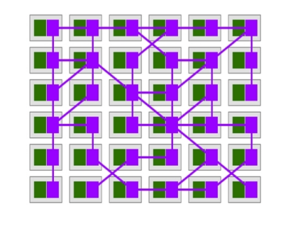
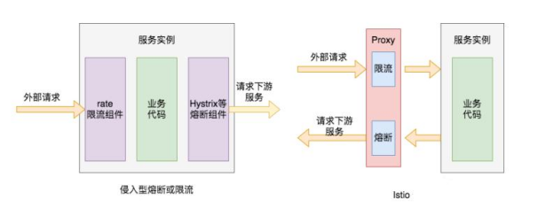
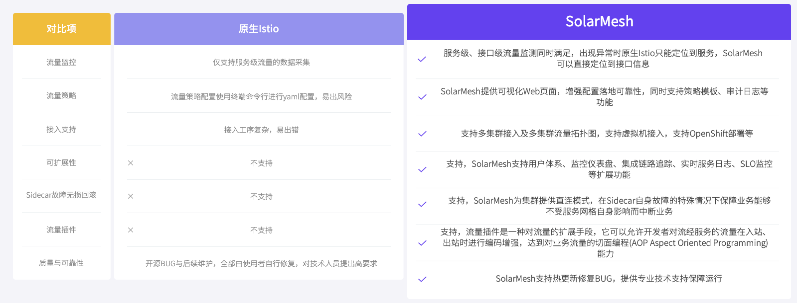

In the process of application evolution from monolithic architecture to microservice architecture, due to the substantial increase in the number of fine-grained microservice applications, the requirements for service discovery, load balancing, circuit breaker and current limiting among microservices have increased significantly.

In the microservice architecture, the call links between services are longer than in the era of single applications. Microservice splitting not only improves the overall capabilities of the system, but also increases the probability of cascading failures between services. There are dependent calls between multiple services. If a service cannot respond to the request in time, the fault will propagate towards the source of the call, which may cause large-scale cascading failures in the cluster and render the entire system unavailable.

To deal with this situation, a circuit breaker strategy can be introduced. In order to prevent the expansion of the fault scope, the basic logic of fusing is to isolate the fault. By continuously detecting and periodically counting the number of failed service calls, if the health status of the service is lower than the set threshold, circuit breakers will be initiated to eliminate erroneous service instances. Although the circuit breaker mechanism cannot solve the fault, it can try to ensure that the service interface on the non-faulty link can be accessed normally when a fault occurs, and control the scope of the fault to a local area. The circuit breaker service will not remain in the circuit breaker state forever. Fault recovery will be performed in the circuit breaker mechanism, and the circuit breaker will be turned off after detecting that the service is normal. Istio supports more comprehensive fault detection, fuse opening and fuse recovery mechanisms.

The current limiting function is also an important means of protecting services. The main purpose of circuit breakers is to isolate faults. In addition to internal problems in the system service, the cause of the fault may also be that the request volume exceeds the limit of the system's processing capacity. Subsequent new incoming requests It will continue to increase the service load, leading to resource exhaustion and service errors. The purpose of current limiting is to reject excessive request traffic and ensure that the overall service load is at a reasonable level. The throughput of the system can generally be measured. In order to ensure the stable operation of the system, once the threshold that needs to be restricted is reached, measures need to be taken to limit the traffic, such as delaying processing, rejecting processing, or partially rejecting processing, etc. Istio supports setting current limiting based on the number of service connections, number of requests in queue, etc. It also supports the classic token current limiting mode to proactively protect upstream services.

While the microservice architecture has brought about huge changes in the development and operation model, it has also introduced many issues in service governance: an application consists of multiple services, each service has multiple instances, and the running status of each instance is constantly changing. There is a huge demand for inter-service traffic management and service governance capabilities. The service mesh represented by Istio can easily carry the communication function between microservice applications by taking over all traffic sent and received by the service, issue service governance configuration through the control plane, and then route traffic between each service according to the configuration. , providing fault handling strategies such as circuit breakers and current limiting.

### Fusing current limiting principle

How to connect services is the first problem that must be solved in service governance. The usual approach is to embed the basic functions of the communication layer into the business code in the form of SDK. However, this strongly coupled solution will increase the difficulty of development, increase maintenance costs, and increase quality risks. In addition, the code called by the SDK appears redundant in many places. From the perspective of service governance, this method intrudes into the business and is dispersed in the application, which is not conducive to the overall management and control of the microservice system.

Another feasible solution is provided by transferring the logic originally in the SDK to Sidecar. Sidecar is a proxy process deployed on the application node. The application sends the request to the proxy, and the proxy completes routing and forwarding.

From an overall perspective, the traffic call relationship between agents forms a complete network, representing the complex call relationship between services and carrying application communication within the system. Each specific microservice is no longer directly connected to each other, but is implemented by its respective Sidecar proxy communication. In the application form, a set of mesh interaction structures composed of proxies are formed. This is also the origin of the name of the service grid. .

The essence is to precipitate the g
eneral traffic management function into Sidecar, and Sidecar takes over the service traffic and manages it. Traffic hijacking can be used to achieve traffic management without code intrusion, allowing developers to focus more on business functions, reducing the code complexity of microservices, and improving development efficiency. By separating the service governance function from the application itself, control and logic are separated. The Sidecar pattern allows us to add a variety of functions to the application without intrusion, avoiding the need to add additional code to the application to meet the needs of functional expansion.

As shown on the right side of the figure below, when an external request calls the service instance interface, the network requests sent by it will go through their respective network proxies, and then the proxy can provide them with service breaker-related mechanisms. When the call to the service instance continues to make errors, It no longer sends external requests to the service instance, but directly returns the configured error code. Similarly, the Proxy agent can provide a current limiting function. When the external request traffic is too large, the proxy will limit the current flow of some of the requests, reject some of the requests, and forward only some of the requests to downstream services.

The biggest architectural difference between the system and traditional microservice systems such as Spring Cloude is to extract the microservice governance logic from the original specific microservice process and implement an architecture that is managed by a unified control plane and executed by an agent data plane. Various service governance logics are also implemented under this architectural model. The Service Mesh architecture generally consists of two parts: the Control Plane and the Data Plane. The Control Plane is mainly responsible for the centralized management and distribution of governance information for the entire microservice system, while the agent program of the Data Plane is responsible for the specific execution of Various service governance information and rules issued by the control plane. Regarding the deployment of the agent program, by turning on automatic injection in Istio, the agent program can be automatically deployed to the same Pod as the user application when deploying the application. Users do not need to worry about the deployment of the agent program.

In Istio, the generalized circuit breaker configuration includes two parts: The first is circuit breaker based on request capacity limit. Requests exceeding the set threshold are directly discarded and an error is returned, which is more intuitively like a current limiting configuration. This is achieved by setting the connectionPool connection thread pool parameter, which can limit the number of concurrent connections and requests for the upstream service (applicable to TCP and HTTP), thereby achieving the current limiting function. The second is service circuit breaker based on service instance quality detection, which is a measure adopted to reduce the overall service abnormality rate and service delay by isolating faulty service instances. Specifically, Istio introduces anomaly detection to complete the circuit breaker function. If the cumulative number of errors in a service instance exceeds a predefined threshold within a certain period of time, Istio will remove the erroneous service instance from the load balancing pool.

Anomaly detection principle: When a host anomaly is detected, if no host has been isolated in the load balancing pool so far, the abnormal host will be immediately isolated; if a host has been isolated, the currently isolated host will be checked Whether the number is lower than the set threshold (specified by outlier_detection.max_ejection_percent in Envoy), if the number of currently isolated hosts does not exceed the threshold, the host will be isolated, otherwise it will not be isolated. Usually anomaly detection is used together with active health checks for comprehensive health check solutions. The types of anomaly detection mainly include continuous 5XX responses, including internal business errors or continuous gateway failures.

Quarantine is not permanent and will have a time limit. When a host is quarantined, it is marked as unhealthy unless the load balancer is in panic mode. The isolation time is equal to the value of outlier_detection.base_ejection_time_ms in Envoy multiplied by the number of times the host has been isolated. Continuous failures of a certain host will cause it to be isolated for longer and longer periods of time. After the specified isolation time has passed, the isolated host will automatically recover and accept remote calls from the caller again. The removed instance will be added back for another try after a period of time. If successful, the instance is considered successful, otherwise the instance will be evicted again. The eviction time here is a base time multiplied by the number of evictions. Istio can also control the eviction ratio, which means what proportion of service instances are evicted when they do not meet the requirements. When too many instances are evicted, it will enter panic mode. At this time, Istio will ignore the health marks of the instances on the load balancing pool and still send requests to all instances, thereby ensuring the overall availability of a service.

In Istio, circuit breakers are set in the TrafficPolicy of the CRD resource of DestinationRule. Current limiting circuit breakers are implemented by setting the connection pool connectionPool, and exception detection outlierDetection is set to implement service instance isolation circuit breakers.

There are two categories of configurations under ConnectionPool: TCP and HTTP. The two cooperate with each other to provide configurations related to current limiting for services. TCP-related basic configurations include maxConnections and connectTimeout. maxConnections represents the maximum number of HTTP1/TCP connections to the target service. It will only limit connections based on the HTTP1.1 protocol and will not affect connections based on HTTP2 because the HTTP2 protocol only establishes a connection once. connectTimeout represents the timeout time when establishing a TCP connection. The default unit is seconds. If this time is exceeded, the connection will be automatically disconnected. Configurations under HTTP include http1MaxPendingRequests, http2MaxRequests and maxRequestsPerConnection. http1MaxPendingRequests indicates the maximum number of HTTP requests in the pending state, that is, the maximum number of HTTP requests that the target service can handle at the same time. The default is 1024. http2MaxRequests indicates the maximum number of HTTP2 requests for the target service. The default is 1024. maxRequestsPerConnection indicates how many requests each TCP connection can be reused. If this parameter is set to 1, the keepalive feature will be disabled.

The relevant configuration items under OutlierDetection involve the circuit breaker mechanism of the service. Specifically, there are several basic configurations as follows. consecutiveErrors indicates that if the target service returns error codes several times in a row, the target service will be removed from the list of available service instances, that is to say, circuit breaker will be performed and the target service will no longer be requested. When a service is accessed through an HTTP request and the return code is 502, 503, or 504, Istio will judge the network request as an error. The default value of this attribute configuration is 5, which means that if the target instance returns a 5xx error code for five consecutive http requests, the service instance will be removed and will no longer accept network requests from the client.

Interval indicates the time interval for service elimination. That is, if a consistentErrors error occurs within the interval time period, the service circuit breaker will be triggered. Its units include hours, minutes, seconds and milliseconds. The default value is 10 seconds. baseEjectionTime indicates how long the target service must remain in the ejection state after it is ejected. During this time, the target service will remain in the access-denied state. This time will automatically increase as the number of ejections increases, and the time is the product of baseEjectionTime and the number of ejections. The units include hours, minutes, seconds and milliseconds. The default is 30 seconds. maxEjectionPercent indicates the maximum percentage of instances in the available service instance list that are removed. The default is 10%. When this ratio is exceeded, even if a circuit breaker occurs again, the service will not be removed. This avoids the problem of most service instances being removed due to transient errors.

minHealthPercent represents the minimum percentage of health mode, which is the ratio of health (not eliminated) among all service instances. When it is lower than this ratio, the entire cluster is considered to be in an unhealthy state, the service elimination circuit breaker mechanism related to the outlierDetection configuration will be turned off, and service health checks will no longer be performed. All service instances can be requested to access, including healthy and unhealthy ones. host. The default value of this attribute is 50%, and the sum of minHealthPercent and maxEjectionPercent generally does not exceed 100%.

In addition to circuit breaking, rate limiting is a simple and effective way to mitigate cascading failures and prevent exhaustion of shared resources. Envoy is a feature-rich proxy, and you can easily add rate limiting functionality to your service by configuring Envoy filters. The fusing function introduced above has the following shortcomings: it is accurate to the instance level and cannot limit the current flow of a certain API. It takes effect after routing rules. The server passively limits the flow after receiving a request that exceeds the configured service capacity limit, and does not actively limit the flow before traffic distribution. Under the Istio system, advanced current limiting requirements can be achieved through the configuration of EnvoyFilter. EnvoyFilter provides three ways to expand: writing C++ extension code, Lua script extension, and WebAssembly extension. In practice, Lua script method is commonly used. Customize the HTTP Filter to match the current limiting circuit breaker conditions, and place the circuit breaker plug-in in front of the router. Each time a request is processed, the plug-in will be used to determine whether the current flow needs to be limited. The current limiter can also reference external independent current limiting services. EnvoyFilter supports two current limiting methods: centralized current limiting and local current limiting in the configuration center, realizing the current limiting function based on the classic token principle.

In most cases, the service call throughput between upstream and downstream in the local current limiting control system is very effective, but sometimes its effect is not guaranteed, and in this case a global current limiting service is required. The most common situation is when a large number of services send requests to a small number of services (such as each application service sending requests to a database service). In this case, it is difficult to configure effective enough circuit breakers for each downstream service so that the upstream service can run smoothly. In this case, configuring a global speed limiter for the service is a good solution.

Envoy's global rate limiting solution is implemented based on a global rate limit service RLS (rate limit service). RLS is designed as a gRPC service that provides rate limiting scenarios. Global speed limiting takes effect on the network entrance of the speed-limited business. This means that no matter whether the request comes from other microservices deployed in the cluster or from external access other than the gateway, the request will be speed limited. Therefore, global speed limiting is a kind of emergency response. An effective means to protect critical services in scenarios where traffic surges.

After understanding the circuit breaker principle of Istio, let’s get started and experience specific service mesh products.

### SolarMesh

SolarMesh is an efficient visual microservice management platform based on Istio and container technology. It focuses on lightweight, convenience, efficiency, and visualization, making the service grid no longer difficult to learn and use, and filling the last shortcoming of enterprises implementing Istio.

*Sidecar mode, eliminating the need to configure third-party components or modify the application

*Available in all languages

*Rich process control strategies

[SolarMesh free trial address>>](https://www.cloudtogo.cn/product-SolarMesh)
