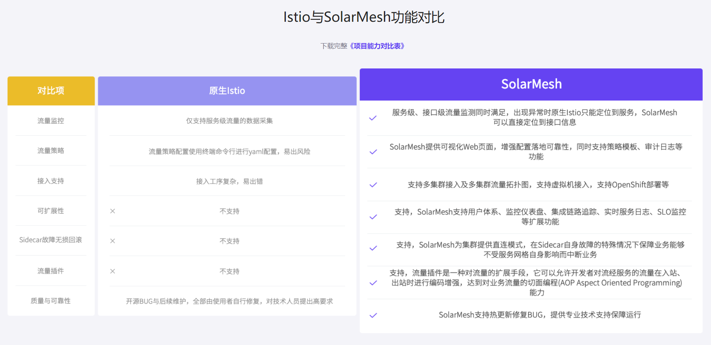

Original text from: CNCF (Foundation) Blog

On September 28, 2022, the CNCF Technical Oversight Committee (TOC) voted to accept it as a CNCF incubation project.

Istio is an open source project that publicly provides a unified and efficient way to secure, connect and monitor services in cloud native applications. Istio provides zero-trust networking, policy enforcement, traffic management, load balancing and monitoring functions without the need to rewrite applications.

Research and development on Istio began in 2016. It was originally developed by Google and IBM, along with the Lyft team that built the Envoy proxy.

### Source of significant contributions to Istio’s subsequent code

· Multiple technology companies and cloud vendors, including Red Hat, Cisco, VMware, Intel, Huawei, Tencent, Alibaba and DaoCloud;

· Companies formed to bring Istio solutions to market, including Tetrate, Aspen Mesh, and Solo.io;

· End users of Istio, including Auto Trader UK, Salesforce, SAP and Yahoo.

Istio stands on the shoulders of multiple CNCF projects such as Kubernetes, Envoy, gRPC, Prometheus, and SPIFFE. It can be installed with Helm and integrates with projects including Knative, Flagger, Jaeger, Open Policy Agent, and OpenTelemetry.

Istio released version 1.0 in 2018. In 2019, it was the fourth fastest growing open source project in GitHub. More than 190 companies are using Istio, and more than 20 vendors provide products or plug-ins for their Kubernetes platform that can be used to install and deploy Istio, including Google, IBM, Red Hat, VMware, Huawei, Alibaba, Cisco, Oracle and D2IQ .

"We are excited to unify Google's cloud native stack projects - Kubernetes, Istio and Knative - into CNCF," said Craig Box, Developer Relations Lead at Google Cloud and member of the Istio Steering Committee. "Our team has been working hard to unify the service The Grid community has come together around the Kubernetes Gateway API, and we look forward to seeing and driving more collaborations like this between CNCF projects. This is an important milestone for Istio and its community, and we're excited to be part of the project's development Take the next step.”

"Support for open source innovation is a key component of IBM's hybrid cloud strategy, and we see this in Istio in particular, so we have contributed from the beginning. With Istio accepted into the CNCF, the project is moving forward We deserve to applaud this milestone as we enter a new stage of development. CNCF’s open governance and strong community will help nurture the project and ensure a bright future for Istio’s users and contributors and the entire CNCF community.” — Jason McGee, IBM Researcher and General Manager of IBM Cloud

"Istio is one of the key open source projects in the ecosystem. Huawei Cloud began contributing to Istio in 2018. Istio has demonstrated its potential in enterprise digitization and application modernization through use cases in multiple industries such as the Internet, finance, and automobiles. I am happy to see the Istio project accepted by CNCF. We will continue to contribute to Istio and work with CNCF to promote the community and use cases in more industries." — Bruno Zhang, Chief Technology Officer of Huawei Cloud

The U.S. government has mandated that federal infrastructure adopt a zero-trust architecture, and the Istio community will work with government agencies to support this goal, including co-writing the National Institute of Standards and Technology SP 800-204A Securing Microservices standard. Istio is currently being adopted by the U.S. government, having been selected as a service mesh for the DoD Enterprise DevSecOps initiative, and Istio is known for being deployed on F/16 jets.

“Bringing Istio to the CNCF further validates its neutrality and maturity as a foundational technology for modern software platforms,” said Nicolas Chaillan, former Air Force and Space Force Chief Software Officer and Tetrate advisor. “Istio has been integral in driving security best practices across government and commercial organizations, which will accelerate Istio’s adoption and expand its impact across the industry.”

According to the CNCF annual survey, Istio is currently the most widely used service mesh. A list of public reference customers can be found on the website, including case studies from Airbnb, Atlassian, eBay, Salesforce.com, Splunk, T Mobile, and WP Engine. Both annual IstioCon events have attracted more than 4,000 attendees.

"Istio's scalability, broad feature support, and scalability make it an excellent choice for Airbnb. Airbnb is currently using Istio to serve the vast majority of internal traffic and plans to use Istio as a future service mesh solution .” – Weibo He, Senior Software Engineer, Airbnb

"The use of Istio has been a force multiplier for WP Engine. By implementing Istio, we have created a platform that provides greater security and observability, allowing our application teams to focus on their business logic." – Glenn Jones, Principal Software Engineer, WP Engine

"Istio is the core of Intuit's developer platform, powering communication between thousands of services running as multi-clusters. Istio's scalable architecture allows Intuit to build custom and enhanced services using its own tools Grid. In the process of automating one of Istio's multi-cluster models, Intuit has contributed to an open source project called Admiral for service discovery in a multi-cluster Istio service mesh. We're excited to see how the environment mesh evolve it and actively explore it internally.” – Jason Webb, Distinguished Engineer, Intuit

### Main components of Istio

The Istio service mesh is logically divided into a data plane and a control plane.

The data plane consists of a set of intelligent Envoy proxies, most commonly deployed as sidecars. These proxies mediate and control all network communication between microservices. They also collect and report telemetry data for all mesh traffic. Istio engineers contribute many important features to Envoy, including extensibility through WebAssembly.

Control plane manages and configures proxies to route traffic. Logically separated in a single binary, components include the data plane programmer (Pilot), certificate authority (Citadel), configuration management engine (Galley), and sidecar admission controller.

### Important milestones for Istio

· 85 maintenance personnel from 15 companies

· >8,800 individual contributors

· >40,000 pull requests

· >20,000 questions

· >260 versions

· >33,000 GitHub stars

· >8,500 Slack members

The project has been in the works for nearly six years, and Istio is not resting on its laurels. A new operational model called Environment Grid was recently announced to solve common operational challenges by moving data plane functions from sidecar containers to network infrastructure. The environment grid has been released as an experimental feature and is currently under community development. Istio will continue to support the Sidecar deployment mode, and the two modes will interoperate seamlessly.

"As the number of service mesh requirements in the cloud native ecosystem continues to increase, Istio joining the CNCF is an exciting move. Istio brings service mesh innovation to the forefront of the CNCF family of projects with its new environment mesh architecture . We are seeing increasing end-user adoption of service meshes and expect the industry to have a broad impact as projects like Istio continue to mature. We look forward to working with the Istio community to help take it to the next level. ” ——Chris Aniszczyk, Chief Technology Officer of CNCF

----------------------------------

### Xingyun Innovation - Service Mesh (SolarMesh)

SolarMesh - an efficient visual microservice governance platform based on Istio and container technology, providing application life cycle management, comprehensive traffic management and non-intrusive service governance solutions. SolarMesh helps enterprises quickly locate problems in complex microservice scheduling and enhance research and development efficiency. Let the service grid no longer be difficult to learn and use, and make the implementation of the service grid in the enterprise smoother, safer and more stable.

[SolarMesh free trial address>>](https://www.cloudtogo.cn/product-SolarMesh)
