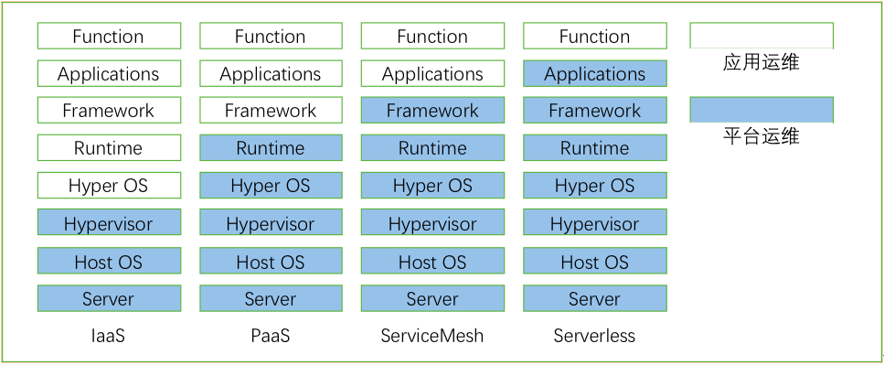

### 1. Operation and maintenance will continue to sink and will become mainstream, and Serverless will be gradually promoted.

One development direction of cloud computing is to decentralize operation and maintenance. Management functions and operation and maintenance work that have nothing to do with the business will be decentralized to the infrastructure as much as possible. Applications can focus on the development and operation of business capabilities. The evolution of this trend has affected the development direction of cloud computing. From the initial virtualization, to IaaS, to PaaS, it is a process of handing over part of the operation and maintenance responsibilities of the application system to the platform operation and maintenance.

PaaS provides running containers for cloud applications, solving application deployment problems and runtime management problems. However, applications still require a lot of operation and maintenance work, especially for microservice applications, which need to solve many problems, such as service release and Awareness, load balancing of multi-instance applications, service failure detection and isolation, grayscale release strategies have been applied, etc. These cannot be solved at the PaaS level, and are usually solved by the development framework, which is the microservice governance framework we mentioned earlier.

Because the provision of business functions is the embodiment of the value of the business development team, the business development team should focus on the realization of business functions, and non-functional requirements should be left to the platform for processing. Based on this demand, the service grid emerged. The issue of microservice governance can be managed by the service grid for unified operation and maintenance, and business applications only need to focus on the realization of business capabilities.

After the emergence of the service grid, the life cycle of the business application itself still needs to be operated and maintained by the application. This gradually evolved the concept of Serverless. Serverless does not mean that there is no server, but that the development team does not care what the server looks like. The development team only needs to submit the business code to get the required running instances. For the application development team, the Server does not exist.

Judging from the current technology trends in the industry, the concept of ServiceMesh has been accepted by most large cloud companies. The criticized performance issues of ServiceMesh are also being gradually solved. It can be predicted that more microservice applications will adopt this technology this year. Basic abilities. Serverless is still in its early stages of development, including fully managed services and FaaS (Function as a Service). Fully managed services have gradually matured in public clouds. With the popularity of hybrid clouds, fully managed services will gradually develop. Since FaaS involves changes in the development model, it will take some time to replace the existing development model. However, there should be more and more applications for some suitable application scenarios.

#### [Service Mesh Product](https://www.cloudtogo.cn/product-SolarMesh)

SolarMesh is an efficient visual microservice management platform based on Istio and container technology. It focuses on lightweight, convenience, efficiency, and visualization, making the service grid no longer difficult to learn and use, and filling the last shortcomings of enterprises implementing Istio. , making the service grid no longer difficult to learn and use, making the implementation of the service grid in enterprises smoother, safer, and more stable.

SolarMesh features:

· Help enterprises quickly locate problems in complex microservice scheduling and enhance R&D efficiency.

· Use traffic grayscale to make version updates smoother and reduce version upgrade risks.

· Support real-time reflection of real cluster status, highlight business issues from the perspective of traffic, and enhance operation and maintenance capabilities.

· Supports multi-cluster management and can be connected to any number of standard k8s clusters with extremely low access costs.

### 2. Further integration of container virtual machines

The advantages and disadvantages of containers and virtual machines have been debated since the birth of container technology. Containers are lightweight, have good packaging capabilities and are easy to deploy. Especially after the emergence of Kubernetes, they are likely to replace virtual machines. But when it comes to handling heavy applications (such as relational databases, big data, etc.), container technology seems to be somewhat inadequate. In addition, container technology is still not up to the level of virtual machines in terms of resource isolation and security, so in many scenarios, virtual machines are still useful.

In this case, how to realize the integration of container technology and virtualization technology and give full play to the strengths of both has become a development topic of cloud computing. There are currently three main technologies, one is a hybrid of container virtual machines; the other is lightweight virtual machines; and the last is secure containers.

A mix of container virtual machines. By modifying the orchestration engine of the container or virtual machine, a set of APIs can be used to support the deployment of containers and virtual machines, and at the same time open up the network between the virtualization layer and the container to enable more efficient mutual access. This is the current practice of some traditional virtualization vendors. Currently, the more mature implementation is Redhad’s Kubevirt.

Lightweight virtual machine. To solve the problems of too large virtual machine images, slow startup, and high resource consumption, the industry has proposed lightweight virtual machine solutions. The lightweight virtual machine uses a streamlined and proprietary library operating system (LibraryOS), which can be compiled using high-level languages and run directly on commercial cloud platform hypervisors. They have many advantages over container technology, not only having isolation capabilities comparable to virtual machines, but also having faster startup times and smaller attack surfaces. Due to the use of a proprietary operating system, lightweight virtual machines are inferior to other solutions in terms of language support and compatibility. There are currently many technologies for lightweight virtual machines, such as Unikernel, Drawbridge, MirageOS and HaLVM.

Security container, or sandbox container. In order to solve the isolation weakness of the container, the secure container provides a layer of sandbox (Sandbox) for the running of the container. The application running in the sandbox of the container has its own kernel and virtual device, which is distinguished from the host and other sandboxes. Come on. The advantage of secure containers is that they are compatible with current container images and can be directly applied without making major changes to container orchestration Kubernetes. The disadvantage is that some performance and flexibility are sacrificed. Currently, open source projects for secure containers include Kata container, Google’s gVisor, etc.

There may be some overlap in the implementation of secure containers and lightweight virtual machines, but no matter which direction, they are developing in the general direction of the integration of virtual machines and containers. The goal is to improve the isolation and security of business applications while leveraging the lightweight, fast delivery and flexible scheduling capabilities of containers.

[SolarMesh free trial address>>](https://www.cloudtogo.cn/product-SolarMesh)
