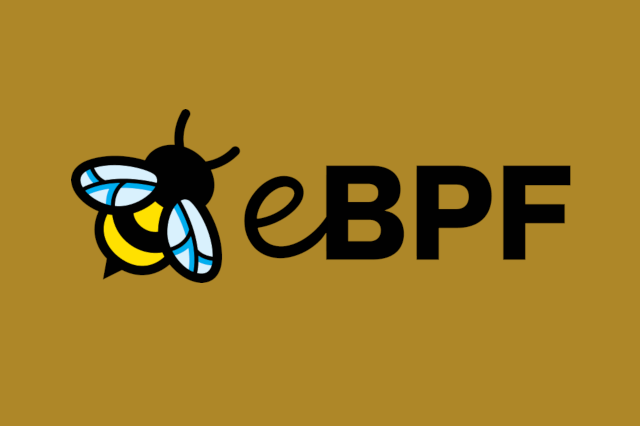

There are currently several service mesh products and projects that promise to simplify the connection between application microservices. Additional features such as secure connections, observability and traffic management are also provided. But as we've seen repeatedly over the past few years, excitement about service meshes has been diluted by practical concerns about additional complexity and overhead. Let’s take a look at how EBPF simplifies, making the service mesh data plane more efficient and easier to deploy.

### Sidecar problem

Today, service mesh solutions for Kubernetes require you to add a proxy sidecar container (such as Envoy or Linkerd-Proxy) to each application pod. That's right: even in a very small environment with, say, 20 services running 5 pods each, spread across three nodes, you have 100 agent containers. No matter how small and efficient the agent implementation is, sheer duplication consumes resources. The memory used by each agent increases with the number of services it needs to communicate with. Pranay Singhal wrote about his experience configuring Istio to reduce consumption from about 1GB per agent (!) to a more reasonable 60-70MB. However, even in the small environment we imagine with 100 agents on three nodes, this optimized configuration still requires about 2GB per node.

Why do we need these sidecars? This model allows the agent container to share the network namespace with the application containers in the Pod. Network namespaces are a Linux kernel construct that allow containers and pods to have their own independent network stacks, isolating containerized applications from each other. This allows applications to not interfere with each other, which is why, when running a web application on port 80, you can have as many pods as you want - the network namespace means they all have their own port 80. The proxy must share the same network namespace so that it can intercept and process traffic from the application container.

### eBPF

Importantly, there is only one core per node; all containers (and therefore all pods) running on a node share the same core. If you add an EBPF program to an event in the kernel, it will be triggered no matter which process causes the event, whether it is running in the application container or directly on the host.

This is why eBPF is such an exciting technology for any kind of tooling in Kubernetes—you only need to add the tool once per node and all application units will be covered. Whether you are looking for observability, security, or networking, EBPF-based solutions can provide instrumentation to applications without the need for sidecars.

The eBPF-based Cilium project (which recently joined the Cloud Computing Foundation during its incubation phase) brings this "borderless" model to the service mesh world. Like the traditional sidecar model, Cilium supports a single Envoy proxy instance per node to run the service mesh data plane. Using the previous example, this reduces the number of proxy instances from 100 to 3.

### Less YAML

In the sidecar model, the YAML specifying each application pod needs to be modified to add the sidecar container. This is often automated - for example, using a Mutating webhook to inject the sidecar when each application pod is deployed.

For example, in Istio, this requires tagging the Kubernetes namespace and/or pod to define whether sidecars should be injected, which of course requires enabling Mutating webhooks for the cluster.

But what if something goes wrong? If the namespace or pod is not labeled correctly, the sidecar will not be injected and the pod will not connect to the service mesh. Worse, if an attacker compromises a cluster and is able to run a malicious workload (such as a cryptocurrency miner), they will be less likely to flag it for participation in the service mesh. With the traffic observability provided by the service mesh, it will not be visible.

In contrast, in the eBPF-enabled Sidecarless proxy model, PODs do not require any additional YAML for instrumentation and instead use CRDs to configure the service mesh on a clustered basis. Even pre-existing pods can become part of a service mesh without requiring a reboot.

If an attacker attempts to bypass Kubernetes orchestration by running the workload directly on the host, the eBPF program can see and control this activity because it is visible in the kernel.

### eBPF network efficiency

Eliminating sidecars isn't the only way eBPF can optimize your service mesh. EBPF-enabled networking allows packets to take shortcuts around parts of the kernel networking stack, which can significantly improve the performance of Kubernetes networking. Let's see how this applies to the service mesh data plane. In the case of a service mesh, where the proxy runs as a sidecar in a traditional network, the path that packets take to reach the application is quite circuitous: inbound packets must traverse the host TCP/IP stack to reach the network namespace to which the POD is connected via virtual Ethernet. . From there, the packet must pass through the Pod's network stack to reach the proxy, which forwards the packet to the application through the loopback interface. Keep in mind that traffic must flow through proxies on both sides of the connection, which results in a significant increase in latency compared to non-service mesh traffic.

Kubernetes CNI implementations based on eBPF, such as Cilium, can use eBPF programs to intelligently hook into specific points in the kernel to redirect packets along more direct routes. Cilium knows all Kubernetes endpoints and service identities, so this is possible. When a packet arrives at the host, Cilium can send it directly to its destination's proxy or pod endpoint.

#### Encryption in the network

If a networking solution is able to recognize Kubernetes services and provide network connectivity between the endpoints of those services, it is not surprising that it can provide the capabilities of a service mesh data plane. But these features can go beyond basic connectivity. One example is transparent encryption.

A service mesh is often used to ensure that all application traffic is authenticated and encrypted. This is accomplished via mutual TLS (MTLS). The service mesh proxy component acts as an endpoint for network connections and negotiates secure TLS connections with its remote peers. This connection encrypts communication between agents without requiring any changes to the application.

However, TLS managed at the application layer is not the only way to achieve authenticated and encrypted communication between components. Another option is to use IPSec or WireGuard to encrypt traffic at the network layer. Since it works at the network layer, this encryption is completely transparent not only to the application but also to the proxy, and it can be enabled with or without a service mesh. If the only reason for using a service mesh is to provide encryption, you may want to consider network-level encryption. Not only is it simpler, but it can also be used to authenticate and encrypt any traffic on the node—it's not just limited to those workloads with Sidecar enabled.

Original text from https://thenewstack.io/how-ebpf-streamlines-the-service-mesh/

[SolarMesh free trial address>>](https://www.cloudtogo.cn/product-SolarMesh)
