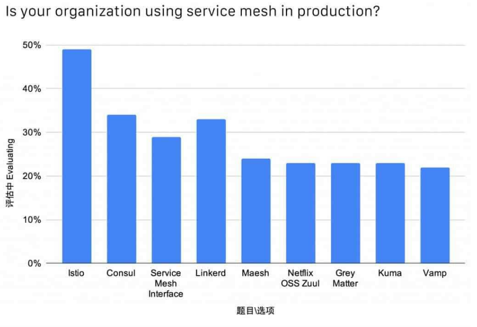
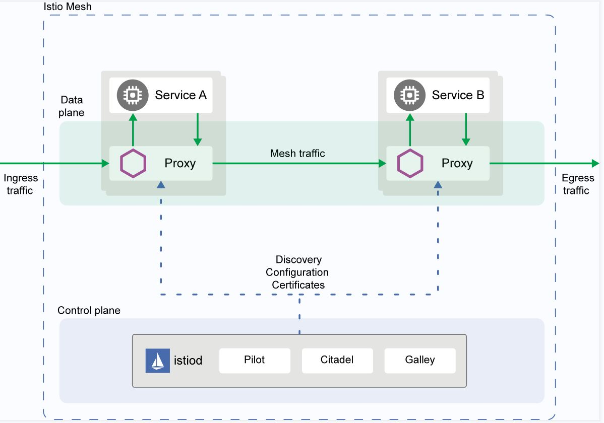
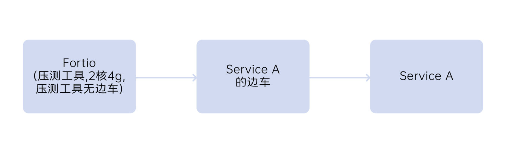
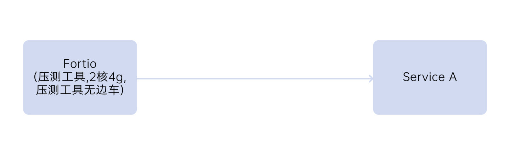
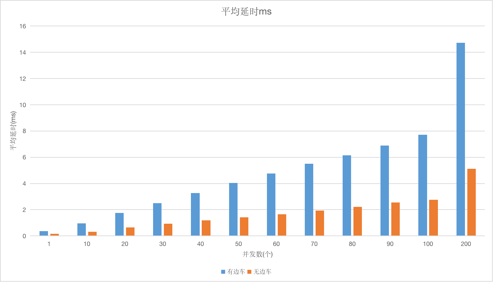
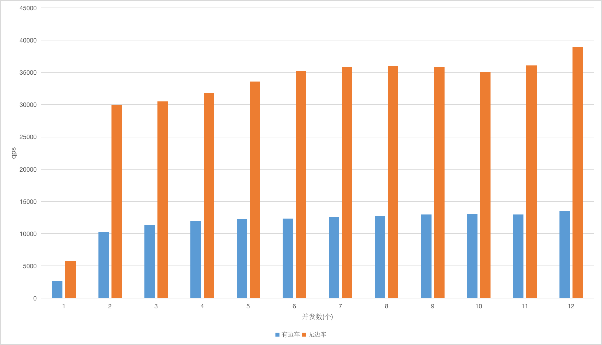
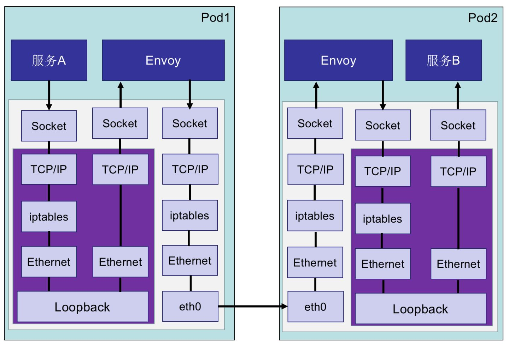
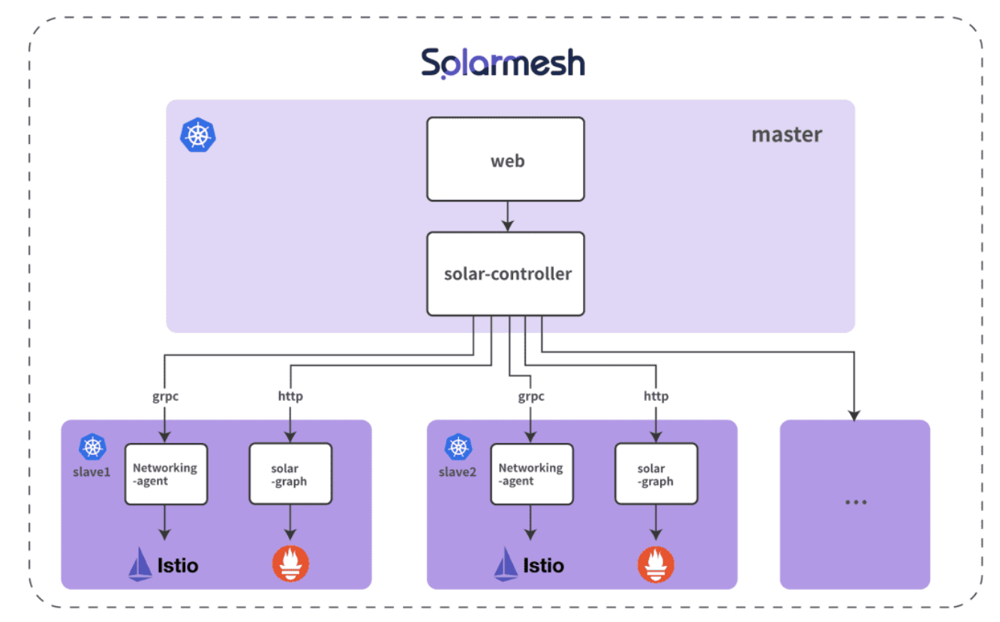

It is only in the past two years that service grids have become popular in China. There are many open source service grid frameworks in the industry, such as linkerd2, kuma, nginMesh, maesh, etc. Among them, Istio is currently the most popular open source in the service grid field. Project, 38% of enterprises use service mesh in production, and nearly half of them choose Istio.

In this article, let’s talk about why Istio is so popular?

### 1. What is Istio

Let’s take a look at the architecture of Istio:

As we can see from the above figure, the Istio service mesh is logically divided into data plane and control plane:

· Data plane: directly processes inbound and outbound data packets, providing forwarding, routing, health check, load balancing, circuit breaker, authentication, authentication, fault injection, and observability capabilities.

· Control plane: Provides service discovery, configuration and certificate management capabilities.

When building large distributed systems, it is a common pattern to separate the control plane and data plane. The data plane will directly interact with specific applications, while the components of the control plane will issue a series of configurations and instructions to help the data plane complete specific work.

### 2. Istio performance

Two Alibaba Cloud ecs.g6.2xlarge machines are used, one of which deploys the stress testing tool Fortio, and the other deploys Service A and Service A's sidecar. In the case of using the fannel grid plug-in, 30 concurrency is used for stress testing. The stress testing scenario is shown in the figure below. Service A receives the request and returns directly without any logical processing. Fortios calls Service A through the sidecar. The average response time is 2.505ms. Under the same concurrency, without deploying Service A's sidecar, the average response time for calling Service A through Fortios is 0.936ms.

Scenario of pressure test with sidecar:

Endless car pressure test scenario:

Average delay:

QPS:

The performance loss caused by the service mesh includes two aspects:

1. Losses caused by traffic policy, observability and secure communication. These losses exist in any microservice framework and require continuous optimization of the performance of Envoy itself to improve it.

2. After the calls between service grid microservices pass through the sidecar, compared with the traditional service framework, there are two more network calls. This is an additional performance loss caused by the service grid.

The service grid uses iptables traffic hijacking by default. When the traffic passes through the sidecar Envoy, it will pass through the TCP/IP protocol stack twice. As shown in Figure 8, when the number of services is large, there will be a large number of iptables rules, which will affect the network. performance. One current idea in the industry is to use technologies such as eBPF to improve application performance. Based on eBPF, microservices and sidecars can communicate directly through Sockets. However, this technology has relatively high requirements for the version of the operating system kernel, so few companies can achieve it.

#### Xingyun Innovation explores and practices Istio - SolarMesh

1. SolarMesh, based on Istio and container technology, provides traffic monitoring and management, and provides a complete non-intrusive service management solution.
2. SolarMesh can help enterprises quickly locate problems in complex microservice scheduling and enhance research and development efficiency.
3. SolarMesh can make version updates smoother and reduce version upgrade risks through traffic grayscale.
4. SolarMesh supports real-time reflection of real cluster status, highlights business issues from the perspective of traffic, and enhances operation and maintenance capabilities.
5. SolarMesh supports multi-cluster management and can be connected to any number of standard k8s clusters with extremely low access costs.

SolarMesh architecture design:

SolarMesh’s product improvements to the Istio community

1. Istio’s direct connection mode provides second-level direct connection traffic switching when sidecar fails;

2. Unified management of multiple clusters provides a God’s perspective for traffic operation and maintenance;

3. Visualize and standardize Istio operations, say goodbye to the terminal;

4. Reflect the real situation of the cluster and visualize traffic monitoring;

5. Provide monitoring capabilities for istio core components;

6. Service quality (SLO) detection capability;

7. One-click deployment of distributed link tracking component jaeger;

8. One-click deployment of the data visualization tool grafana to further enhance the traffic monitoring experience;

9. ……

----------------

Experience SolarMesh, [SolarMesh free trial address>>](https://www.cloudtogo.cn/product-SolarMesh)
