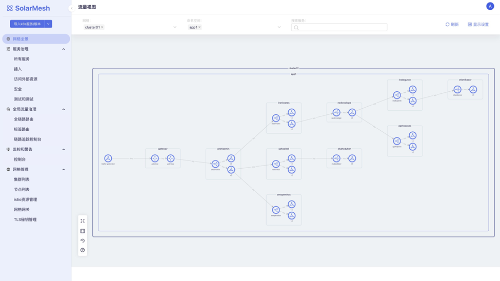
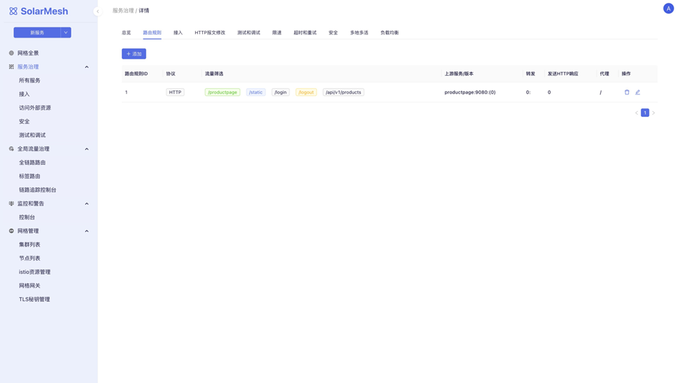
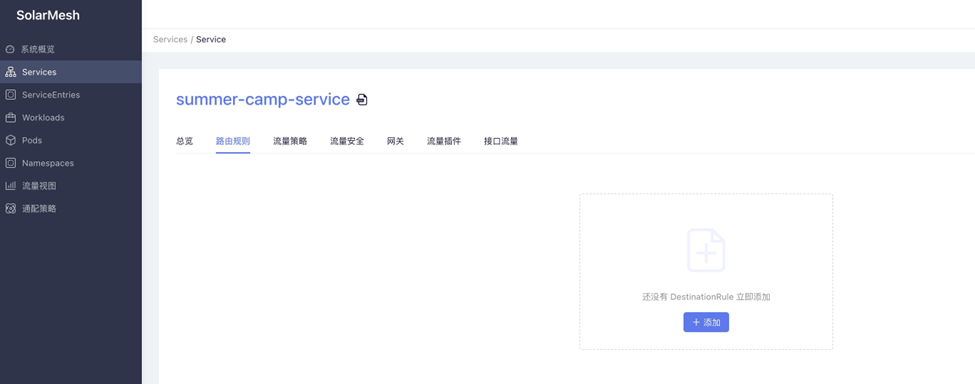
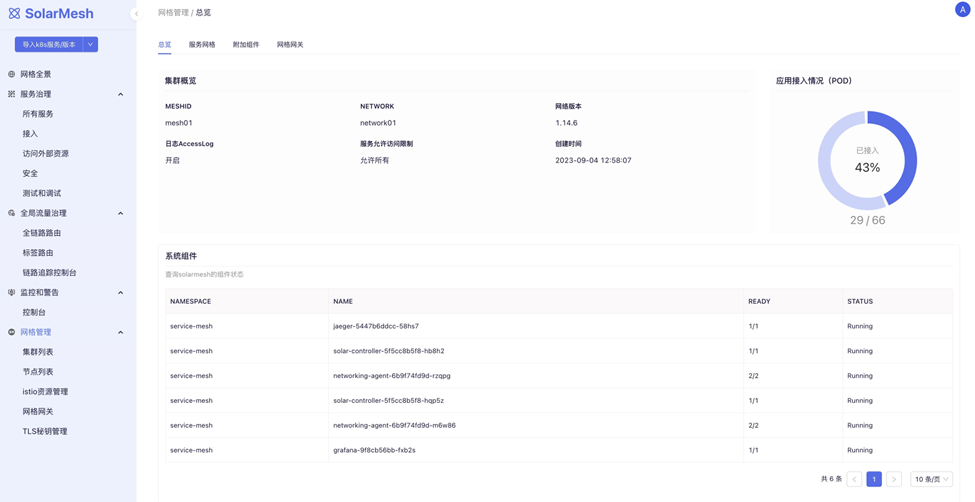
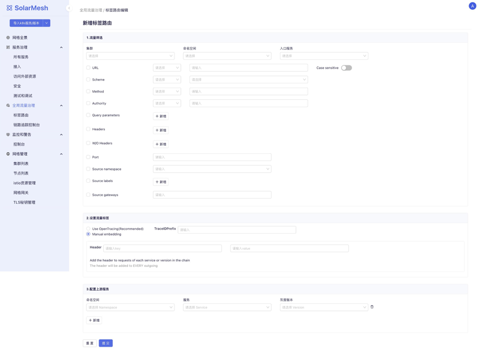

## SolarMesh

SolarMesh, introduced by Cloudtogo Innovations, is a traffic governance platform built upon Istio, providing comprehensive traffic governance capabilities for applications deployed on Kubernetes clusters.

In previous versions, SolarMesh provided functionalities such as traffic visualization, batch configuration of traffic control policies, API-level traffic data collection and display, Sidecar direct connection mode, support for WASM plugin development, and several WASM plugins.

In version 1.13, the main updates are as follows:

1. Significantly enriching SolarMesh's traffic governance capabilities from the perspective of operations and maintenance (O&M).
2. Providing mesh-level traffic visualization.
3. Offering lifecycle management capabilities for Istio, focusing on Istio's installation, upgrade, and multi-cluster management.
4. Introducing label-based routing capabilities, along with full-link gray release functionality based on this capability.
5. Integrating with other open-source frameworks and gaining their capabilities, such as Slime.

## New Features

### Redesigned Functional Architecture

The functionalities of SolarMesh have been rearranged, eliminating direct display and operation of Istio objects, and instead reorganizing them from the perspective of SRE's daily O&M. At the same time, the new version also eliminates the management of non-mesh objects such as Namespace, Pod, and Deployment. The comparison between the old and new versions is as follows:

1. After installing the mesh, users can batch import services into the mesh from "Import K8s Service/Version." Gray version imports can also be done from here.
2. The mesh panorama displays the running status of all services in the mesh.
3. Service governance capabilities are concentrated in "Service Governance > All Services." Users can also quickly locate services with these capabilities from perspectives such as "Access," "Accessing External Resources," "Security," and "Testing and Debugging."

### Service Management

The new version's service management consolidates all traffic governance capabilities but categorizes them according to operational characteristics, no longer based on Istio capabilities as the planning basis. The comparison between the old and new versions is as follows:

All services imported into SolarMesh will appear in "Service Governance > All Services," where users can make detailed settings. These settings are divided into:

1. Route rules, for managing API route rules.
2. Access, for managing service exposure methods.
3. HTTP message modification, for modifying HTTP requests and responses.
4. Testing and debugging, for injecting delays, errors, etc., into APIs.
5. Rate limiting, for configuring service rate limits.
6. Timeout and retry.
7. Security, for managing service mTLS, authorization, and authentication.
8. Multi-site active-active, for managing traffic distribution strategies or failover strategies for services deployed in multiple regions.
9. Load balancing.

### Istio Lifecycle Management

The focus of Istio lifecycle management is not only on how to correctly install Istio but also on maintaining the stable operation of Istio itself and being able to smoothly upgrade to new versions. The requirements for gateways will be higher. When CVE patch versions are released, gateways should be able to be independently upgraded without interrupting business. Additionally, Istio lifecycle management also incorporates multi-cluster management, supporting multi-primary and remote-cluster types of multi-cluster deployment as well as two types of hybrid deployment.

The functionalities of Istio lifecycle management are as follows:

1. Users can manage the installation and upgrade of Istio clusters in "Cluster List."
2. "Node List" is used to manage the multi-region properties of clusters.
3. "Mesh Gateway" is used to manage mesh installation and upgrade.
4. "TLS Management" is used to manage certificate rotation.

### Label-Based Routing

Label-based routing involves filtering specific traffic characteristics and then forwarding the traffic to different versions of services. This routing rule can be configured for multiple services to achieve functionalities such as full-link gray release and traffic coloring.

Users can use traffic filtering rules supported by Istio to filter traffic and bind labels to these feature traffic, which will be propagated along with the traffic in the invocation chain. If users' services already use the OpenTracing framework, labels will automatically propagate between services traversed by the traffic.

These are the main updates of SolarMesh in this release. Feel free to obtain the download link for trial from the backend or visit online.

[SolarMesh free trial address>>](https://www.cloudtogo.cn/product-SolarMesh)
