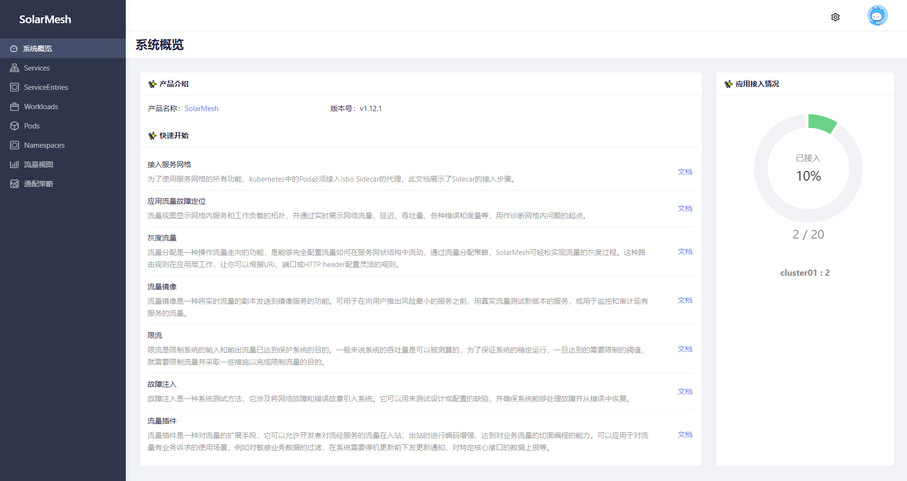
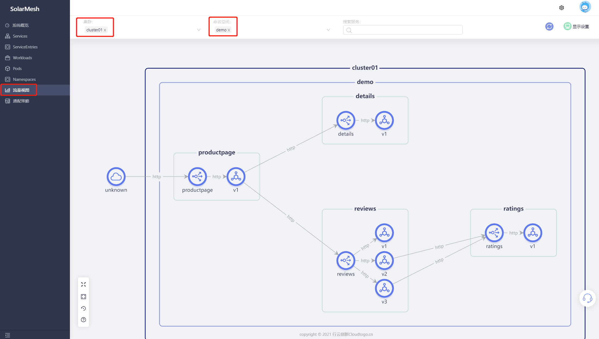

## Preconditions

### Environment configuration

Before installing SolarMesh, review the following environmental requirements:

1. Prepare a Kubernetes environment of version 1.21 and above to ensure that you can access the external network, ensure that images can be pulled normally, and that there are certain computing resources to run more applications.
2. Prepare kubectl and helm tools

### Download the installation package

The installation package includes command line tools and helm charts packages.
```shell
# download
wget http://release.solarmesh.cn/solar/v1.12/solar-v1.12.1-linux-amd64.tar.gz
# Unzip
tar -xvf solar-v1.12.1-linux-amd64.tar.gz
# empower
export PATH=$PATH:$PWD/solar/bin/
chmod +x $PWD/solar/bin/solarctl
chmod +x $PWD/solar/bin/istioctl
```

Confirm version:
```shell
$ solarctl version
solarctl version: v1.12.1
```

## Install SolarMesh

### Install Istio

```shell
$ istioctl operator init --hub registry.cn-shenzhen.aliyuncs.com/solarmesh --tag 1.13.9

$ kubectl apply -f - <<EOF
apiVersion: install.istio.io/v1alpha1
kind: IstioOperator
metadata:
  namespace: istio-system
  name: demo
spec:
  hub: registry.cn-shenzhen.aliyuncs.com/solarmesh
  tag: 1.13.9
  profile: default
  meshConfig:
    accessLogFile: /dev/stdout
    enableTracing: true
    defaultConfig:
      proxyMetadata:
        ISTIO_META_DNS_CAPTURE: "true"
        ISTIO_META_DNS_AUTO_ALLOCATE: "true"
      extraStatTags:
        - request_path
        - request_method
  values:
    global:
      meshID: mesh01 # mesh name
      multiCluster:
        clusterName: cluster01 # cluster name
      network: network1 # network name
  components:
    pilot:
      k8s:
        env:
        - name: PILOT_TRACE_SAMPLING
          value: "100"
        - name: PILOT_FILTER_GATEWAY_CLUSTER_CONFIG
          value: "true"
        - name: PILOT_ENABLE_FLOW_CONTROL
          value: "true"
        resources:
          requests:
            cpu: 10m
            memory: 100Mi
    egressGateways:
    - name: istio-egressgateway
      enabled: true
      k8s:
        resources:
          requests:
            cpu: 10m
            memory: 40Mi
    ingressGateways:
      - name: istio-ingressgateway
        enabled: true
        k8s:
          service:
            ports:
              - name: status-port
                port: 15021
                protocol: TCP
                targetPort: 15021
              - name: http2
                port: 80
                protocol: TCP
                targetPort: 8080
              - name: https
                port: 443
                protocol: TCP
                targetPort: 8443
              - name: tcp
                port: 31400
                protocol: TCP
                targetPort: 31400
              - name: tls
                port: 15443
                protocol: TCP
                targetPort: 15443
              - name: promethues # solarmesh config
                port: 9090
                protocol: TCP
                targetPort: 9090
              - name: kiali
                port: 20001
                protocol: TCP
                targetPort: 20001
              - name: networking-agent
                port: 7575
                protocol: TCP
                targetPort: 7575
              - name: grafana
                port: 3000
                protocol: TCP
                targetPort: 3000
              - name: jaeger
                port: 16686
                protocol: TCP
                targetPort: 16686
EOF
```

Check workloads：
````shell
$ kubectl get po -n istio-system
NAME                                   READY   STATUS    RESTARTS   AGE
istio-egressgateway-76766bdd95-s7vrb   1/1     Running   0          25s
istio-ingressgateway-bdf95b49b-xtc8r   1/1     Running   0          25s
istiod-7c79849787-g74gn                1/1     Running   0          54s
$ kubectl get po -n istio-operator
NAME                              READY   STATUS    RESTARTS   AGE
istio-operator-6b78df4f7c-gpmn8   1/1     Running   0          2m29s
````

### 1. Install SolarMesh dashboard
```bash
solarctl install solar-mesh
```

Check component status:
```shell
$ kubectl get po -A -w
NAMESPACE              NAME                                               READY   STATUS    RESTARTS   AGE
service-mesh           solar-controller-58fc49b759-hpdwd                  2/2     Running   0          102s
service-mesh           solar-controller-58fc49b759-kwtf5                  2/2     Running   0          103s
solar-operator         solar-operator-596d9b48dc-knr7w                    1/1     Running   0          32s
```

Configure login account: admin/admin
```shell
kubectl create secret generic admin --from-literal=username=admin --from-literal=password=admin -n service-mesh
kubectl label secret admin app=solar-controller -n service-mesh
```

### 2. Install SolarMesh backend

#### 1. Controller
```shell
export ISTIOD_REMOTE_EP=$(kubectl get nodes|awk '{print $1}' |awk 'NR==2'|xargs -n 1 kubectl get nodes -o jsonpath='{.status.addresses[0].address}')
solarctl operator init --external-ip $ISTIOD_REMOTE_EP --eastwest-external-ip $ISTIOD_REMOTE_EP
```

#### 2. Backend service
```shell
kubectl apply -f - <<EOF
apiVersion: install.solar.io/v1alpha1
kind: SolarOperator
metadata:
   name: cluster01 #Specify the cluster name
   namespace: solar-operator
spec:
   profile: default
   istioVersion: "1.13"  ## corresponding to your Istio installation version
EOF
```

Check installation status:

```shell
$ kubectl get po -n service-mesh
NAMESPACE              NAME                                               READY   STATUS    RESTARTS   AGE
service-mesh           networking-agent-d79988595-58tbs                   3/3     Running   0          52s
service-mesh           networking-agent-d79988595-nzfg5                   3/3     Running   0          2m46s
$ kubectl get po -n solar-operator
solar-operator         solar-operator-78d69dc876-sl7rl                    1/1     Running   0          7m20
```

#### 3. Install Addons

1. Quick customization function. The resource list is in the installation package, the path is: /solar/manifests/addon/
```shell
helm install kube-shortcut kube-shortcut -n kube-shortcut-system
kubectl apply -f kube-shortcut/files/solarmesh.yaml
```

2. Tracing and monitoring alarms
```shell
$ solarctl install grafana --name cluster01
$ solarctl install jaeger --name cluster01
```

3. Install prometheus、kiali

```shell
$ pwd
/root/solar/manifests/addon
$ helm install prometheus prometheus -n istio-system
$ helm install kiali kiali -n istio-system
```

Check installation status:

```shell
$ kubectl get po -n kube-shortcut-system
NAME                                               READY   STATUS    RESTARTS   AGE
kube-shortcut-controller-manager-67d5d59f6-hq7nd   2/2     Running   0          2m39s

$ kubectl get po -n service-mesh
NAME                                READY   STATUS    RESTARTS   AGE
grafana-5d5ff44cd6-8wdj9            1/1     Running   0          1m
jaeger-5447b6ddcc-z4ng7             1/1     Running   0          1m

$ kubectl get po -n istio-system
NAME                                    READY   STATUS    RESTARTS   AGE
istio-egressgateway-658847747d-sqsjp    1/1     Running   0          39m
istio-ingressgateway-547c7d5bdf-brgrt   1/1     Running   0          39m
istiod-768bd77b6-spnrc                  1/1     Running   0          39m
kiali-d596b8bf4-hxp26                   1/1     Running   0          11m
prometheus-759d98874d-6wrnd             2/2     Running   0          14m
```

### 3. Complete cluster initialization

Register cluster kubeConfig to solarmesh
```shell
solarctl register --kube-config .kube/config --name cluster01
```

#### 4. Installation verification

To access the solarmesh dashboard, use the following command to obtain the entry:
```shell
$ kubectl get svc -n service-mesh -l app=solar-controller
NAME               TYPE        CLUSTER-IP      EXTERNAL-IP   PORT(S)    AGE
solar-controller   ClusterIP   10.96.202.179   <none>        8080/TCP   28m
```
access:



#### 5. Verification function

Use solarctl to install the bookinfo sample project into the test namespace.

```shell
solarctl install bookinfo -n demo

$ kubectl get po -n demo
NAME                              READY   STATUS    RESTARTS   AGE
details-v1-8d56bfc84-qj7n9        1/1     Running   0          9m42s
productpage-v1-7cbccd8fc4-b84qc   1/1     Running   0          9m42s
ratings-v1-585fc5fbdd-x2nkk       1/1     Running   0          9m42s
reviews-v1-dbbb74b84-ktn7j        1/1     Running   0          9m42s
reviews-v2-75c48c6c58-bjts2       1/1     Running   0          9m42s
reviews-v3-68cd99b996-5n29d       1/1     Running   0          9m42s
```

Enter the Namespaces page of SolarMesh and turn on the automatic access switch.

Visit the productpage of bookinfo and view the solarmesh traffic view to prove that SolarMesh has been installed successfully.



## High availability and horizontal expansion

### Improve usability

By default, SolarMesh installs two copies of the solar-controller and networking-agent components, which can generally meet higher load requests.

Generally speaking, the more replicas a component service has, the higher the corresponding available fault tolerance. If you have high availability requirements, you can continue to increase the number of replicas to enhance fault tolerance.

### Highly available deployment
If you are proficient in the installation and configuration of istio multi-cluster and need solar-controller to support multi-cluster level high availability, our solar-controller can be deployed in istio multi-cluster form. This is our final form of SolarMesh high-availability deployment.

In order to successfully deploy high availability, you need to follow the instructions below.

1. First, you must prepare an istio multi-cluster. The deployment mode is [multi-primary](https://istio.io/latest/docs/setup/install/multicluster/multi-primary/) .

2. Execute the installation of the SolarMesh management cluster in the two clusters deployed by Istio (assumed to be named cluster1 and cluster2).

3. Configure Istio's Gateway and VirtualService resources in the cluster1 and cluster2 clusters deployed by Istio so that traffic can access the solar-controller component through the domain name configured on the gateway. When you access SolarMesh later, you will use the domain name you configured now.

The following configuration of cluster1: You must ensure that your domain name is accessible

```shell
apiVersion: networking.istio.io/v1alpha3
Kind: Gateway
metadata:
   name: gw
   namespace: service-mesh
spec:
   selector:
     istio: ingressgateway
   servers:
   - port:
       number: 80
       name: http
       protocol: HTTP
     hosts:
     - "web1.solarmesh.cn"

---
apiVersion: networking.istio.io/v1alpha3
kind: VirtualService
metadata:
   name: vs
   namespace: service-mesh
spec:
   hosts:
   - "*"
   gateways:
   -gw
   http:
   - route:
     -destination:
         host: solar-controller
         port:
           number: 8080
```

4. Test. You visit web1.solarmesh.cn and then view the logs of the pods corresponding to the solar-controllers in the two clusters. When you see that the logs are generated by polling, it means that the SolarMesh management cluster has been successfully deployed with high availability.

5. Install SolarMesh’s backend service

6. Complete cluster initialization and register cluster kubeConfig to solarmesh. Note that you need to execute the command to register the business cluster in both cluster1 and cluster2 installed by Istio.

7. Others. In the high-availability deployment mode, the wildcard policy in the SolarMesh function is not yet highly available. You need to configure the corresponding policy in both Istio cluster1 and cluster2.


## learn more

Click on the link below to learn more about SolarMesh related features:

- [Canary Release](/docs/v1.12.x/tutorials/canary/)
- [Local rateLimit](/docs/v1.12.x/tutorials/ratelimit/)
- [Black and White List](/docs/v1.12.x/tutorials/ap/)
- [Traffic Plugin](/docs/v1.12.x/tutorials/mirror/)
- [Fault Injection](/docs/v1.12.x/tutorials/fault/)
- [Traffic Mirror](/docs/v1.12.x/tutorials/mirror/)

