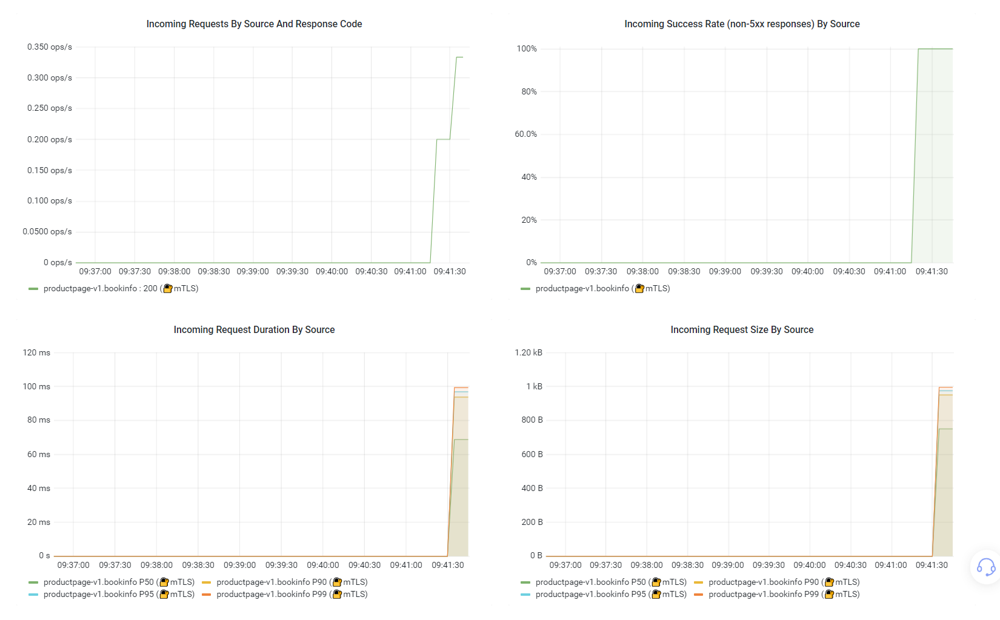
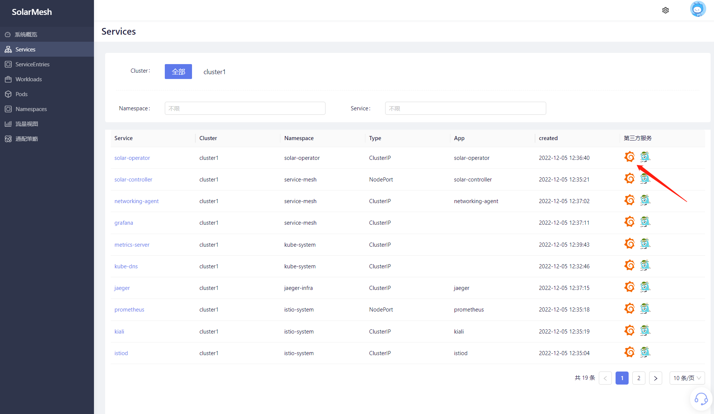
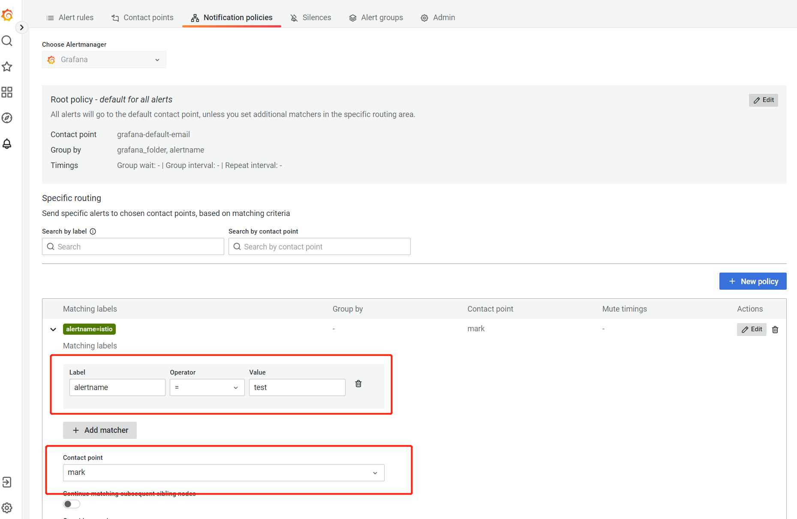

`grafana` is an open source timing statistics and monitoring platform that provides rich observability dashboards and supports many data sources such as prometheus, elasticsearch, graphite, influxdb, etc.

The core business of SolarMesh is traffic monitoring between cloud services. Grafana can provide SolarMesh with a rich dashboard. With the help of traffic data provided by SolarMesh, it can intuitively display the traffic status of the current service.

## Install grafana

Install grafana using solarctl
```bash
solarctl install grafana --name <cluster name: cluster01>
```
After successful installation, the grafana server will be installed in the cluster. The default namespace is service-mesh.

```bash
kubectl get deploy -n service-mesh
NAME READY UP-TO-DATE AVAILABLE AGE
grafana 1/1 1 1 13h
```

### Extension
By default, grafana uses the default istio indicator for dashboard display, which can meet most of the needs. like:



The figure shows the request PXX, request success rate, etc.

If you also need to display request_path and other content in the workload chart, you need to specify two parameters when installing grafana:

- `--extra-metric`: Whether it is necessary to display additional request_method and request_path. The default value is false, and the enable setting is true.
- `--istio-version`: The version of istio in the cluster, in the format of x.xx

as follows:

```shell
solarctl install grafana --name cluster1 --extra-metric=true --istio-version 1.11
```

In addition, you also need to modify the configuration of istio configmap:

```shell
meshConfig:
     defaultConfig:
       extraStatTags:
         - request_path
         - request_method
```

Then restart istiod and restart your business workload. After completing these tasks, you can see the following graph in the workload details, which shows the current request time and request size TOP3 interface diagram.


### Use grafana for alerting

The alarm function provides the alarm function of istio monitoring indicators. Users can set alarm rules for monitoring indicators. When the monitoring indicators trigger the alarm conditions set by the user, the user can be notified via email, alertmanager, webhook, etc., allowing users to learn about the cloud at the first time. If a service exception occurs, handle the fault quickly to avoid business losses due to resource problems.

#### Alarm configuration

The alarm entry of grafana is in the `Service List` interface. Click on the grafana icon. Click `alerting` in the left column and click new alert rule.



Select the metrics you want to alert, set your alert rules, and create recipients



When the alarm is first triggered, you can see that the status of the alarm rule is Firing.


Check your email. You have received the alert email.


#### other

##### 1. silence, etc.

The alarm function also supports functions such as silence. I won’t go into details here. For details, you can check [grafana](https://grafana.com/docs/grafana/latest/alerting/).

##### 2. Storage

By default, grafana installed by solarmesh does not mount storage volumes. When grafana is restarted, data will be lost. If you need data persistence, you need to create pvc by specifying `-v true` when installing grafana, which will mount a 1Gi storage volume for grafana by default.

```shell
solarctl install grafana -h
The grafana subcommand installs the grafana in the cluster.

Usage:
   solarctl install grafana [flags]

Flags:
   -c, --context string The name of the kubeconfig context to use
   -h, --help help for grafana
       --hub string grafana image (default "registry.cn-shenzhen.aliyuncs.com/solarmesh/grafana")
       --name string cluster name require
   -n, --namespace string grafana installation namespace (default "service-mesh")
   -p, --path string .kubeConfig path
   -v, --persistent grafana persistent installation
       --prometheus-namespace string prometheus namespace is exist namespace (default "istio-system")
   -t, --tag string grafana image tag (default "9.2.1")
       --watch-namespace string solar operator namespace (default "solar-operator")
```

##### Connect with other alarm systems

In most cases, your company may already have its own mature alarm system, and you may be more accustomed to using your own alarm function. If your alarm system is implemented based on [Prometheus](https://prometheus.io/), you can refer to the following content to configure istio-related alarm indicators, and then perform relevant alarms.

(1) Collection indicators

You can use servicemonitor and PodMonitor to collect metrics of istio control plane and data plane.

(2) Set istio-related alarm rules.
For standard alarm indicators, please refer to the description on the official website: https://istio.io/latest/docs/reference/config/metrics/

## Uninstall grafana

Uninstall grafana using solarctl

> For the installation of solarctl, see `Quick Start/Installation->Get solarctl`

```bash
solarctl uninstall cluster --name grafana
```
