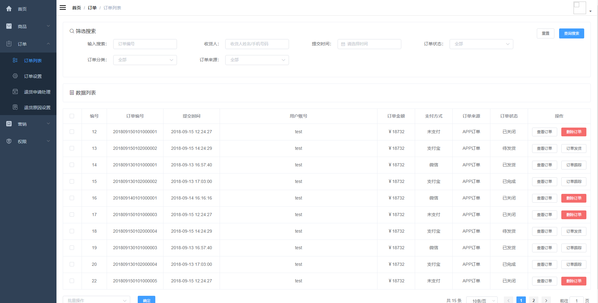
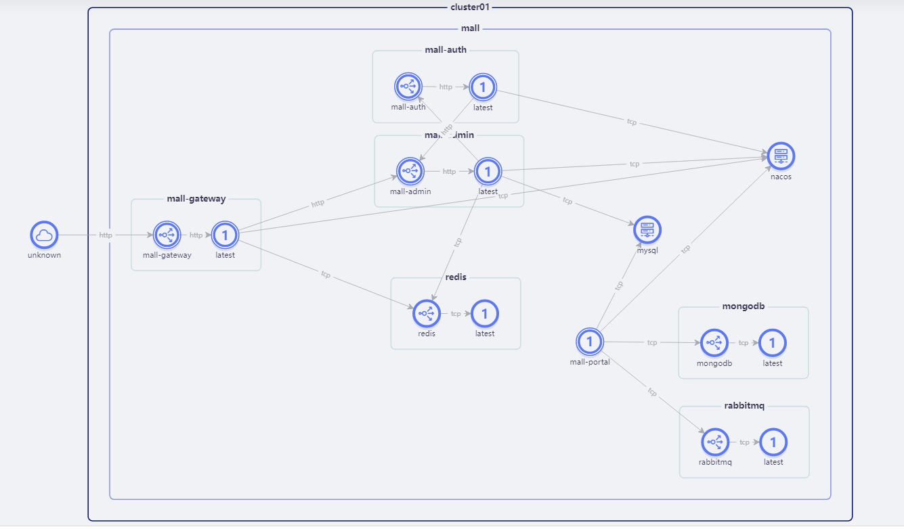

## Meaning

The SOA system represented by Spring Cloud generally relies on a component called the service registration center as the communication medium between microservices. In layman's terms, it is equivalent to a bulletin board, which records the IP addresses of all services. If any service needs When communicating with other services, take a look at the bulletin board and get the other party's IP before calling. This reflects an idea. For the bulletin board, it will consider each microservice to be fixed. If the microservice moves, it will have to go to the bulletin board to change the IP.

Kubernetes will consider the service instance to be free, and it may be scheduled to any node in the cluster. Kubernetes will provide a cloud resource called service to describe this group of service instances. When calling, there is no need to care about the other party being scheduled now. No matter where they go, you don't need to care which instance is scheduled, they will be considered to provide the same service to the client.

If the entire SOA system is forcibly migrated to Kubernetes, service instances may change frequently under Kubernetes scheduling, and registration and re-registration will continue to occur on the registration center, resulting in a very unstable service.

The existence of these problems requires a solution to balance the relationship between these SOA architecture applications and kubernetes.

To this end, SolarMesh has added support for registration centers. By hijacking traffic and acting as a proxy for the service registration center, the SOA architecture is seamlessly connected to Kubernetes, and you can enjoy the technical benefits brought by Kubernetes and the service grid without changing any code.

## use

To connect to the registration center in v1.10.1, you need to change the configuration of the `networking-agent` component in the business cluster and register the address of the registration center into the `networking-agent` component.

Example:

First edit the `configmap` resource of the `networking-agent` component

```bash
$ kubectl edit configmap -n service-mesh networking-agent -o yaml

apiVersion: v1
data:
   application.yaml: |-
     defaultConfig:
       rootNamespace: service-mesh
     configSources:
       - 10.10.13.110:8848 # Fill in the address of the registration center here. The configSources field is empty when installing directly.
kind: ConfigMap
metadata:
   annotations:
     kubectl.kubernetes.io/last-applied-configuration: |
       {"apiVersion":"v1","data":{"application.yaml":"defaultConfig:\n rootNamespace: service-mesh\nconfigSources:\n - 10.10.13.110:8849"},"kind":"ConfigMap ","metadata":{"annotations":{},"labels":{"app":"networking-agent","helm.sh/chart":"solar-1.5.2"},"name": "networking-agent","namespace":"service-mesh"}}
   creationTimestamp: "2021-12-02T06:38:52Z"
   labels:
     app: networking-agent
     helm.sh/chart: solar-1.5.2
   managedFields:
   - apiVersion: v1
     fieldsType: FieldsV1
     fieldsV1:
       f:data:
         .: {}
         f:application.yaml: {}
       f:metadata:
         f:annotations:
           .: {}
           f:kubectl.kubernetes.io/last-applied-configuration: {}
         f:labels:
           .: {}
           f:app: {}
           f:helm.sh/chart: {}
     manager: kubectl-client-side-apply
     operation: Update
     time: "2021-12-02T06:38:52Z"
   name: networking-agent
   namespace: service-mesh
   resourceVersion: "18784274"
   selfLink: /api/v1/namespaces/service-mesh/configmaps/networking-agent
   uid: a8611d47-6895-442d-8f82-94cd5fb83a7f
     pod name
```

Restart the `network-agent` component

```bash
kubectl rollout restart deploy/networking-agent -n service-mesh
```

After the restart is completed, the `networking-agent` component will gain support for the configured registration center. The interface traffic of the injected sidecar service accessing the registration center will be hijacked to the `networking-agent` component for enhancement.

## Try it

### Sample project

This demonstration uses a typical e-commerce project [mall-swarm](https://github.com/macrozheng/mall-swarm)

mall-swarm is a microservice mall system that uses core technologies such as Spring Cloud Hoxton & Alibaba, Spring Boot 2.3, Oauth2, MyBatis, Docker, Elasticsearch, and Kubernetes. It also provides a Vue-based management backend to facilitate and quickly build the system. Mall-swarm integrates system functions such as registration center, configuration center, monitoring center, and gateway on the basis of e-commerce business.

Since mall-swarm has many dependencies and is troublesome to deploy, we made a k8s deployment yaml for all the middleware of mall-swarm, so that all middleware can be deployed in the cluster to facilitate testing. After the transformation, the source code is open source in [mall-swarm- istio](https://github.com/solarmesh-cn/mall-swarm-istio), so we use the modified version of mall-swarm this time.

### Preconditions

* k8s cluster
* Install SolarMesh v1.10.1 and above
* Deploy nacos and configure the network-agent component (nacos can be deployed inside or outside the cluster)

### Instructions

### Create namespace

```bash
kubectl create ns mall
```

#### clone warehouse

```bash

git clone https://github.com/solarmesh-cn/mall-swarm-istio.git

cd mall-swarm-istio

```

### Deploy infrastructure

```bash
kubectl apply -n mall -f mall-swarm/document/k8s/infra
```

### Import sql

Connect to mysql on the cluster nodeport 33066 port and import the sql file below mall-swarm/document/sql

### Deploy mall-swarm

```bash
kubectl apply -n mall -f mall-swarm/document/k8s/service
```

### Access sidecar

Connect the `gateway`, `mall-admin`, `mall-auth`, `mall-portal`, `mall-monitor`, `mall-search` services to the sidecar. Here you can use the `manual access` function of SolarMesh , find the corresponding `workload` and access it.


### Visit page

Deploy mall-admin-web

> Note: config/prod.env.js is configured to the gateway service in the cluster

Just visit the mall-admin-web page



### Traffic view

Try to visit more times on the page to let the mall generate more traffic.

View the traffic view at this time. SolarMesh has completely monitored the traffic topology of the entire project.


