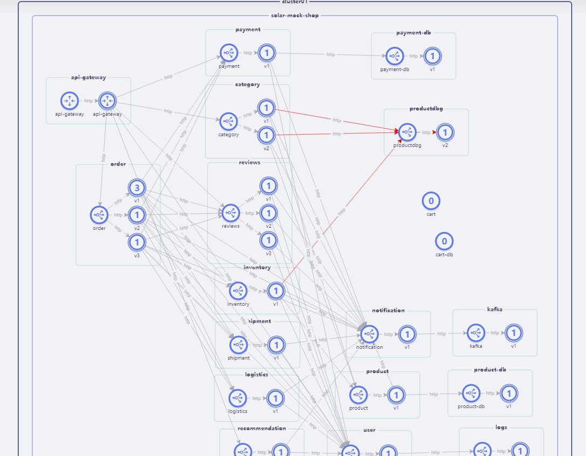
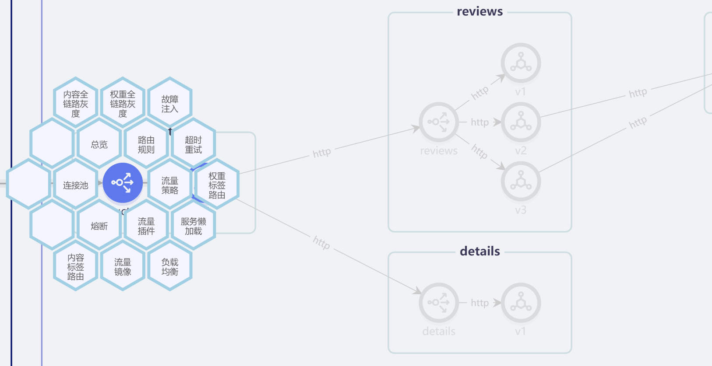
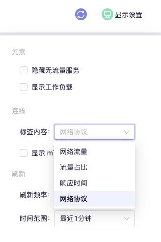

SolarMesh provides `traffic graph` to reflect the observability of services, and can set a variety of traffic policies while observing.

The `Traffic Graph` page of the SolarMesh web interface displays the topology of services and workloads within the grid, and displays it through real-time network traffic, latency, throughput, etc.

The traffic graph is almost entirely based on istio's standard metrics: standard metrics received from Prometheus and obtained via Kubernetes information.

The traffic page is used as a starting point for diagnosing issues within the grid. SolarMesh integrates with Grafana and Jaeger to provide easy access to deep monitoring and distributed tracing of various services.

The nodes in the diagram are services or workloads, and the arrows represent network connections between different services. This is based on Istio metrics retrieved from Prometheus. This graph serves as a visual monitoring tool as it shows various errors and metrics in the system.

---

## Traffic strategy

SolarMesh provides configurations that are not limited to grayscale publishing, fault injection, timeout retry, circuit breaker current limiting, rbac and other traffic policies. They are all integrated in the traffic graph. Users can achieve their goals with very little learning cost.

The following are the traffic policies currently supported by SolarMesh:

## resource

Click on an icon on the left to display the legend so you can better understand what the icons mean in the diagram. The traffic graph can display resources at the following levels: clusters, namespaces, applications, services, workloads, etc.

---

## display setting

You can select and configure what the graph displays and how often the data is updated.

---

## Namespaces

Displays data only for the selected namespace.

---

## Edge label

Labels on the edge of the traffic graph display various real-time information about traffic between services. You can display the following information: network traffic, traffic proportion, response time, network protocol, and whether to use mTLS.

​
