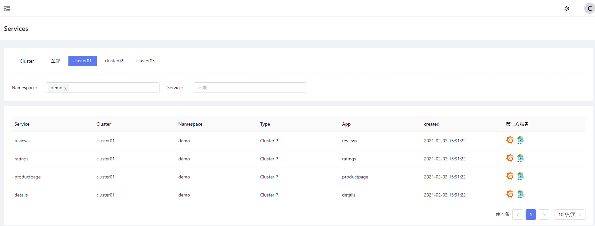

`jaeger` is a distributed tracking system inspired by Dapper and Zipkin developed by Uber. It complies with the [opentracing](https://opentracing.io/) specification and is a distributed link tracking solution.

SolarMesh's core business is traffic monitoring between cloud services. Jaeger can enhance SolarMesh's observation capabilities in a certain traffic request scenario, which has positive significance for the scheduling of internal service interfaces, problem analysis, and performance optimization.

In SolarMesh, jaeger enhances the following functions

* Distributed tracing information delivery
* Distributed transaction monitoring
* problem analysis
* Service dependency analysis
* Performance optimization

## Install jaeger

Install jaeger using solarctl

```bash
solarctl install jaeger --name <cluster name: cluster01>
```
After successful installation, the jaeger server will be installed in the cluster. The default namespace is service-mesh. It is recommended to use `jaeger.service-mesh:6831` to send `span` data

```bash
$ kubectl get svc -n service-mesh
NAME TYPE CLUSTER-IP EXTERNAL-IP PORT(S) AGE
jaeger ClusterIP 10.96.74.5 <none> 5775/UDP,6831/UDP,6832/UDP,5778/TCP,16686/TCP,14268/TCP,14250/TCP,9411/TCP 65s
```

|Port|Protocol|Component|Function|
|-|-|-|-|
|5775|UDP|agent|accept zipkin.thrift over compact thrift protocol (deprecated, used by legacy clients only)|
|6831|UDP|agent|accept jaeger.thrift over compact thrift protocol|
|6832|UDP|agent|accept jaeger.thrift over binary thrift protocol
|5778|HTTP|agent|serve configs
|16686|HTTP|query|serve frontend
|14268|HTTP|collector|accept jaeger.thrift directly from clients
|14250|HTTP|collector|accept model.proto
|9411|HTTP|collector|Zipkin compatible endpoint (optional)

### Use jaeger to enhance solarmesh

After SolarMesh installs jaeger, the jaeger icon will appear in the add-on component on the `Service List` page.



Click the jaeger icon to access the jaeger interface of the corresponding service. Here we click the jaeger icon of the reviews service.


