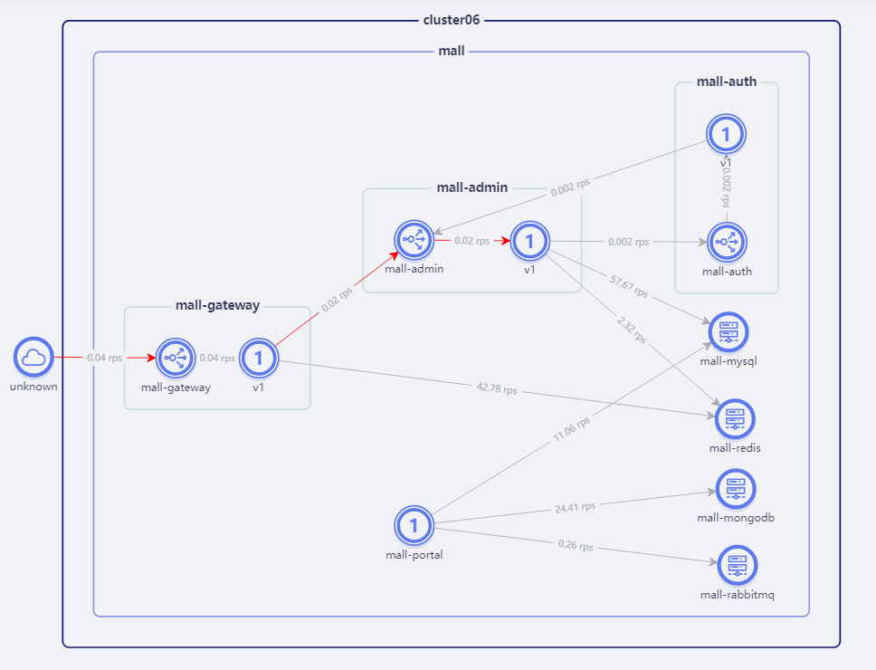

Istio is implemented based on kubernetes, so it is strongly coupled with kubernetes. The fundamental scenario of its use is to manage microservices on the cloud. However, in most actual scenarios, products are deployed on virtual machines or physical machines, for which istio is actually not applicable. In the cloud scenario, there are also basic components installed on vm (virtual machine or physical machine). The microservices on the cloud need to use the microservices on the vm. In this case, the vm needs to be added to the istio mesh.

Regarding how to add microservices on vm to istio mesh, this article will not describe too much. You can check the official website’s description of this part https://istio.io/latest/docs/setup/install/virtual-machine/

This document mainly introduces how to use a virtual machine that has been connected to istio.

## Declare virtual machine application

After connecting to the virtual machine, we need to declare the applications running on the virtual machine so that services in the cluster can access the applications on the virtual machine.

Create a `ServiceEntry` on the SolarMesh page to point to an application on the virtual machine. `hosts` configures the domain name for accessing the virtual machine application, `endpoints` configures the ip of the virtual machine, and `ports` configures the port of the application on the virtual machine, similar to As shown in the figure below

## Access virtual machine applications

When `ServiceEntry` is created successfully, services in the cluster can access virtual machine applications through `hosts`

> ⚠️Remember to turn off the firewall on the virtual machine before accessing, or open the corresponding port of the application on the firewall so that the request can be accessed smoothly.

The following figure is a traffic view of an e-commerce project `mall-swarm` deployed in solarmesh. The infrastructure `mysql`, `redis`, and `mongodb` are deployed in virtual machines, and business services are deployed in clusters.

