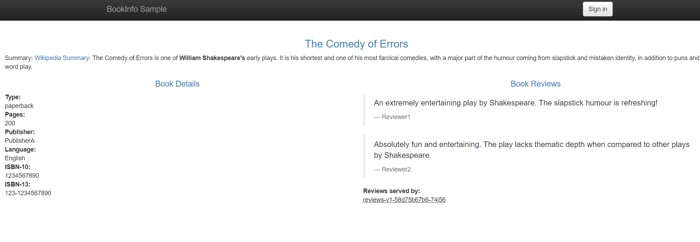
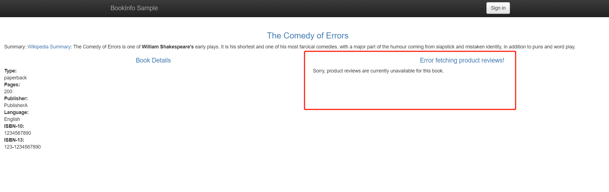
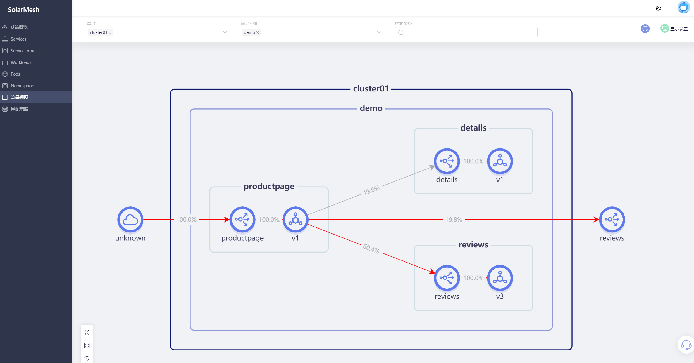

Fault injection is a system testing method that involves deliberately introducing network faults and errors into the system. It can be used to test for flaws in a design or configuration and ensure that the system can handle failures and recover from errors.

Through solarmesh, faults can be easily injected into the page to test the fault tolerance of the service. You can configure arbitrary HTTP fault codes and inject them into the target service taken over by solarmesh. After the configuration takes effect, your HTTP request to the target service will return the set fault code.

## Try it

> Assume that we have deployed the bookinfo sample project and connected sidecar to the service of the bookinfo sample project.

Visit the page of our pre-deployed sample project bookinfo and refresh it several times. You will find that without any strategic intervention, the Book Reviews column in the page presents three states: red star, black star and no star. The probability of occurrence is approximately 1:1:1.

We configure a delayed failure for the reviews service.

Visit the sample productpage page again. We can find that the fault has occurred and the reviews service has started to report errors.

Now enter SolarMesh's traffic view interface, and you can see such a traffic topology map. Since the request has been injected with a delay error, you can see that the reviews traffic line visited by the productpage is red.

