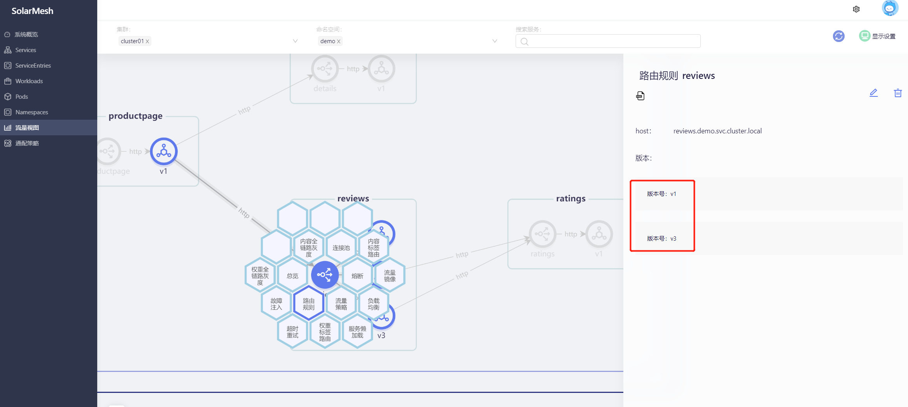

Traffic Mirroring is a feature that sends a copy of live traffic to a mirroring service, which can be used to test new versions of a service with real traffic before rolling it out to users with minimal risk, or for monitoring and auditing the traffic of an existing service.

Through solarmesh, traffic mirroring can be easily configured on the page. Select the service connected to the sidecar as the source service and configure its traffic to be mirrored to the target service. After the configuration takes effect, your HTTP requests to the source service will send a copy of the traffic to the target service.

## Try it

> Assume that we have deployed the bookinfo sample project (see `Quick Start/Installation/Use solarctl to install the sample project`) and connected the sidecar to the service of the bookinfo sample project (see `Quick Start/Take over the service`)

Visit the productpage of our pre-deployed sample project bookinfo and refresh it several times. You will find that without any strategic intervention, the Book Reviews column in the page presents three states: red star, black star and no star. The probability of occurrence is approximately 1:1:1.

We set up traffic mirroring for the v1 version of reviews and mirror its traffic to the v3 version.

First we set up target rules for reviews, defining v1 and v3 versions.

Then set a traffic mirroring policy for it.

Visit the productpage of the sample project bookinfo again. No matter how we refresh it, the result is that the Book Reviews column in the page will only show no stars. This shows that the mirrored traffic will not affect the normal operation of the original traffic.

Then view the traffic view:

We will find that there is traffic from the v3 version to the ratings service, which is actually the mirror traffic of the v1 version.
