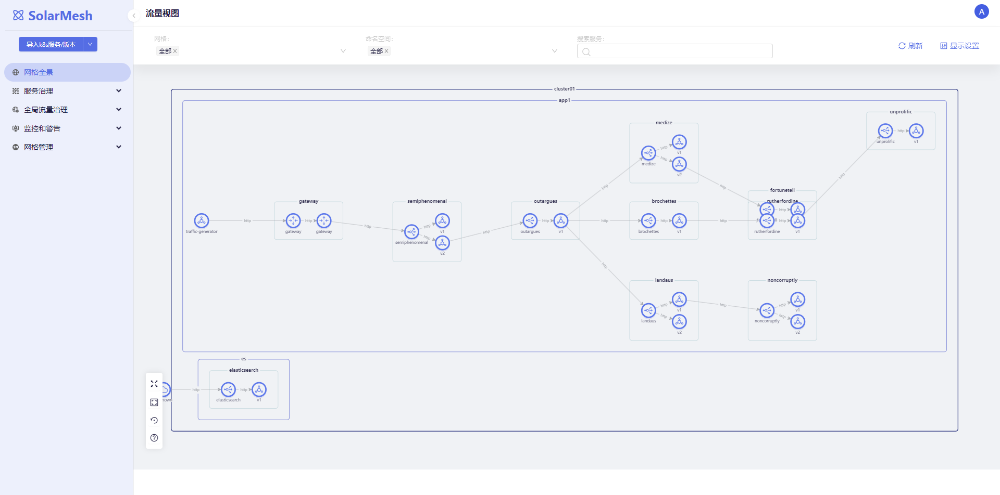

## Preconditions

### Environment configuration

Before installing SolarMesh, review the following environmental requirements:

1. Prepare a Kubernetes environment of version 1.21 and above to ensure that you can access the external network, ensure that images can be pulled normally, and that there are certain computing resources to run more applications.
2. Prepare kubectl and helm tools

### Download the installation package

The installation package includes command line tools and helm charts packages.
```shell
# download
wget http://release.solarmesh.cn/solar/v1.13/solar-v1.13.2-linux-amd64.tar.gz
# Unzip
tar -xvf solar-v1.13.2-linux-amd64.tar.gz
# empower
export PATH=$PATH:$PWD/solar/bin/
chmod +x $PWD/solar/bin/solarctl
```

Confirm version:
```shell
$ solarctl version
solarctl version: v1.13.2
```

## Install SolarMesh

### 1. Install SolarMesh dashboard
```bash
solarctl install solar-mesh
```

Check component status:
```shell
$ kubectl get po -A -w
NAMESPACE              NAME                                               READY   STATUS    RESTARTS   AGE
service-mesh           solar-controller-58fc49b759-hpdwd                  2/2     Running   0          102s
service-mesh           solar-controller-58fc49b759-kwtf5                  2/2     Running   0          103s
solar-operator         solar-operator-596d9b48dc-knr7w                    1/1     Running   0          32s
```

Configure login account: admin/admin
```shell
kubectl create secret generic admin --from-literal=username=admin --from-literal=password=admin -n service-mesh
kubectl label secret admin app=solar-controller -n service-mesh
```

### 2. Install SolarMesh backend

#### 1. Controller
```shell
export ISTIOD_REMOTE_EP=$(kubectl get nodes|awk '{print $1}' |awk 'NR==2'|xargs -n 1 kubectl get nodes -o jsonpath='{.status.addresses[0].address}')
solarctl operator init --external-ip $ISTIOD_REMOTE_EP --eastwest-external-ip $ISTIOD_REMOTE_EP
```

#### 2. Backend service
```shell
kubectl apply -f - <<EOF
apiVersion: install.solar.io/v1alpha1
kind: SolarOperator
metadata:
   name: cluster01 #Specify the cluster name
   namespace: solar-operator
spec:
   profile: default
EOF
```

Check installation status:

```shell
$ kubectl get po -n service-mesh
NAMESPACE              NAME                                               READY   STATUS    RESTARTS   AGE
service-mesh           networking-agent-d79988595-58tbs                   3/3     Running   0          52s
service-mesh           networking-agent-d79988595-nzfg5                   3/3     Running   0          2m46s
$ kubectl get po -n solar-operator
solar-operator         solar-operator-78d69dc876-sl7rl                    1/1     Running   0          7m20
```

#### 3. Install Addons

##### Tracing and monitoring alarms
```shell
$ solarctl install grafana --name cluster01
$ solarctl install jaeger --name cluster01
```

Check installation status:

```shell
$ kubectl get po -n kube-shortcut-system
NAME                                               READY   STATUS    RESTARTS   AGE
kube-shortcut-controller-manager-67d5d59f6-hq7nd   2/2     Running   0          2m39s

$ kubectl get po -n service-mesh
NAME                                READY   STATUS    RESTARTS   AGE
grafana-5d5ff44cd6-8wdj9            1/1     Running   0          1m
jaeger-5447b6ddcc-z4ng7             1/1     Running   0          1m
```

### 3. Complete cluster initialization

Register cluster kubeConfig to solarmesh, and the address of kubeConfig cannot be 127.0.0.1
```shell
solarctl register --kube-config $HOME/.kube/config --name cluster01
```

#### 4. Installation verification

To access the solarmesh dashboard, use the following command to obtain the entry:
```shell
$ kubectl get svc -n service-mesh -l app=solar-controller
NAME               TYPE        CLUSTER-IP      EXTERNAL-IP   PORT(S)    AGE
solar-controller   ClusterIP   10.96.202.179   <none>        8080/TCP   28m
```
access:



## High availability and horizontal expansion

### Improve usability

By default, SolarMesh installs two copies of the solar-controller and networking-agent components, which can generally meet higher load requests.

Generally speaking, the more replicas a component service has, the higher the corresponding available fault tolerance. If you have high availability requirements, you can continue to increase the number of replicas to enhance fault tolerance.

### Highly available deployment
If you are proficient in the installation and configuration of istio multi-cluster and need solar-controller to support multi-cluster level high availability, our solar-controller can be deployed in istio multi-cluster form. This is our final form of SolarMesh high-availability deployment.

In order to successfully deploy high availability, you need to follow the instructions below.

1. First, you must prepare an istio multi-cluster. The deployment mode is [multi-primary](https://istio.io/latest/docs/setup/install/multicluster/multi-primary/) .

2. Execute the installation of the SolarMesh management cluster in the two clusters deployed by Istio (assumed to be named cluster1 and cluster2).

3. Configure Istio's Gateway and VirtualService resources in the cluster1 and cluster2 clusters deployed by Istio so that traffic can access the solar-controller component through the domain name configured on the gateway. When you access SolarMesh later, you will use the domain name you configured now.

The following configuration of cluster1: You must ensure that your domain name is accessible

```shell
apiVersion: networking.istio.io/v1alpha3
Kind: Gateway
metadata:
   name: gw
   namespace: service-mesh
spec:
   selector:
     istio: ingressgateway
   servers:
   - port:
       number: 80
       name: http
       protocol: HTTP
     hosts:
     - "web1.solarmesh.cn"

---
apiVersion: networking.istio.io/v1alpha3
kind: VirtualService
metadata:
   name: vs
   namespace: service-mesh
spec:
   hosts:
   - "*"
   gateways:
   -gw
   http:
   - route:
     -destination:
         host: solar-controller
         port:
           number: 8080
```

4. Test. You visit web1.solarmesh.cn and then view the logs of the pods corresponding to the solar-controllers in the two clusters. When you see that the logs are generated by polling, it means that the SolarMesh management cluster has been successfully deployed with high availability.

5. Install SolarMesh’s backend service

6. Complete cluster initialization and register cluster kubeConfig to solarmesh. Note that you need to execute the command to register the business cluster in both cluster1 and cluster2 installed by Istio.

7. Others. In the high-availability deployment mode, the wildcard policy in the SolarMesh function is not yet highly available. You need to configure the corresponding policy in both Istio cluster1 and cluster2.


## learn more

Click on the link below to learn more about SolarMesh related features:

- [Canary Release](/docs/v1.13.x/tutorials/canary/)
- [Local rateLimit](/docs/v1.13.x/tutorials/ratelimit/)
- [Black and White List](/docs/v1.13.x/tutorials/ap/)
- [Traffic Plugin](/docs/v1.13.x/tutorials/mirror/)
- [Fault Injection](/docs/v1.13.x/tutorials/fault/)
- [Traffic Mirror](/docs/v1.13.x/tutorials/mirror/)

