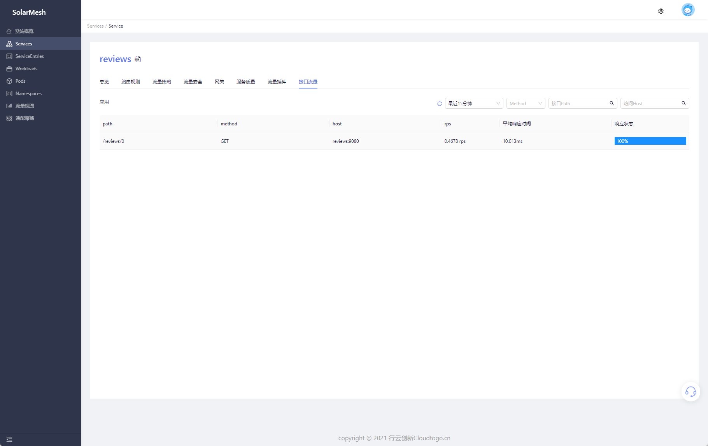

In microservice architecture, fault location has always been a troublesome task. Although Istio's data collection can monitor abnormal status between services and effectively reduce the cost of finding faults, technicians still need to use logs and other means to accurately locate them.

In order to further accelerate the accuracy of fault location, SolarMesh provides interface-level traffic monitoring based on Istio's data collection. When abnormal traffic occurs, SolarMesh can directly locate the interface information, helping technicians to locate the root cause of the fault faster and more accurately.

## Try it

### Prerequisites

1. Elasticsearch needs to exist in the cluster as a data implementation.

> ⚠ If Elasticsearch does not exist in the cluster, you can refer to the ES official helm library for installation https://github.com/elastic/helm-charts

### Enable function

SolarMesh will collect interface data and push it to the designated Elasticsearch for storage. Please refer to the following command to configure the access address of Elasticsearch.

```bash
$ kubectl edit cm -n service-mesh grpc-logging

apiVersion: v1
data:
   application.yaml: |-
     ds_driver: Elastic
     url: http://elasticsearch.service-mesh:9200 # Configure the ES access address
     username: elasticsearch # Username, leave it blank if ES does not require username and password for access.
     passworld: elasticsearch # Password, leave it blank if ES does not require username and password for access.
kind: ConfigMap
metadata:
   annotations:
     kubectl.kubernetes.io/last-applied-configuration: |
       {"apiVersion":"v1","data":{"application.yaml":"ds_driver: Elastic\nurl: http://elasticsearch:9200"},"kind":"ConfigMap","metadata":{ "annotations":{},"labels":{"app":"grpc-logging","helm.sh/chart":"solar-1.10.2"},"name":"grpc-logging"," namespace":"service-mesh"}}
   creationTimestamp: "2022-01-24T04:58:38Z"
   labels:
     app: grpc-logging
     helm.sh/chart: solar-1.10.2
   managedFields:
   - apiVersion: v1
     fieldsType: FieldsV1
     fieldsV1:
       f:data:
         .: {}
         f:application.yaml: {}
       f:metadata:
         f:annotations:
           .: {}
           f:kubectl.kubernetes.io/last-applied-configuration: {}
         f:labels:
           .: {}
           f:app: {}
           f:helm.sh/chart: {}
     manager: solar-operator
     operation: Update
     time: "2022-01-24T04:58:38Z"
   name: grpc-logging
   namespace: service-mesh
   resourceVersion: "34996566"
   selfLink: /api/v1/namespaces/service-mesh/configmaps/grpc-logging
   uid: 130c0dab-ccc6-4b26-bc3f-6e7707c1943a

```

Restart the `network-agent` component

```bash
kubectl rollout restart deploy/networking-agent -n service-mesh
```

### Page display

After the collected data is correctly pushed to Elasticsearch, the service interface information can be displayed on the SolarMesh page.
Visit the `Services` page to find the corresponding service.

Go to the service details page and click Interface Traffic. The page will collect all interface traffic of the current application for combined display. On the page, you can get the average response time of the current interface, RPS, and the response error ratio within this period of time.



Click on an interface under a certain path, and the page will display all access status of the current interface during this period, including each response time, response code, and which version of the request was returned.


