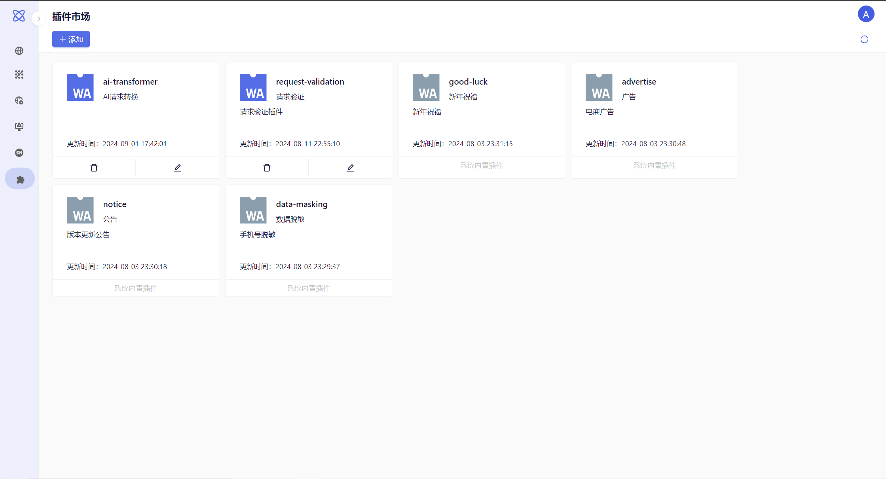
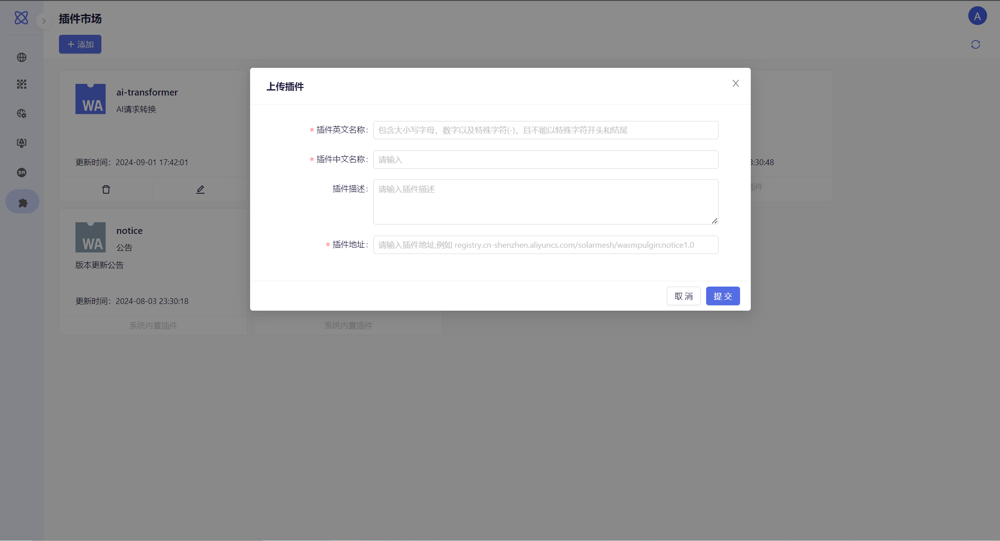
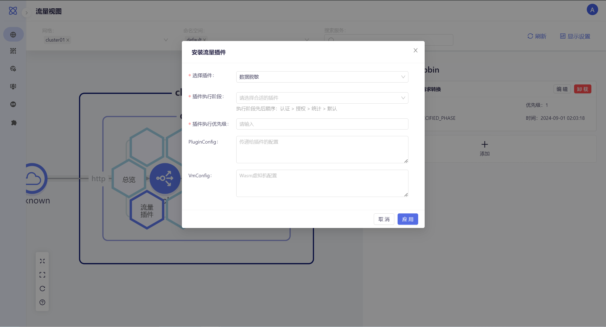
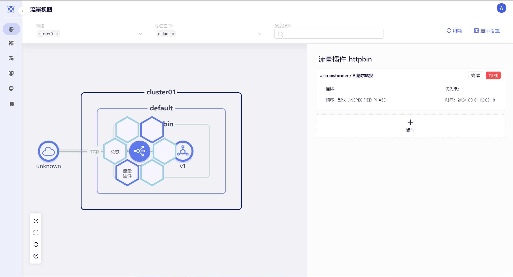
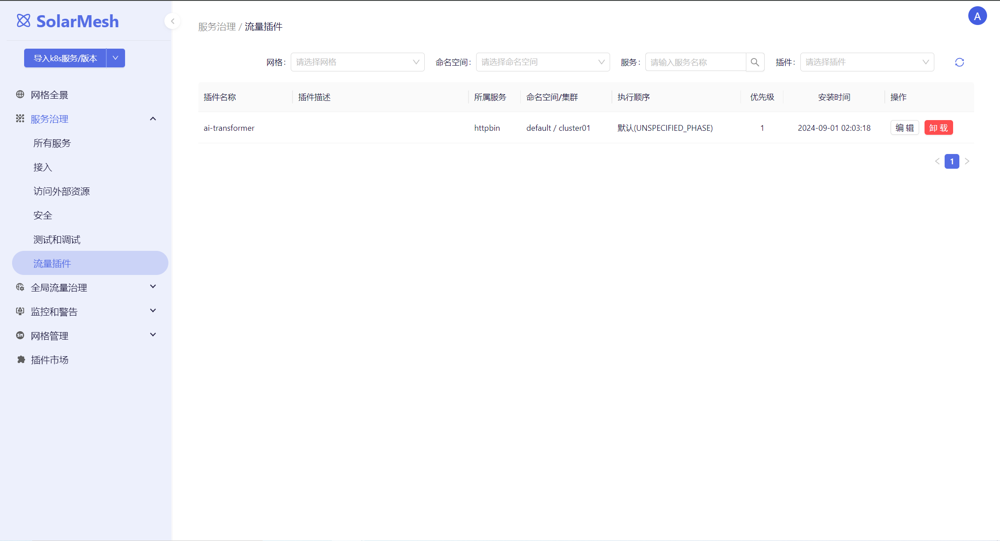

## WASM Plugins

Istio's WebAssembly (Wasm) plugin extension mechanism ensures memory safety through sandbox isolation, supports multiple programming languages, allowing developers to write plugins in their preferred language. These plugins allow for independent version management and upgrades, enabling updates without affecting the existing system. Additionally, traffic-agnostic hot updates ensure that deployments do not disrupt existing connections. These powerful features help build more flexible and secure application networks, making Istio a versatile tool for modern microservice architectures.

## SolarMesh Plugin Marketplace

The SolarMesh Plugin Marketplace is a specialized platform designed to simplify the introduction of Istio WebAssembly (Wasm) plugins. It provides users with an easy-to-use interface for defining and managing Wasm plugins, including specifying the plugin's OCR address, name, and other important configurations. This platform significantly enhances user convenience and the overall flexibility of the system.

The core advantages of the SolarMesh Plugin Marketplace lie in its ease of use and professionalism. Users can easily introduce pre-developed Wasm plugins with simple configurations, without needing to delve into technical details. These plugins ensure memory safety through sandbox isolation, enhancing system stability and security. Moreover, the multi-language support allows users to choose suitable plugins without being limited to specific programming languages.

More importantly, the SolarMesh Plugin Marketplace seamlessly integrates with the Istio ecosystem, allowing users to fully leverage Istio's powerful features. Independent version management and traffic-agnostic hot updates ensure that plugins can be upgraded without affecting existing traffic, thus ensuring service continuity and reliability. Through this highly integrated and user-friendly plugin marketplace, SolarMesh not only simplifies the introduction of plugins but also provides strong support for building more flexible and secure application networks.

Currently, the plugin market includes the following plugins:

### Uploading Plugins

Users can also add their own developed plugins. Click "Add," enter the plugin's English name, Chinese name, description, and plugin URL.

Plugin URLs support the following types:

- Image URL (recommended): `oci://private-registry:5000/check-header:latest`
- File URL: `https://private-bucket/filters/openid.wasm`

### Applying Plugins

In the traffic view, click on the service and select the traffic plugin you need to apply, such as data masking.

When applying a plugin, you need to fill in the following parameters:

- Plugin Execution Stage: Determines where in the filter chain this WasmPlugin is to be injected. Execution stage order: Authentication > Authorization > Statistics > Default.
- Plugin Execution Priority: If there are multiple plugins, you may need to set priorities. Higher numbers indicate higher priority, ranging from 1 to 1000.
- PluginConfig: Plugin configuration, which can be referenced within the plugin.
- VmConfig: Plugin virtual machine configuration, typically environment variables.

After applying the plugin, you can see the installed plugin in the details.

### Traffic Plugins

In the traffic plugin list, you can see the installation status of plugins across the entire cluster.

