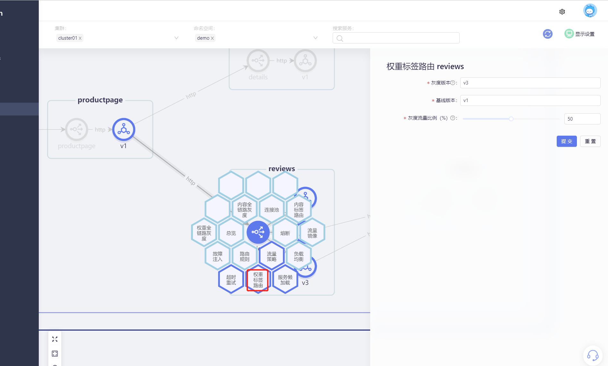
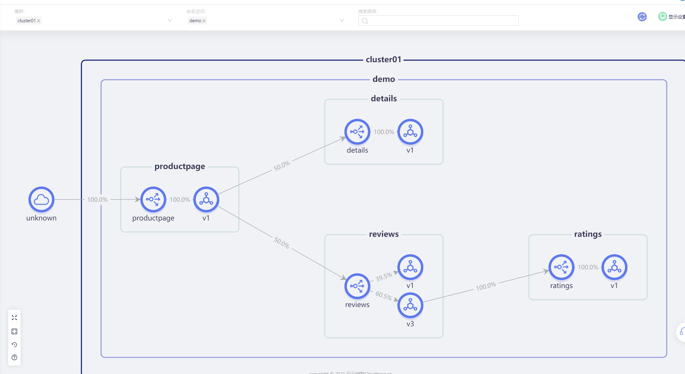

Canary release is a way to smooth the transition of version upgrades. When the version is upgraded, some users will use the new version, and other users will continue to use the old version. After the new version is stable, the scope will be gradually expanded to migrate all user traffic to the new version. Version comes up.
This can maximize the control of business risks caused by new version releases, reduce the impact of failures, and support rapid rollback.

SolarMesh supports grayscale publishing based on weight and content.

## Try it

> Assume that we have deployed the bookinfo sample project and connected sidecar to the service of the bookinfo sample project.

The process of using SolarMesh to configure weighted grayscale publishing for services is as follows.

Click on the specific service in "Traffic View" and select the "Weight Label Routing" function.

Just configure the grayscale version, baseline version, and grayscale version traffic ratio.

We set grayscale traffic for the v1 and v3 versions of the reviews service, with a ratio of 50%.

Then we visit the productpage interface. Our expectation is that its traffic will switch back and forth between the review-v1 instance and the review-v3 instance, and the traffic will be close to 50%.

Check the traffic view to see a clearer traffic situation:

