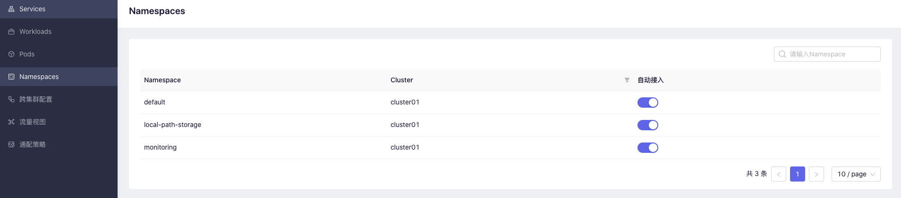
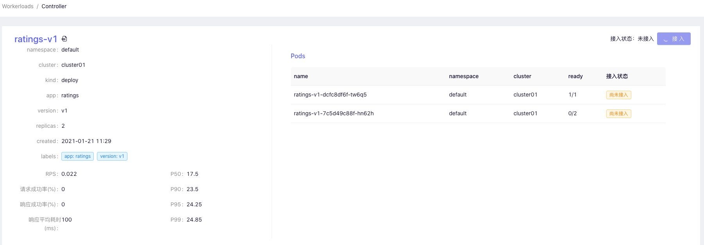
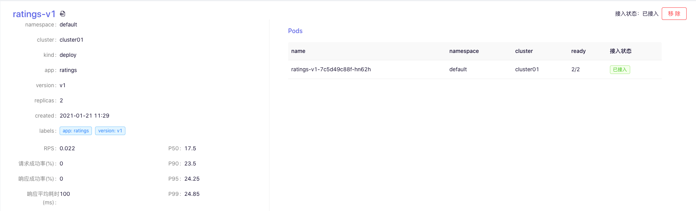

This chapter explains how to hand over the services in the cluster to SolarMesh to take over

In order to use all the features of the service mesh, Pods in `kubernetes` must be connected to the Istio Sidecar proxy.

The following sections describe two methods of injecting Istio sidecars into pods:

Manual injection: Access the Workload page through SolarMesh and inject the proxy configuration into it.

Automatic injection: Turn on the automatic access switch of SolarMesh on the Namespace page. Automatic injection will inject the agent configuration into all pods under the current Namespace and use the `admission controller` to inject the agent configuration when the Pod is created.

## Precautions

According to the SolarMesh specification, your resources need to make the following adjustments

* [workload](https://kubernetes.io/zh/docs/concepts/workloads/) and [pod](https://kubernetes.io/zh/docs/concepts/workloads/pods/) need to add `app ` and `version` tags.

```yaml
apiVersion: apps/v1
Kind: Deployment
metadata:
   name: details-v1
   labels:
     app: details # workload Add app label
     version: v1 # workload add version label
spec:
   replicas: 1
   selector:
     matchLabels:
       app: details
       version: v1
   template:
     metadata:
       labels:
         app: details # template Add app label
         version: v1 # template adds version label
     spec:
       serviceAccountName: bookinfo-details
       containers:
       - name: details
         image: docker.io/istio/examples-bookinfo-details-v1:1.15.0
         imagePullPolicy: IfNotPresent
         ports:
         - containerPort: 9080
```

List of supported protocols: https://istio.io/latest/docs/ops/configuration/traffic-management/protocol-selection/

## Automatic injection

Automatic injection uses the `mutating webhook admission controller` provided by kubernetes, which can automatically inject Sidecar into the applicable pod.

Note that unlike manual injection, automatic injection occurs at the container level. You won't see any changes to the deployment itself. You need to inspect the individual containers (via kubectl describe) to see the injected agents.

### Automatic injection on SolarMesh

Enter the Namespces page

Turn on namespace automatic injection.



You can see it after turning on the sidecar switch --> READY 2/2

```bash
kubectl get po -n demo
NAMESPACE           NAME                                          READY   STATUS                  RESTARTS   AGE
demo                details-v1-687cc78964-tpk2t                   2/2     Running   0          14d
demo                productpage-v1-8488bbdbfd-wddv5               2/2     Running   0          14d
demo                ratings-v1-8ddf6c6c-xtx8d                     2/2     Running   0          14d
demo                reviews-v1-f965c5c7c-tfx58                    2/2     Running   0          14d
demo                reviews-v2-86b699c6bf-k6vft                   2/2     Running   0          14d
demo                reviews-v3-85b6d84958-7xwc4                   2/2     Running   0          14d
```

---

## Manual injection

### Manual injection on SolarMesh

Find the workload you want to inject in the workloads list

Click to inject sidecar on the workload details page.

Accessing status:



Wait for READY 2/2 to appear on the dashboard page, which means the injection is successful.


