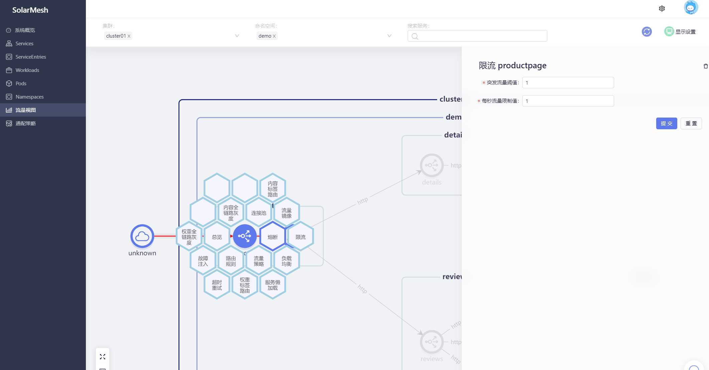
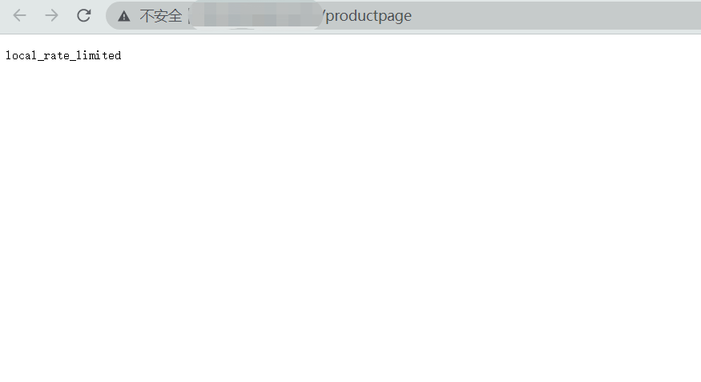

## The concept of current limiting
Throttling is a mechanism that limits the number of requests sent to the server. It specifies the maximum number of requests that the client can send to the server in a given period of time, usually expressed as the number of requests within a period of time, such as 300 requests per minute or 10 requests per second. The purpose of throttling is to prevent the service from being overloaded by global requests from the same client IP or from any client.

Taking the current limiting mechanism of 300 requests per minute as an example, if 301 requests are sent to the service, the current limiter will reject the 301st request. At the same time, the flow limiter will return a 429 HTTP status code (Too Many Requests) and reject the request before it reaches the service.

## Try it

> Assume that we have deployed the bookinfo sample project (see `Quick Start/Installation/Use solarctl to install the sample project`) and connected the sidecar to the service of the bookinfo sample project (see `Quick Start/Take over the service`)

Visit the page of our pre-deployed sample project bookinfo and refresh it several times. You will find that without any strategic intervention, the Book Reviews column in the page presents three states: red star, black star and no star. The probability of occurrence is approximately 1:1:1.


We configure the traffic limiting policy for the productpage.



After submission, when we visit productpage, we will find that errors occur from time to time.



When we access it through curl, the result will be clearer:

```shell
< HTTP/1.1 429 Too Many Requests
< x-local-rate-limit: true
< content-length: 18
< content-type: text/plain
< date: Sat, 06 May 2023 09:44:36 GMT
< server: istio-envoy
< x-envoy-decorator-operation: productpage.demo.svc.cluster.local:9080/*
<
```

``429 Too Many Requests``, indicating that the current limiting policy has taken effect.
