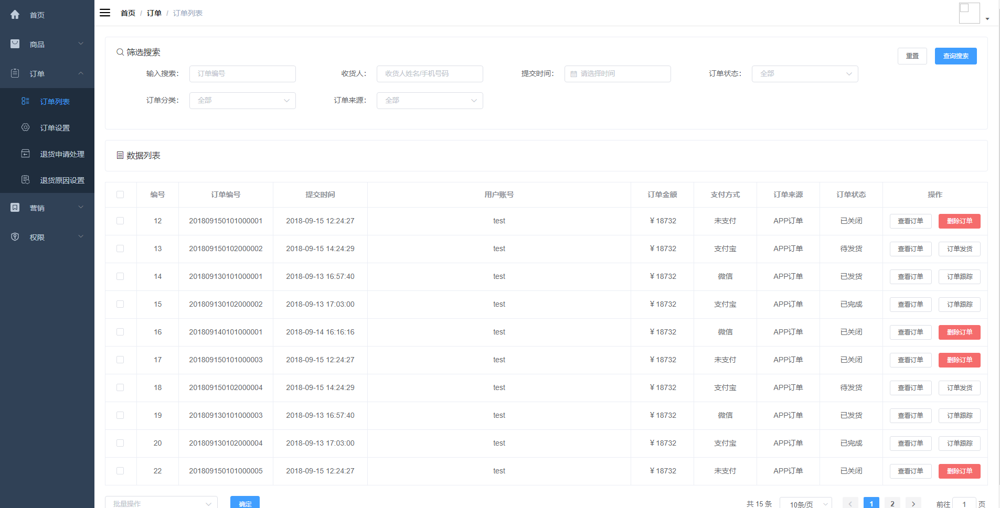
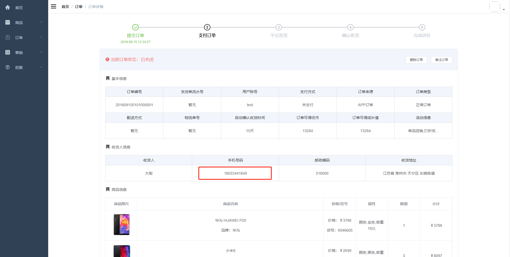
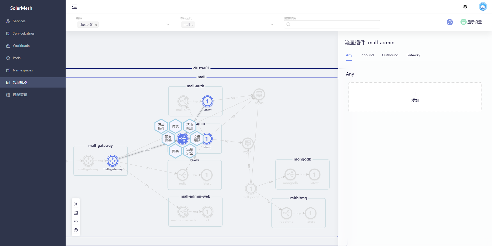

The traffic plug-in is a means of extending traffic. It allows developers to enhance the coding of the traffic flowing through the service during inbound and outbound operations, achieving AOP Aspect Oriented Programming (AOP) capabilities for business traffic. It can be applied to usage scenarios that have business demands on traffic, such as filtering sensitive business data, sending update notifications before the system needs to be shut down for updates, reporting data on specific core interfaces, etc.

The traffic plug-in is a further encapsulation of the [WASM](../tools/wasm.html) capability provided by SolarMesh. You can select a source service among the services connected to the sidecar and insert the filter into the service through the SolarMesh page.

## Preconditions

First, you need to declare the existing plug-in in the traffic plug-in library.

```bash
$ kubectl edit cm -n service-mesh mesher-config

apiVersion: v1
data:
   application.yml: |
     config:
       name: "mesher"
       version: "v1.0.0"
       istiod_name: "discovery"
       in_cluster: true
       ...
       wasmPlugins:
       - name: desensitize
         nickname: data desensitization
         description: Desensitize the data of all mobile phone numbers
         uri: http://release.solarmesh.cn/wasm/data-cleaning.wasm
         type: 0
       - name: notice
         nickname: notification announcement
         description: Version update announcement
         uri: http://release.solarmesh.cn/wasm/notice.wasm
         type: 0
```

Restart the `solar-controller` component and update the traffic plug-in library

```bash
kubectl rollout restart deploy/solar-controller -n service-mesh
```

## Try it

### Sample project

This demonstration uses a typical e-commerce project [mall-swarm](https://github.com/macrozheng/mall-swarm)

mall-swarm is a microservice mall system that uses core technologies such as Spring Cloud Hoxton & Alibaba, Spring Boot 2.3, Oauth2, MyBatis, Docker, Elasticsearch, and Kubernetes. It also provides a Vue-based management backend to facilitate and quickly build the system. Mall-swarm integrates system functions such as registration center, configuration center, monitoring center, and gateway on the basis of e-commerce business.

Since mall-swarm has many dependencies and is troublesome to deploy, we made a k8s deployment yaml for all the middleware of mall-swarm, so that all middleware can be deployed in the cluster to facilitate testing. After the transformation, the source code is open source in [mall-swarm- istio](https://github.com/solarmesh-cn/mall-swarm-istio), so we use the modified version of mall-swarm this time.

### Preconditions

* Deployed the mall-swarm-istio project in the k8s cluster
* The service is connected to the sidecar and access is normal



### need

In the mall-swarm-istio project, visit the `Homepage->Order->Order Details` page, and you can see that the mobile phone number exposed to the outside world is displayed on the page in clear text.



In some scenarios, displaying a real phone in clear text may pose some security risks. Therefore, we hope to encrypt the mobile phone number so that users cannot directly obtain the real mobile phone number on the order. In such a scenario, we can use the capabilities of the traffic plug-in to clean the data and encrypt sensitive information before responding to the front end.

### accomplish

Visit SolarMesh's traffic view page to view the traffic topology of the entire project.


Since the mobile phone number is the data returned from the `mall-admin` application, we only need to control the traffic of the `mall-admin` application so that its sensitive data cannot be responded to outside the application.

Select `mall-admin` to open the traffic plug-in sidebar.



Add a `data cleaning` traffic plug-in, which will clean all mobile phone numbers in the response data.

![Select data cleaning plug-in]../../images/Select data cleaning plug-in.png)

Save the `Data Cleaning` traffic plug-in so that the traffic plug-in will take effect on the application.


Visit the `Homepage->Order->Order Details` page again. Now the mobile phone number on this page is no longer displayed in plain text, but in an encrypted state.


