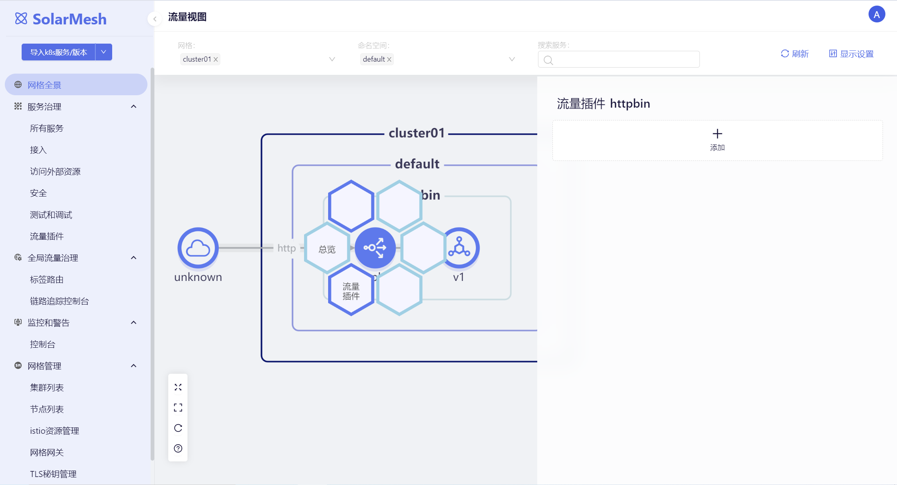
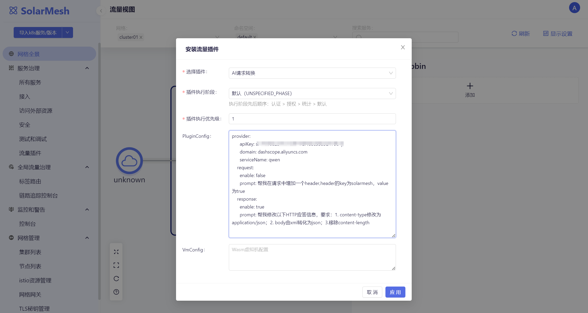
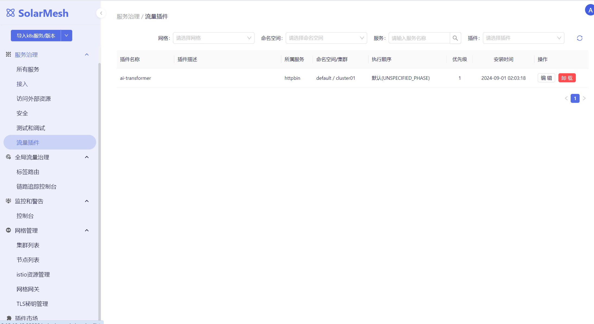
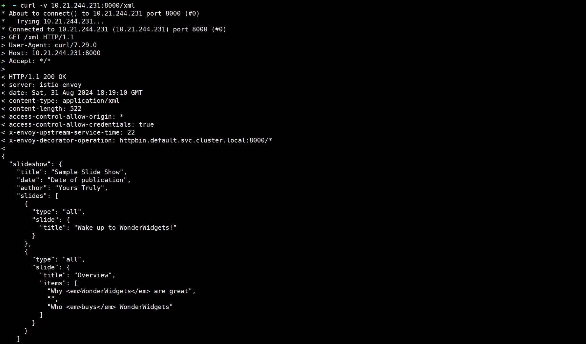
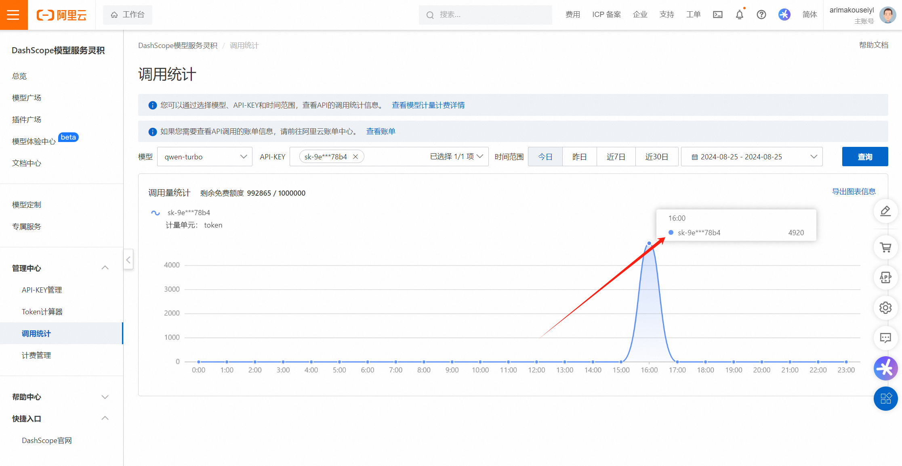
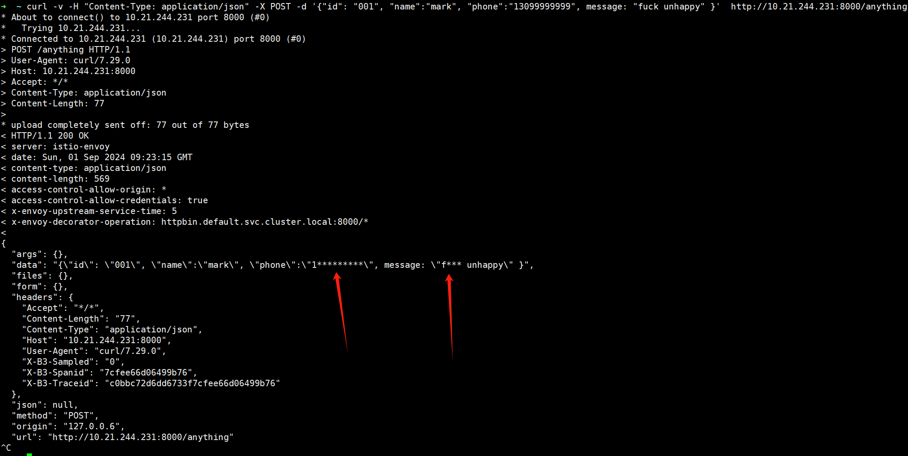

Artificial Intelligence (AI) is rapidly advancing, leading the way in the new era of digital transformation. From deep learning to big data analytics, the progress in AI has brought unprecedented opportunities across industries. It can process vast amounts of information efficiently and accurately, helping businesses and organizations make more precise decisions. In fields such as healthcare, education, and manufacturing, the application of AI has improved service quality and production efficiency, while also providing new tools for tackling complex societal challenges.

Embracing AI is not only an inevitable trend in technological development but also key to enhancing individual skills, boosting corporate competitiveness, and contributing to the overall well-being of society. Mastering the fundamentals of AI and leveraging its powerful capabilities are crucial for promoting personal career development and social progress. As AI technology continues to mature, building a smarter and more efficient living environment has become a real possibility.

SolarMesh has recently been actively embracing AI and has launched AI traffic plugins to help our users enhance their operational efficiency.

## AI插件

AI plugins, specifically known as AI WebAssembly (Wasm) plugins, represent a category of traffic plugins that combine the power of AI with the structure of Wasm to achieve intelligent traffic management through a plugin-based approach. Currently, SolarMesh has developed an AI traffic transformation plugin. Below is a detailed description of this plugin.
### AI-Transformer

The AI request/response transformation plugin allows users to adjust service request and response data using natural language without writing code. For instance, when testing a service interface, testers can use this plugin to automatically generate new requests/responses for boundary condition testing based on the original request/response. Large language models often consider more details, thus helping to uncover edge cases that might be overlooked in manual testing.

| Field                 | Data Type	    | Requirement 	  | Default Value	         | Description|
|-----------------------|----------|----------------|------------------------|-----------------------|
| model                 | 	string	 | Optional 	     | qwen-turbo	            | The name of the model                   |
| request.enable        | 	bool	   | Required	      | -	                     | Whether to enable transformation at request stage      |
| request.prompt        | 	string	 | Required	      | -	                     | Prompt used for request stage transformation  |
| response.enable       | string	  | Required	      | -	                     | Whether to enable transformation at response stage |
| response.prompt	      | string	  | Required	      | -	                     | Prompt used for response stage transformation |
| provider.serviceName	 | string	  | Optional	      | -	                     | Currently supports Qwen only             |
| provider.domain	      | string	  | Optional 	     | dashscope.aliyuncs.com | 	LLM service domain             |
| provider.apiKey	      | string	  | Required	      | -                      | 	API Key   |

配置示例：
```yaml
    provider:
      apiKey:
      domain: dashscope.aliyuncs.com
      serviceName: qwen
    request:
      enable: false
      prompt: Add a header to the request with the key 'solarmesh' and value 'true'
    response:
      enable: true
      prompt: "Modify the HTTP response as follows: 1. Change content-type to application/json; 2. Convert the body from XML to JSON; 3. Remove the content-length"
```

### Using AI-Transformer in SolarMesh

In the mesh panorama, select the service where you want to install the plugin, then click on Traffic Plugin.



Configure the "AI Request Transformation" plugin by setting the PluginConfig and saving it. The PluginConfig contains the content of the configuration example above, which will be configured into the wasm plugin.


After saving, we can return to the "Traffic Plugins" menu and observe that the httpbin service has installed the ai-transformer plugin.


Next, we access httpbin to validate whether our prompt takes effect.

Httpbin provides an XML interface that returns test data in XML format.


Now that we have installed the AI-Transformer plugin for httpbin, let's test the XML interface again.



We find that the originally XML-formatted response interface has now changed to JSON format, indicating that Qwen has helped us change the format.

We can also return to the Alibaba Cloud console to check the approximate API call records, although these records will show a significant delay before appearing.



### Advanced Usage

We can also utilize the AI-Transformer plugin to anonymize our business data, such as encrypting phone numbers and sensitive words. We can improve the rules as follows:
```yaml
    response:
      enable: true
      prompt: Modify the HTTP response to mask phone numbers and English profanity with asterisks
```

access：
```shell
curl -v -H "Content-Type: application/json" -X POST -d '{"id": "001", "name":"mark", "phone":"13099999999", message: "fuck unhappy" }'  http://10.21.244.231:8000/anything
```

result：


