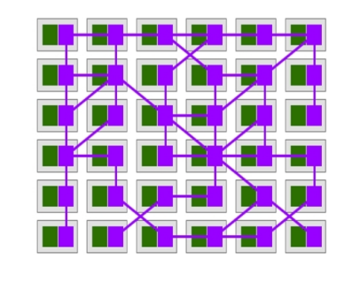
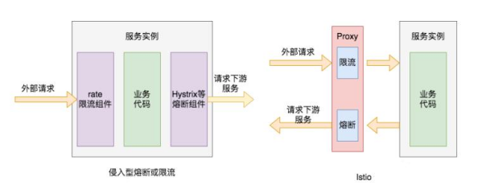
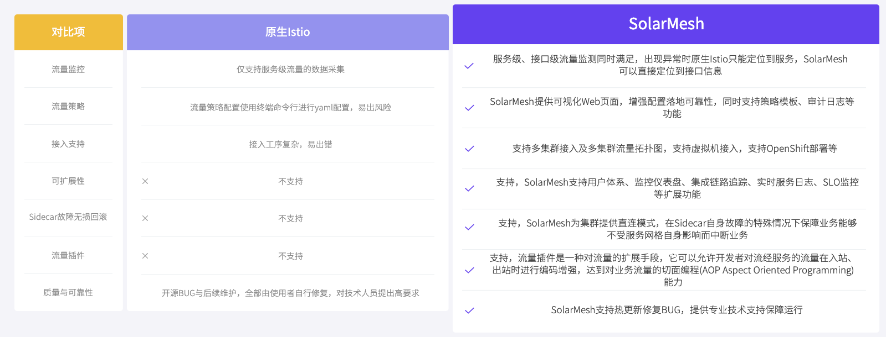

应用从单体架构向微服务架构演进的过程中，由于细粒度的微服务应用数量大幅增长，微服务之间的服务发现、负载均衡、熔断限流等需求显著提高。

在微服务架构下服务之间的调用链路相比单体应用时代更长，微服务化拆分带来系统整体能力提升的同时，也增加了服务间级联故障出现的概率。多个服务之间存在依赖调用，如果某个服务无法及时响应请求，故障向调用源头方向传播，可能引发集群的大规模级联故障，造成整个系统不可用。

为应对这种情况，可以引入熔断策略。为了防止故障范围的扩大，熔断的基本逻辑就是隔离故障。通过不断探测和周期性统计服务失败调用次数，如果服务的健康状况低于设定阈值则启动熔断，剔除错误服务实例。熔断机制虽然解决不了故障，但却能在故障发生时尽量保全非故障链路上的服务接口能被正常访问，将故障范围控制在局部。被熔断的服务也不会一直处于熔断状态，在熔断机制中还会执行故障恢复，探测到服务正常后关闭熔断。Istio支持较全面的故障检测，熔断开启和熔断恢复机制。

限流功能也是保护服务的重要手段，熔断的主要目的是隔离故障，而引起故障的原因除了系统服务内部的问题外，还有可能是请求量超过了系统处理能力的极限，后续新进入的请求会持续加重服务负载，导致资源耗尽发生服务出错。限流的目的就是拒绝过多的请求流量，保证服务整体负载处于合理水平。系统的吞吐量一般是可以被测算的，为了保证系统的稳定运行，一旦达到需要限制的阈值，就需要采取措施限制流量，比如延迟处理、拒绝处理，或者部分拒绝处理等。Istio支持基于服务连接数，请求排队数等设置限流，还支持经典的令牌限流模式，主动保护上游服务。

微服务架构带来开发运维模式巨大变革的同时，也引入了服务治理的诸多问题：一个应用由多个服务组成，每个服务有多个实例，每个实例的运行状态不断变化，这对服务间流量管理和服务治理功能提出了巨大需求。以Istio为代表的服务网格，通过接管服务发送和接收的所有流量，可以轻松承载微服务应用间的通信功能，通过控制平面下发服务治理配置，然后根据配置在各个服务之间的路由流量，提供熔断限流等故障处理策略。

### 熔断限流原理

如何将服务联通起来，是服务治理首先要解决的问题。通常的做法是将通讯层基础功能以SDK的形式嵌入业务代码中，但是这种强耦合的方案会增加开发的难度，增加维护成本，增加质量风险。另外对于SDK调用的代码多处冗余出现，从服务治理的角度来看，这样的方式侵入了业务，并且分散于应用，不利于微服务体系的整体管控。

通过将原来在SDK中的逻辑转移到Sidecar中，提供了另一种可行方案。Sidecar就是在应用节点上部署的代理进程，应用将请求发给代理，由代理完成路由转发。

从整体来看，代理间流量调用关系形成完整的网络，代表服务间复杂的调用关系，承载着系统内的应用通信。各个具体的微服务之间不再直接发生连接，而是转由各自的Sidecar代理通信实现，在应用形态上形成了一组由代理所组成的网状交互结构，这也是服务网格名称的由来。

的本质是将通用流量治理的功能沉淀至Sidecar中，由Sidecar接管服务流量并对其进行治理。可以通过流量劫持的手段，做到无代码侵入实现流量治理，让开发者更聚焦业务功能，降低微服务的代码复杂性，提高开发效率。通过将服务治理功能从应用本身剥离出来，做到了控制与逻辑的分离。Sidecar模式允许我们向应用无侵入添加多种功能，避免了为满足功能扩展需求而向应用添加额外的代码。

如下图右侧所示，当外部请求调用服务实例接口时，其发送的网络请求会经过它们各自的网络代理，那么代理就可以为其提供服务熔断相关的机制，当调用服务实例持续出错时，就不再将外部请求发送到服务实例，而是直接返回配置的错误码。同样，Proxy代理可以为其提供限流功能，当外部请求流量过大时，代理会对其中一部分请求进行限流，拒绝部分请求，只将部分请求转发下游服务。

将微服务治理逻辑从原先具体的微服务进程中抽离出来，实现由统一控制面管理和代理数据面执行的体系结构，是体系与Spring Cloude等传统微服务体系在架构上最大的区别。各种服务治理逻辑，也是在这样的架构模式下实现的。Service Mesh架构总体上由控制面(Control Plane)和数据面(Data Plane)两部分组成，其中控制面主要承担整个微服务体系治理信息的集中管控分发，而数据面的代理程序则负责具体执行由控制面下发的各类服务治理信息及规则。对于代理程序的部署问题，Istio中通过开启自动注入，在部署应用时可以把代理程序自动部署到用户应用相同的Pod下，用户无需担心代理程序的部署问题。

在Istio中，广义的熔断配置包括两部分：首先是基于请求容量限制的熔断，超过设定阈值的请求直接丢弃返回错误，直观更像限流配置。通过设置connectionPool连接线程池参数实现，该参数可以对上游服务的并发连接数和请求数进行限制（适用于TCP和HTTP），从而实现限流功能。其次是基于服务实例质量检测的服务熔断，这是通过隔离故障服务实例来减少整体服务异常率、降低服务延迟而采用的一种措施。具体来说，Istio引入了异常检测来完成熔断功能，如果在一定时间内服务实例累计发生错误的次数超过了预定义阀值，Istio就会将该错误的服务实例从负载均衡池移除。

异常检测原理：检测到了某个主机异常时，如果到目前为止负载均衡池中还没有主机被隔离出去，将会立即隔离该异常主机；如果已经有主机被隔离出去，就会检查当前隔离的主机数是否低于设定的阈值（通过Envoy中的 outlier_detection.max_ejection_percent 指定），如果当前被隔离的主机数量不超过该阈值，就将该主机隔离出去，否则不隔离。通常异常检测会与主动健康检查一起用于全面的健康检查解决方案，异常检测的类型主要包括连续的5XX响应，包括内部业务错误或连续网关故障。

隔离不是永久的，会有一个时间限制。当主机被隔离后，该主机就会被标记为不健康，除非负载均衡处于恐慌模式。隔离时间等于Envoy中的outlier_detection.base_ejection_time_ms的值乘以主机被隔离的次数。某个主机连续出现故障，会导致它被隔离的时间越来越长。经过了规定的隔离时间之后，被隔离的主机将会自动恢复过来，重新接受调用方的远程调用。被移除的实例在一段时间之后，还会被加回去进行再一次的尝试，成功的话实例被认为成功，否则实例会被重新逐出，这里的驱逐时间是一个基础时间乘以驱逐的次数。Istio中还可以控制驱逐比例，也就是说有多少比例的服务实例在不满足要求时被驱逐。当有太多实例被驱逐的时候，会进入恐慌模式，这时Istio会忽略负载均衡池上实例的健康标记，仍然向所有实例发送请求，从而保证一个服务的整体可用性。

Istio中熔断在DestinationRule的CRD资源的TrafficPolicy中设置，通过设置连接池connectionPool实现限流熔断，设置异常检测outlierDetection实现服务实例隔离熔断。

ConnectionPool下有TCP和HTTP两个类别的配置，二者相互协作，为服务提供有关限流的配置。TCP相关的基础配置有maxConnections和connectTimeout。maxConnections表示到目标服务最大的HTTP1/TCP连接数量，它只会限制基于HTTP1.1协议的连接，不会影响基于HTTP2的连接，因为HTTP2协议只建立一次连接。connectTimeout表示建立TCP连接时的超时时间，默认单位是秒，超出该时间，则连接会被自动断开。HTTP下的配置包括http1MaxPendingRequests、http2MaxRequests和maxRequestsPerConnection三种。http1MaxPendingRequests 表示HTTP请求处于pending状态下的最大请求数，也就是目标服务最多可以同时处理多少个HTTP请求，默认是1024个。http2MaxRequests表示目标服务最大的HTTP2请求数量，默认是1024。maxRequestsPerConnection表示每个TCP连接可以被多少个请求复用，如果将这一参数设置为 1，则会禁止keepalive特性。

OutlierDetection下相关的配置项涉及服务的熔断机制，具体有如下几个基础配置。consecutiveErrors表示如果目标服务连续返回多少次错误码后，会将目标服务从可用服务实例列表中剔除，也就是说进行熔断，不再请求目标服务。当通过HTTP请求访问服务，返回码为502、503或504时，Istio会将本次网络请求判断为发生错误。该属性配置的默认值是5，也就是说如果目标实例连续5个http请求都返回了5xx的错误码，则该服务实例会被剔除，不再接受客户端的网络请求。

Interval表示服务剔除的时间间隔，即在interval时间周期内发生1个consecutiveErrors错误，则触发服务熔断。其单位包括小时、分钟、秒和毫秒，默认值是10秒。baseEjectionTime表示目标服务被剔除后，至少要维持剔除状态多长时间。这段时间内，目标服务将保持拒绝访问状态。该时间会随着被剔除次数的增加而自动增加，时间为baseEjectionTime和驱逐次数的乘积。其单位包括小时、分钟、秒和毫秒，默认是30秒。maxEjectionPercent表示可用服务实例列表中实例被移除的最大百分比，默认是10%。当超出这个比率时，即使再次发生熔断，也不会将服务剔除，这样就避免了因为瞬时错误导致大多数服务实例都被剔除的问题。

minHealthPercent表示健康模式的最小百分比，也就是所有服务实例中健康（未被剔除）的比率。当低于这一比率时，整个集群被认为处于非健康状态，outlierDetection配置相关的服务剔除熔断机制将被关闭，不再进行服务健康检查，所有服务实例都可以被请求访问，包含健康和不健康的主机。该属性的默认值是50%，并且minHealthPercent和maxEjectionPercent的和一般都不超过100%。

除了熔断外，速率限制也是缓解级联故障和防止耗尽共享资源的一种简单有效的方法。Envoy是一个功能丰富的代理，通过配置Envoy过滤器可以为服务轻松添加速率限制的功能。上面介绍的熔断功能，有如下缺点：精确到实例级别，无法针对某个api限流熔断。在路由规则后起作用，服务端接收到超出配置的服务容量限制的请求后被动限流，没有做到流量分发之前主动限流。在Istio体系下，可通过EnvoyFilter这个配置来实现高级的限流需求。EnvoyFilter提供了三种方式进行扩展：编写C++扩展代码，Lua脚本扩展，WebAssembly扩展，实践中，Lua脚本方式使用较多。通过自定义HTTP Filter来匹配限流熔断条件，并将该熔断插件放在router前面，每次处理请求时，会先经过该插件来判断是否需要被限流。限流器还可引用外部的独立限流服务，EnvoyFilter支持两种配置中心集中式限流和本地限流两种限流方式，实现了基于经典令牌原理的限流功能。

在大多数情况下，本地限流控制系统中的上下游之间服务调用吞吐量非常有效，但有时它的效果并不能保证，这时候便需要全局限流服务。最常见的情况是当大量服务发送请求到少量服务（例如各应用服务发送给数据库服务的请求）。在这种情况下，很难对每个下游服务配置足够有效的熔断器，使得上游服务可以平稳运行，这种情况下为服务配置全局限速是一个很好的解决方案。

Envoy全局限流方案基于一个全局限速服务RLS（rate limit service）实现，RLS 被设计为一种提供限速场景的gRPC服务。全局限速生效于被限速业务的网络入口，这意味着无论请求来自集群内部署的其他微服务，还是来自网关以外的外部访问，请求都会被限速，因此全局限速是一种在突发流量激增场景中保护关键业务的有效手段。

了解完 Istio 实现熔断原理，快来上手体验一下具体的服务网格产品吧。

### SolarMesh

SolarMesh是一款基于Istio和容器技术打造的高效可视化微服务治理平台，主打轻量、便捷、高效、可视化，让服务网格不再难学难用，补齐企业落地Istio最后的一块短板。

*Sidecar 模式，免去第三方组件配置或修改应用程序

*适用所有语言

*丰富的流程控制策略

[SolarMesh免费体验地址>>](https://www.cloudtogo.cn/product-SolarMesh)
