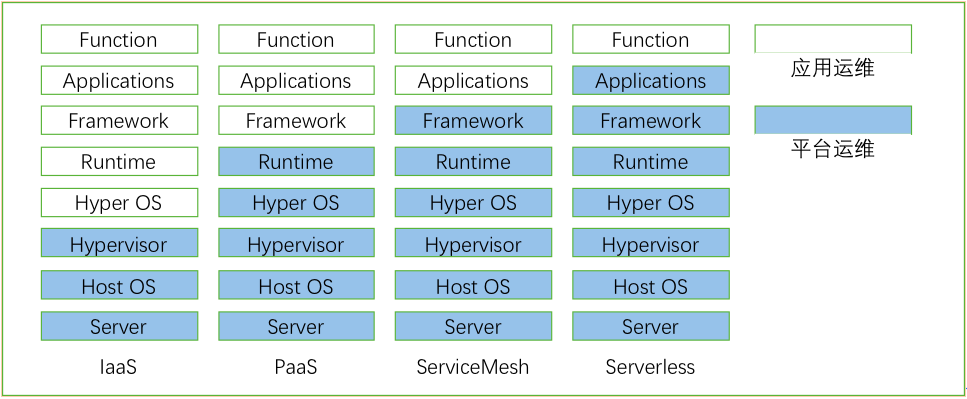

### 一、运维继续下沉，将成为主流，Serverless逐步推广

云计算的一个发展方向就是运维下沉，将和业务无关的管理功能和运维工作尽量下沉到基础设施中，应用可以聚焦在业务能力的开发和运营。这个趋势演化的过程，影响了云计算的发展方向。从一开始的虚拟化，到IaaS，到PaaS都是将应用系统的部分运维职责交给平台运维的过程。

PaaS为云应用提供了运行容器，解决了应用部署的问题和运行时管理的问题，但是应用仍然有大量的运维工作，特别是对于微服务应用，需要解决诸多的问题，如服务的发布和感知，多实例应用的负载均衡，服务故障检测和隔离，已经应用灰度发布的策略等。这些在PaaS层面是无法解决的，通常是由开发框架解决，就是我们前面提到的微服务治理框架。

因为业务功能的提供才是业务开发团队的价值体现，业务开发团队应该聚焦于业务功能的实现，非功能的需求应该交给平台处理。基于这个诉求服务网格出现了，微服务治理的问题可以有服务网格统一运维管理，业务应用只需关注业务能力的实现。

服务网格出现后，业务应用本身的生命周期还是需要应用来运维保障。这就逐步演化出了Serverless的概念，Serverless并非没有Server，而是对于开发团队来说根本不在意Server是什么样的。开发团队只需要提交业务代码，就可以得到需要的运行实例，对应用开发团队来说，Server是不存在的。

从目前业界的技术趋势来看，ServiceMesh的概念已经被大部分的大型云上企业接受，ServiceMesh被诟病的性能问题也在被逐步解决中，可以预测今年将有更多的微服务应用采用这一基础能力。Serverless目前发展还比较初期，包括了全托管的服务和FaaS(函数即服务)，全托管服务在公有云已经逐步成熟，随着混合云的普及，全托管服务会逐步发展。FaaS由于涉及开发模式的转变，目前要取代现有的开发模式还需要时日，不过有些合适的应用场景应该会有越来越多的应用。

#### [服务网格产品](https://www.cloudtogo.cn/product-SolarMesh)

SolarMesh，是一款基于Istio和容器技术打造的高效可视化微服务治理平台，主打轻量、便捷、高效、可视化，让服务网格不再难学难用，补齐企业落地Istio最后的一块短板，让服务网格不再难学难用，让服务网格在企业落地更加平滑、安全、稳定。

SolarMesh 功能：

· 帮助企业在纷繁复杂的微服务调度中快速定位问题，增强研发效率。

· 通过流量灰度让版本更新更加平滑，降低版本升级风险。

· 支持实时反映真实集群状态，以流量的角度凸显业务问题，增强运维能力。

· 支持多集群管理，可对接任意数量的标准k8s集群，接入成本极低。

### 二、容器虚拟机进一步融合

容器和虚拟机的优势和劣势，从容器技术诞生的那天起就一直在争论。容器轻量化，良好的封装能力和部署简便的特点，特别是在Kubernetes出现后，大有取代虚拟机的气势。但是在处理重应用(如关系型数据库，大数据等)的这点上，容器技术显得有些力不从心。另外容器技术在资源隔离和安全性上，还达不到虚拟机的水准，所以在很多场景，仍然是虚拟机的用武之地。

在这种情况下，如何实现容器技术和虚拟化技术的融合，发挥两者的长处，成为云计算的一个发展课题。目前的技术主要有三种，一种是容器虚拟机的混布;一种是轻量级虚拟机;最后是安全容器。

容器虚拟机的混布。通过修改容器或是虚拟机的编排引擎，使得可以通过一套API，支持容器和虚拟机的部署，同时打通虚拟化层和容器的网络，使之更高效率的进行互访。这是一些传统的虚拟化厂商目前的做法。目前比较成熟的实现有Redhad的Kubevirt。

轻量级虚拟机。解决虚拟机镜像过于庞大，启动慢，耗费资源大的问题，业界提出了轻量级虚拟机的解决方案。轻量级虚拟机使用精简专属的库操作系统(LibraryOS)，它能够使用高级语言编译并直接运行在商用云平台虚拟机管理程序之上。相比于容器技术它们有很多的优点，不仅仅有着媲美虚拟机的隔离能力，而且有更快的启动时间和更小的攻击面。轻量级虚拟机的由于使用了专属的操作系统，在语言支持和兼容性上都不如其他解决方案。目前轻量级虚拟机的技术有很多，例如Unikernel，Drawbridge, MirageOS 和HaLVM等。

安全容器，或是叫沙箱容器。为了解决容器的隔离性上的弱点，安全容器为容器的运行提供了一层沙箱(Sandbox)，容器在沙箱中运行的应用程序有自己的内核和虚拟设备，与主机和其它沙箱区分开来。安全容器的优点是可以兼容目前的容器镜像，不需要对容器编排Kubernetes做出大的修改就可以直接应用，缺点是牺牲了部分的性能和灵活度。目前安全容器的开源项目有Kata container，Google的gVisor等。

安全容器和轻量级虚拟机的实现上，可能会有一些重叠，但是不管哪一个方向，都是向着虚拟机和容器融合这个大的方向发展。目标都是在发挥容器的轻量级，快速交付和灵活调度能力的同时，提升业务应用的隔离性和安全性。

[SolarMesh免费体验地址>>](https://www.cloudtogo.cn/product-SolarMesh)
