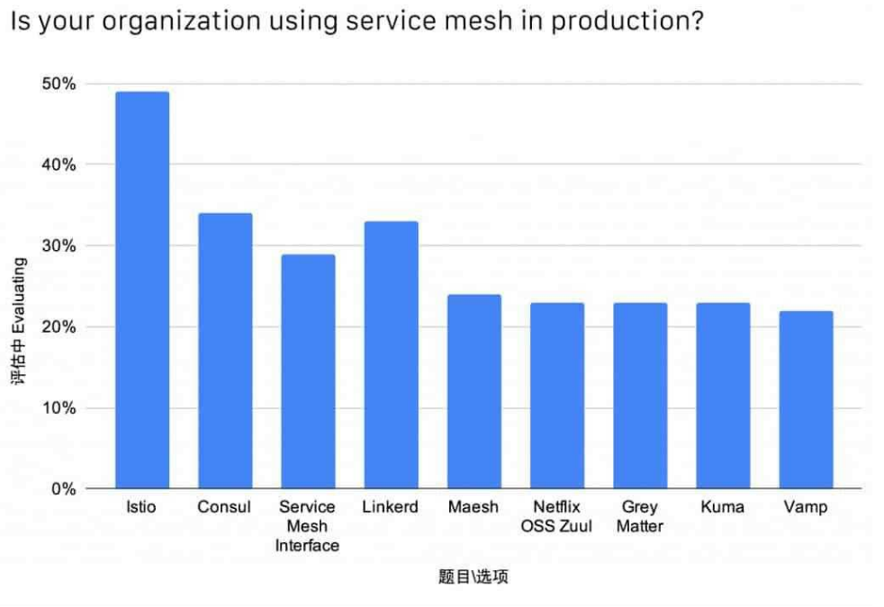
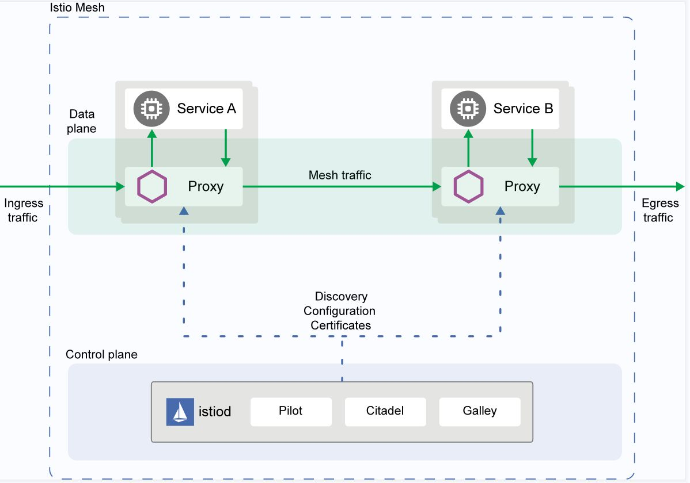
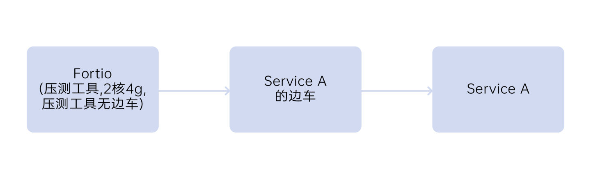
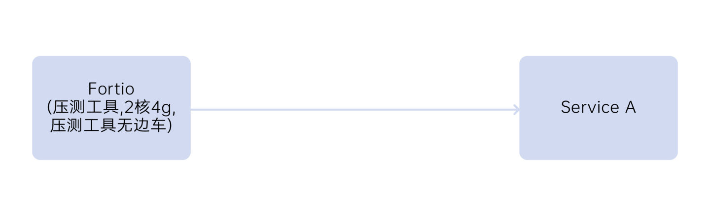
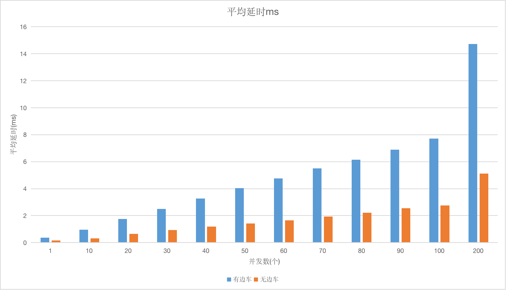
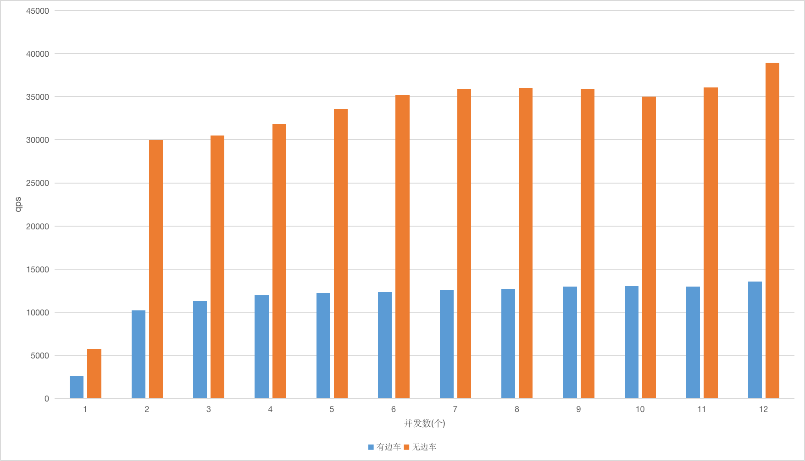
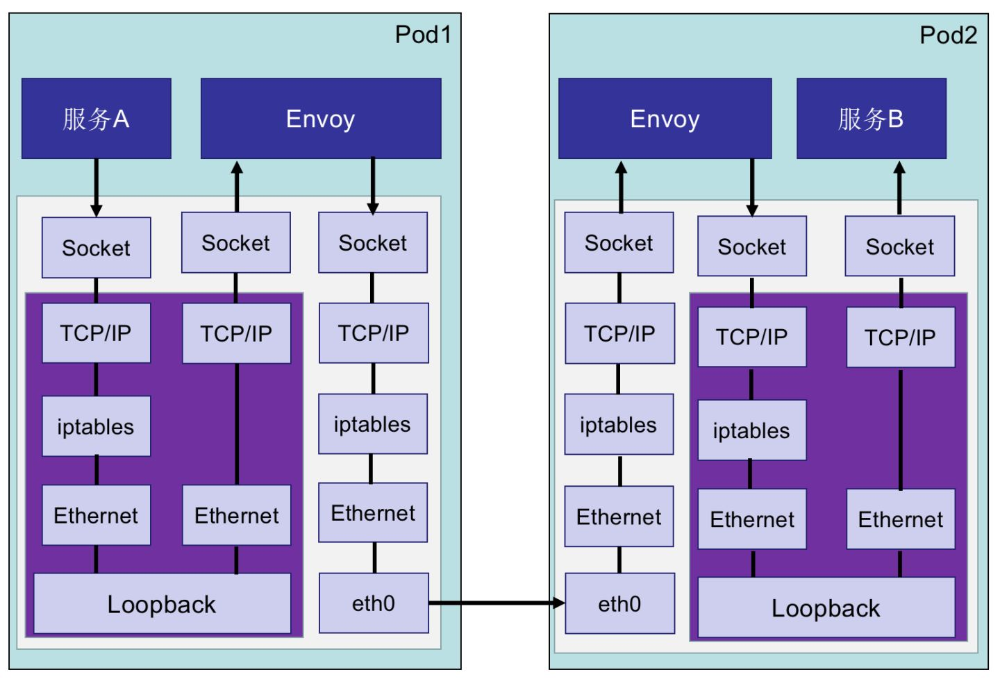
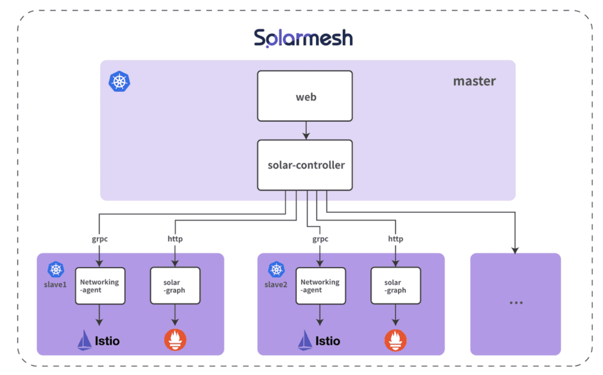

服务网格在国内开始有热度不过是近两年的事，业界有很多开源的服务网格框架，例如 、linkerd2、kuma、nginMesh、maesh等，其中，Istio是目前服务网格领域最流行的开源项目，38% 的企业在生产中使用服务网格，其中有接近一半的选择是Istio。

这篇文章，咱们来聊聊，Istio为何能火？

### 一、什么是 Istio

下面我们一起来看下 Istio 的架构：

从上图我们可以看出，Istio 服务网格从逻辑上分为数据平面（Data plane）和控制平面（Control plane）：

· 数据平面（Data plane）：直接处理入站和出站数据包，提供转发、路由、健康检查、负载均衡、熔断、认证、鉴权、故障注入、可观测能力。

· 控制平面（Control plane）：提供服务发现、配置和证书管理能力。

在构建大型分布式系统的时候，将控制面和数据面分离开是一种常见的模式。数据面会直接和具体的应用交互，而控制面的组件会下发一系列的配置和指令，帮助数据面完成具体的工作。

### 二、Istio 的性能

使用两台阿里云 ecs.g6.2xlarge 机器，其中一台部署压测工具 Fortio，另外一台部署Service A和 Service A 的边车。在使用 fannel 网格插件的情况下，用 30 并发进行压测，压测场景如下图所示，其中 Service A 接收到请求不做任何逻辑处理直接返回，Fortios 通过边车调用 Service A 的平均响应时间为 2.505ms。在同样的并发下，不部署 Service A 的边车，通过Fortios 调用 Service A 的平均响应时间为 0.936ms。

有边车压测场景

无边车压测场景

平均延时

QPS

服务网格带来的性能损耗包含两个方面：

1、流量策略、可观察性和安全通信带来的损耗，这些损耗是任何微服务框架均存在的，需要不断优化 Envoy 本身的性能来提升。

2、服务网格微服务之间的调用经过边车后，与传统服务框架相比，多了两次网络调用，这是服务网格额外带来的性能损耗。

服务网格默认采用的是 iptables 流量劫持的方式，流量经过边车 Envoy 时，会经过两次 TCP/IP协议栈，图 8 所示，当服务数量大的时候会有大量的 iptables 规则，影响网络性能。目前业界的一个思路是使用 eBPF 这样的技术来提高应用性能，基于eBPF使微服务跟边车直接通过 Socket 通讯，但是该技术对操作系统内核的版本要求比较高，因此很少有企业能够达到。

### Istio服务网格

调用链路

#### 行云创新对Istio探索和实践——SolarMesh

1、SolarMesh，是基于 Istio 及容器技术，提供流量监控和管理，提供完善的非侵入式服务治理解决方案。

2、SolarMesh，可以帮助企业在纷繁复杂的微服务调度中快速定位问题，增强研发效率。

3、SolarMesh，可以通过流量灰度让版本更新更加平滑，降低版本升级风险。

5、SolarMesh，支持实时反映真实集群状态，以流量的角度凸显业务问题，增强运维能力。

6、SolarMesh，支持多集群管理，可对接任意数量的标准k8s集群，接入成本极低。

istio服务网格

SolarMesh架构设计

SolarMesh 对Istio社区的产品化改进

1、Istio的直连模式，在sidecar故障时提供秒级的直连流量切换；

2、多集群统一纳管，为流量运维提供上帝视角；

3、可视化、规范化Istio操作，告别terminal；

4、反应集群真实情况，流量可视化监控；

5、为istio核心组件提供监控能力；

6、服务质量(SLO)检测能力；

7、一键部署分布式链路追踪组件jaeger；

8、一键部署数据可视化工具grafana，进一步提升流量监控的体验；

9、……

----------------

体验SolarMesh，

[SolarMesh免费体验地址>>](https://www.cloudtogo.cn/product-SolarMesh)
