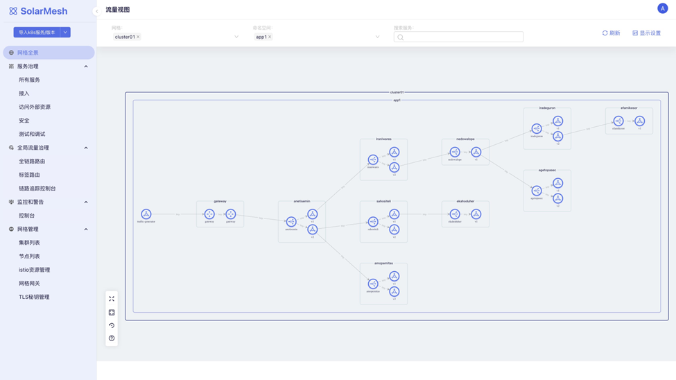
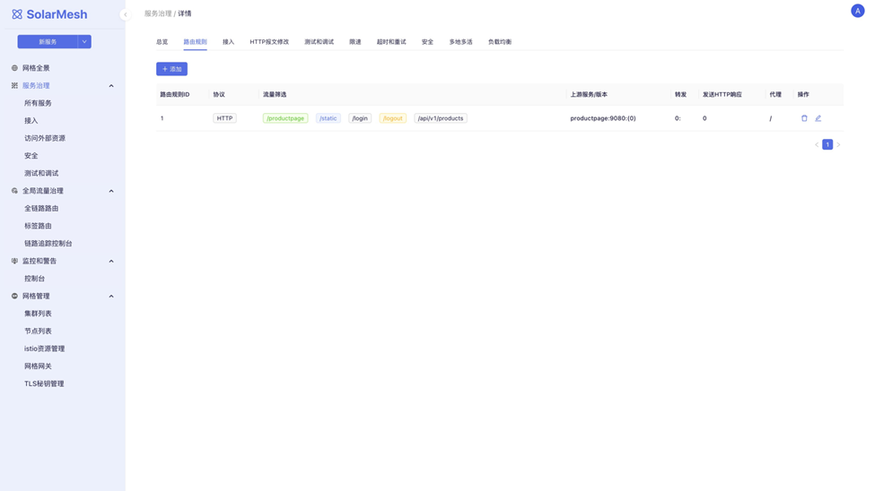
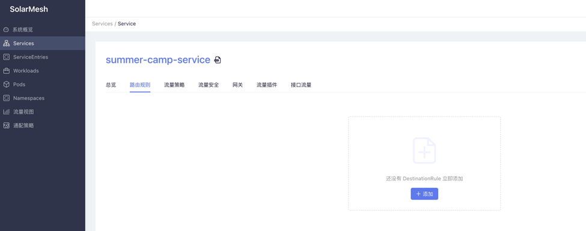
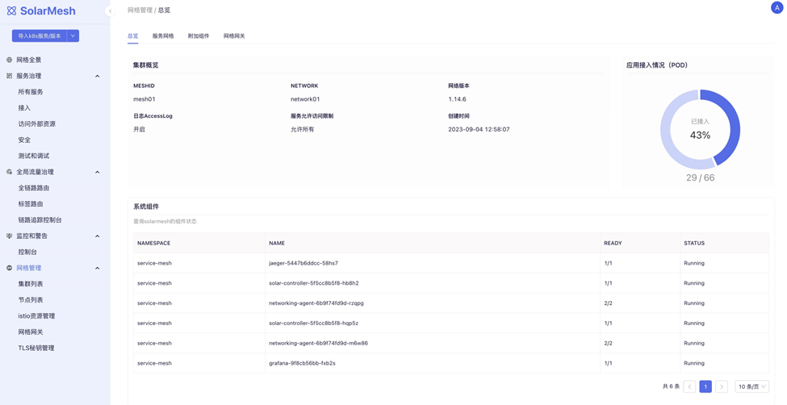
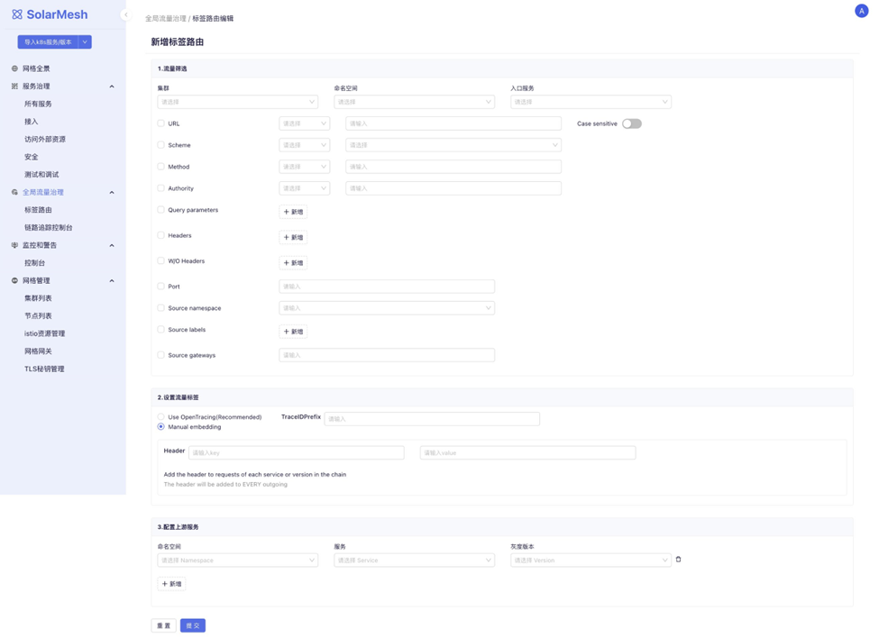

## SolarMesh

SolarMesh是行云创新推出的流量治理平台，它基于Istio，为部署在K8s集群上的应用提供全面的流量治理能力。

在之前的版本中，SolarMesh提供的能力有，流量视图，流量控制策略批量配置，API级别的流量数据采集和展示，Sidecar直连模式，WASM插件开发支持和若干WASM插件。

在v1.13中，主要的更新内容如下，
1.	从运维视角极大的丰富了SolarMesh的流量治理能力。
2.	提供了网格级别的流量视图。
3.	提供了对Istio的生命周期管理能力， 关注Istio本身的安装和升级，以及多集群管理。
4.	提供了标签路由能力，以及基于该能力的全链路灰度功能。
5.	集成其他开源框架并获得其能力， 例如Slime。

## 新特性
### 全新功能架构

SolarMesh的功能被重新调整，取消了直接展示和操作Istio对象，而是从SRE日常运维的角度重新规划。同时新版本中也取消了对Namespace，Pod和Deployment等非网格对象的管理。新旧版本的对比如下。

1.	用户在安装完网格后，可以从 “导入K8s服务/版本”中批量导入服务到网格中。也可以从这里完成灰度版本的导入。
2.	网格全景展示了网格中所有服务的运行状况。
3.	服务治理能力则集中到了 “服务治理>所有服务”中。用户也可以按照功能划分，从 “接入”， “访问外部资源”， “安全”和 “测试和调试”等角度快速定位到开启了这些功能的服务。

### 服务管理

新版本的服务管理集中了流量治理的所有能力，但它们按照运维特性划分，不再以Istio能力为特性规划依据。新旧版本的对比如下。

导入SolarMesh的所有服务都会出现在“服务治理>所有服务”中，用户可以在这里做精细的设置。这些设置被划分为：
1.	路由规则，用来管理API路由规则，
2.	接入，用来管理服务的暴露方式，
3.	HTTP报文修改，用来修改HTTP请求和响应，
4.	测试和调试，用来向API注入延迟、错误等，
5.	限速，用来配置服务限速，
6.	超时和重试，
7.	安全，管理服务的mTLS，授权和鉴权，
8.	多地多活，当服务在多个地域部署了副本，可以用来管理多个副本的流量分配策略活着故障转移策略，
9.	负载均衡

### Istio生命周期管理

Istio生命周期管理的重点并不只是如何正确安装Istio，而是要维持Istio自身的稳定运行，并且可以稳定升级到新版本。对于网关的要求会更高些，在有CVE补丁版本发布时，网关应当可以独立升级，并且业务不会中断。
同时， Istio生命周期管理还兼备了多集群管理，支持Multi-Primary和Remote-Cluster类型的多集群部署以及两种类型的混合部署。

Istio生命周期管理的功能如下：
1.	用户可以在 “集群列表”中管理Istio集群的安装和升级，
2.	“节点列表”用来管理集群的多地域属性，
3.	“网格网关”用来管理网格安装和升级，
4.	“TLS管理”用来管理证书轮换。

### 标签路由
标签路由即根据流量特征筛选特定流量，然后将流量转发到服务的不同版本上。这种路由规则可以配置到多个服务上，用来完成全链路灰度和流量染色等功能。

用户可以通过Istio支持的流量筛选规则来筛选流量，并为这些特征流量绑定标签，该标签会跟随流量一起在调用链中传递。如果用户的服务中已经使用了OpenTracing框架，那么标签会自动在流量经过的服务间传递。

以上就是SolarMesh本次更新的主要内容。欢迎从后台获取下载链接试用，或访问线上

[SolarMesh免费体验地址>>](https://www.cloudtogo.cn/product-SolarMesh)
