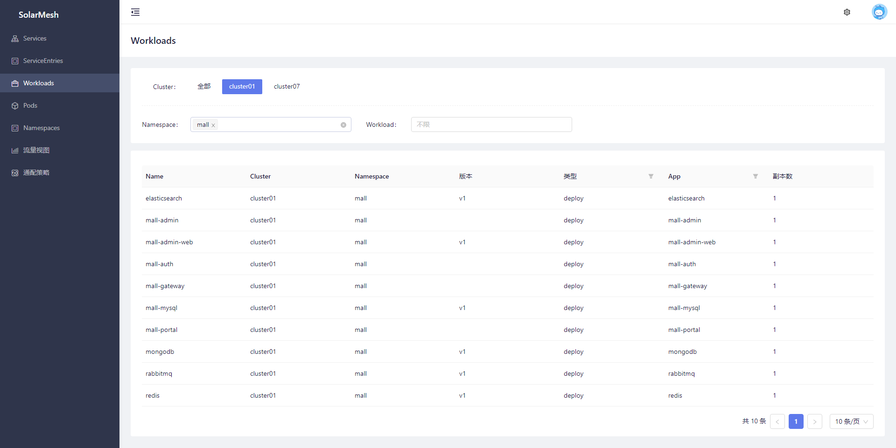
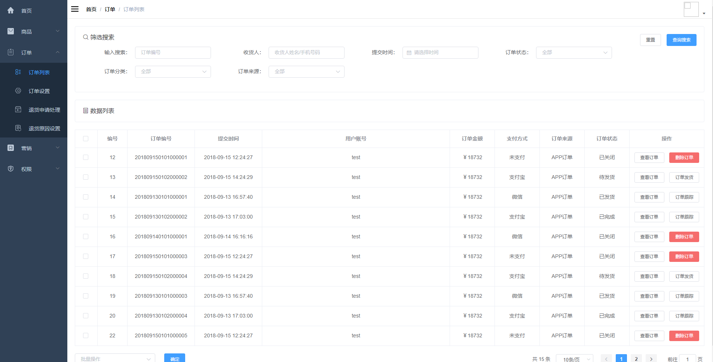
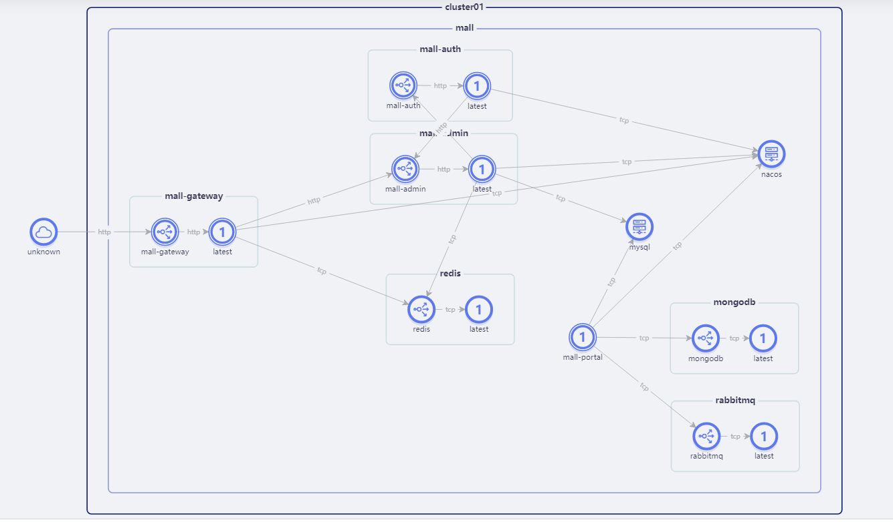

## 意义

以SpringCloud为代表的SOA体系一般会依赖一个叫做服务注册中心的组件做微服务之间的沟通媒介，通俗的说就相当于一块公告版，上面记录的是所有服务的ip地址，如果哪个服务需要与其他服务沟通的时候就去看一眼公告版，拿到对方的ip之后再调用。这里面体现了一个思路，对于公告版而言，它会认为各微服务是固定不动的，如果微服务挪动了地方的话就得去公告版上更改ip。

而Kubernetes会认为服务实例是游离状态的，它可能被调度到集群中任意的一个节点上，Kubernetes会提供一个叫做service的云资源来描述这一组服务实例，在调用时无需关心对方现在被调度到了何方，也不用关心调度到了哪一个实例上，他们会被认为是为客户端提供一样的服务。

如果强行将SOA体系整个迁移到Kubernetes当中，在Kubernetes的调度下服务实例可能会发生频繁的变更，那么注册中心上就会不断发生注册与重新注册，带来的后果就是服务显得十分不稳定。

而这些问题的存在就得需要一套解决方案去平衡这些SOA架构的应用和kubernetes之间的关系。

为此，SolarMesh添加了对注册中心的支持。通过对流量的劫持以及对服务注册中心的代理实现SOA架构与Kubernetes的无缝对接，在不改任何代码的情况下享受kubernetes和服务网格带来的技术红利。

## 使用

在v1.10.1版本中对接注册中心，需要更改业务集群中`networking-agent`组件的配置，将注册中心的地址注册到`networking-agent`组件当中

样例:

先编辑`networking-agent`组件的`configmap`资源

```bash
$ kubectl edit configmap -n service-mesh networking-agent -o yaml

apiVersion: v1
data:
  application.yaml: |-
    defaultConfig:
      rootNamespace: service-mesh
    configSources:
      - 10.10.13.110:8848 # 这里填写注册中心的地址，直接安装时configSources字段是空的
kind: ConfigMap
metadata:
  annotations:
    kubectl.kubernetes.io/last-applied-configuration: |
      {"apiVersion":"v1","data":{"application.yaml":"defaultConfig:\n  rootNamespace: service-mesh\nconfigSources:\n  - 10.10.13.110:8849"},"kind":"ConfigMap","metadata":{"annotations":{},"labels":{"app":"networking-agent","helm.sh/chart":"solar-1.5.2"},"name":"networking-agent","namespace":"service-mesh"}}
  creationTimestamp: "2021-12-02T06:38:52Z"
  labels:
    app: networking-agent
    helm.sh/chart: solar-1.5.2
  managedFields:
  - apiVersion: v1
    fieldsType: FieldsV1
    fieldsV1:
      f:data:
        .: {}
        f:application.yaml: {}
      f:metadata:
        f:annotations:
          .: {}
          f:kubectl.kubernetes.io/last-applied-configuration: {}
        f:labels:
          .: {}
          f:app: {}
          f:helm.sh/chart: {}
    manager: kubectl-client-side-apply
    operation: Update
    time: "2021-12-02T06:38:52Z"
  name: networking-agent
  namespace: service-mesh
  resourceVersion: "18784274"
  selfLink: /api/v1/namespaces/service-mesh/configmaps/networking-agent
  uid: a8611d47-6895-442d-8f82-94cd5fb83a7f
    pod name
```

重启`networking-agent`组件

```bash
kubectl rollout restart deploy/networking-agent -n service-mesh
```

重启完成后，`networking-agent`组件将获得对配置的注册中心的支持，注入过sidecar的服务访问注册中心的接口流量会被劫持到`networking-agent`组件中做增强

## 试试看

### 示例项目

此次演示使用了一个典型的电商项目 [mall-swarm](https://github.com/macrozheng/mall-swarm)

mall-swarm是一套微服务商城系统，采用了 Spring Cloud Hoxton & Alibaba、Spring Boot 2.3、Oauth2、MyBatis、Docker、Elasticsearch、Kubernetes等核心技术，同时提供了基于Vue的管理后台方便快速搭建系统。mall-swarm在电商业务的基础集成了注册中心、配置中心、监控中心、网关等系统功能。

由于mall-swarm依赖众多，部署麻烦，我们将mall-swarm的所有中间件做了一份k8s部署yaml，让所有的中间件都部署到集群内方便测试，改造后源码开源在[mall-swarm-istio](https://github.com/solarmesh-cn/mall-swarm-istio)，所以我们这次使用mall-swarm改造版。

### 前置条件

* k8s集群
* 安装 SolarMesh v1.10.1 及以上版本
* 部署nacos并且配置了networking-agent组件(nacos部署在集群内外都可以)

### 使用方法

### 创建namespace

```bash
kubectl create ns mall
```

#### clone仓库

```bash

git clone https://github.com/solarmesh-cn/mall-swarm-istio.git

cd mall-swarm-istio

```

### 部署基础设施

```bash
kubectl apply -n mall -f mall-swarm/document/k8s/infra
```

### 导入sql

连接集群 nodeport 33066端口上的mysql，导入 mall-swarm/document/sql 下面的sql文件

### 部署mall-swarm

```bash
kubectl apply -n mall -f mall-swarm/document/k8s/service
```

### 接入sidecar

将 `gateway`，`mall-admin`，`mall-auth`，`mall-portal`，`mall-monitor`，`mall-search` 服务接入sidecar，这里可以使用SolarMesh的`手动接入`功能，找到对应的`workload`进行接入



### 访问页面

部署mall-admin-web

> 注: config/prod.env.js配置到集群内的gateway服务

访问mall-admin-web的页面即可



### 流量视图

在页面上试着多访问几次，让mall产生更多的流量。

此时查看流量视图，SolarMesh已经完整的监测到了整个项目的流量拓扑


