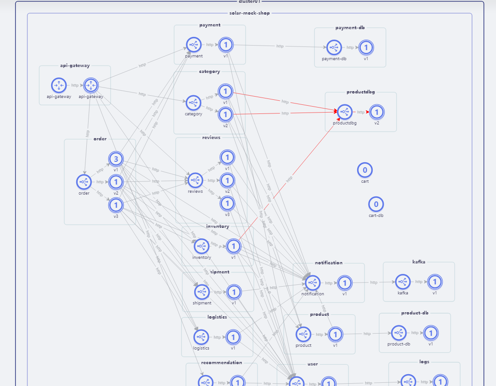
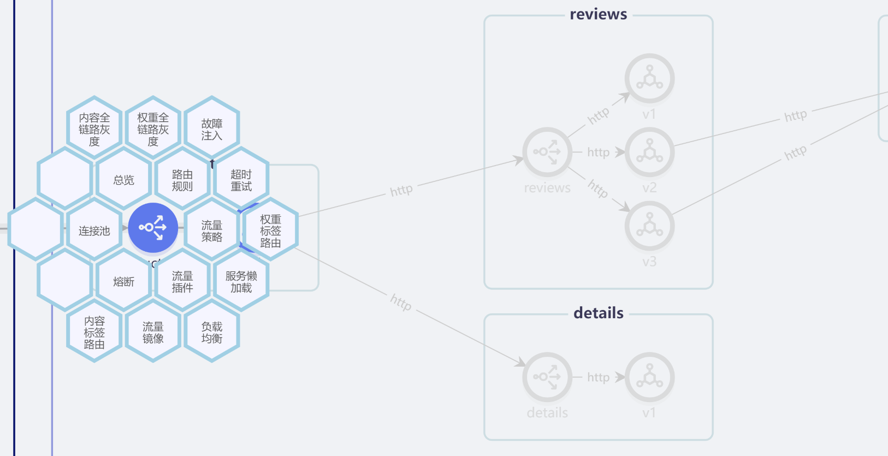
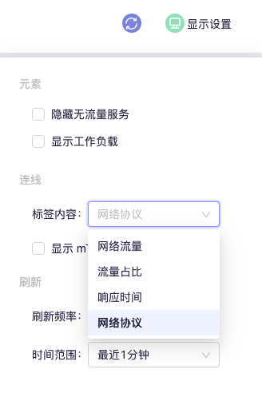

SolarMesh提供`流量视图`来体现服务的可观察性，并且在观测的同时可以设置多种多样的流量策略。

SolarMesh Web界面的`流量视图`页面显示网格内服务和工作负载的拓扑，并通过实时的网络流量、延迟、吞吐量等对其进行展示。

流量视图几乎完全基于istio的标准指标：从Prometheus接收并通过Kubernetes信息获取的标准指标。

流量页面用作诊断网格内问题的起点。SolarMesh与Grafana和Jaeger集成在一起，可轻松访问深度监控和各种服务的分布式跟踪。

图中的节点是服务或工作负载，而箭头表示不同服务之间的网络连接。这基于从Prometheus检索的Istio指标。该图用作可视监视工具，因为它显示了系统中的各种错误和度量。

---

## 流量策略

SolarMesh 提供 不限于 灰度发布、故障注入、超时重试、熔断限流、rbac等流量策略的配置，都集成在流量视图中，用户只需花费很少的学习成本就可以达到自己的目的。

如下是目前 SolarMesh 支持的流量策略：

## 资源

点击左侧的图标显示图例，以便更好地了解图标在图中的含义。流量视图中可以显示以下层级的资源：集群，命名空间，应用，服务和工作负载等。

---

## 显示设置

您可以选择和配置图形显示的内容以及数据的更新频率。

---

## 命名空间

仅显示所选命名空间的数据。

---

## 边缘标签

流量视图边缘上的标签可以显示服务之间流量的各种实时信息。您可以显示以下信息：网络流量、流量占比、响应时间、网络协议、是否使用mTLS。

