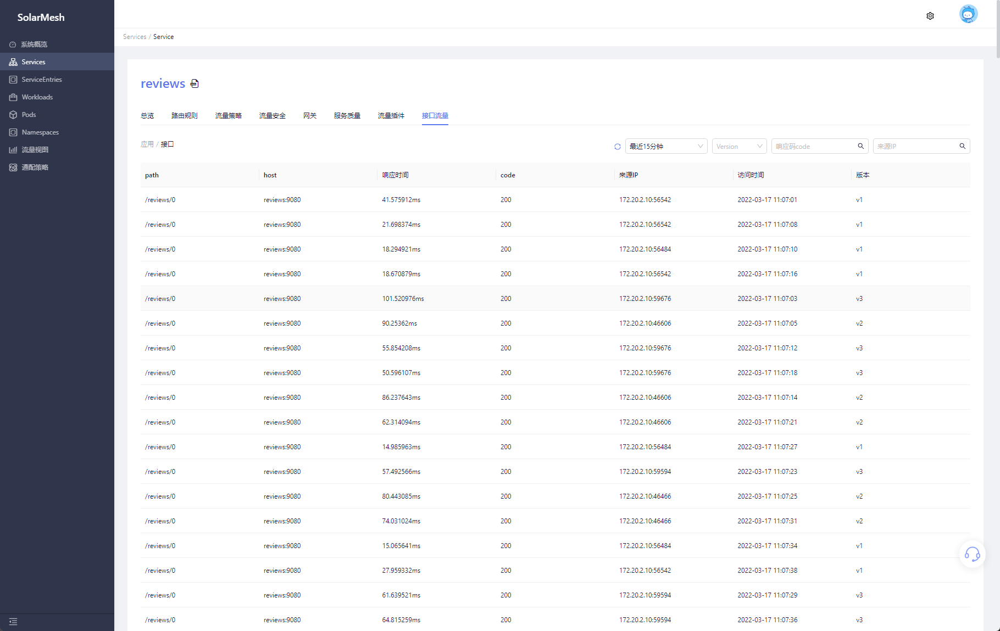

在微服务架构中，故障定位一直以来都是一件麻烦事。虽然通过Istio的数据采集，可以监测到服务与服务之间的异常状态，有效的降低发现故障的成本，但技术人员仍需通过日志等其他手段进行精确定位。

为更进一步加速故障定位的精准度，SolarMesh在Istio的数据采集基础上提供接口级流量监测，在异常流量出现时SolarMesh可以直接定位到接口信息，帮助技术人员更快更精准地定位故障根源。

## 试试看

### 前提条件

1. 集群内需存在Elasticsearch作为数据落地。

> ⚠ 若集群内不存在Elasticsearch可参考ES官方helm库进行安装 https://github.com/elastic/helm-charts

### 开启功能

SolarMesh会采集接口数据推送到指定的Elasticsearch当中存储，请参照以下命令配置Elasticsearch的访问地址。

```bash
$ kubectl edit cm -n service-mesh grpc-logging

apiVersion: v1
data:
  application.yaml: |-
    ds_driver: Elastic
    url: http://elasticsearch.service-mesh:9200 # 配置ES的访问地址
    username: elasticsearch # 用户名，如果ES不需要用户名密码访问则不填
    passworld: elasticsearch # 密码，如果ES不需要用户名密码访问则不填
kind: ConfigMap
metadata:
  annotations:
    kubectl.kubernetes.io/last-applied-configuration: |
      {"apiVersion":"v1","data":{"application.yaml":"ds_driver: Elastic\nurl: http://elasticsearch:9200"},"kind":"ConfigMap","metadata":{"annotations":{},"labels":{"app":"grpc-logging","helm.sh/chart":"solar-1.10.2"},"name":"grpc-logging","namespace":"service-mesh"}}
  creationTimestamp: "2022-01-24T04:58:38Z"
  labels:
    app: grpc-logging
    helm.sh/chart: solar-1.10.2
  managedFields:
  - apiVersion: v1
    fieldsType: FieldsV1
    fieldsV1:
      f:data:
        .: {}
        f:application.yaml: {}
      f:metadata:
        f:annotations:
          .: {}
          f:kubectl.kubernetes.io/last-applied-configuration: {}
        f:labels:
          .: {}
          f:app: {}
          f:helm.sh/chart: {}
    manager: solar-operator
    operation: Update
    time: "2022-01-24T04:58:38Z"
  name: grpc-logging
  namespace: service-mesh
  resourceVersion: "34996566"
  selfLink: /api/v1/namespaces/service-mesh/configmaps/grpc-logging
  uid: 130c0dab-ccc6-4b26-bc3f-6e7707c1943a

```

重启`networking-agent`组件

```bash
kubectl rollout restart deploy/networking-agent -n service-mesh
```

### 页面展示

采集到的数据正确推送到Elasticsearch中后，在SolarMesh的页面上就能够展示服务的接口信息。
访问`Services`情页面，找到对应的服务。

进入到服务的详情页面，点击接口流量。页面会收集当前应用的所有接口流量进行合并展示，在页面上可以获取当前接口的平均响应时间，RPS，以及这段时间之内的响应错误比例。


点击某一个路径下的接口，页面将展示当前接口在这段时间之内的全部访问情况，包括每一次的响应时间，响应码，以及请求是由哪个版本响应返回的。


