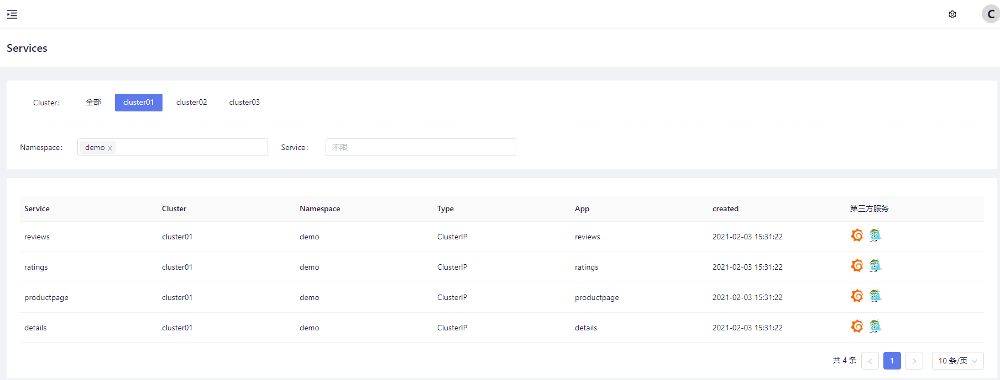
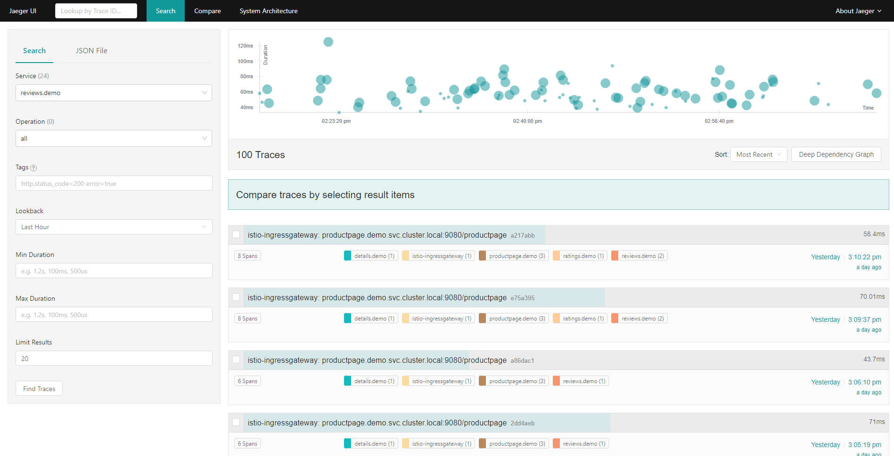

`jaeger`是Uber开发的一个受Dapper和Zipkin启发的分布式跟踪系统，符合 [opentracing](https://opentracing.io/) 规范，是一个分布式链路追踪的解决方案

SolarMesh的核心业务是云服务间的流量监管，jaeger可以增强SolarMesh在某一次流量请求场景下的观测能力，对服务内部接口间调度情况，问题分析，性能优化方面都有积极意义

在SolarMesh中，jaeger增强以下功能

* 分布式跟踪信息传递
* 分布式事务监控
* 问题分析
* 服务依赖性分析
* 性能优化

## 安装jaeger

使用solarctl安装jaeger

```bash
solarctl install jaeger --name <集群名称: cluster01>
```
安装成功之后，jaeger服务端将会安装在集群当中，默认namespace为 service-mesh，推荐使用 `jaeger.service-mesh:6831` 发送 `span` 数据

```bash
$ kubectl get svc -n service-mesh
NAME               TYPE        CLUSTER-IP      EXTERNAL-IP   PORT(S)                                                                      AGE
jaeger             ClusterIP   10.96.74.5      <none>        5775/UDP,6831/UDP,6832/UDP,5778/TCP,16686/TCP,14268/TCP,14250/TCP,9411/TCP   65s
```

|Port|Protocol|Component|Function|
|-|-|-|-|
|5775|UDP|agent|accept zipkin.thrift over compact thrift protocol (deprecated, used by legacy clients only)|
|6831|UDP|agent|accept jaeger.thrift over compact thrift protocol|
|6832|UDP|agent|accept jaeger.thrift over binary thrift protocol
|5778|HTTP|agent|serve configs
|16686|HTTP|query|serve frontend
|14268|HTTP|collector|accept jaeger.thrift directly from clients
|14250|HTTP|collector|accept model.proto
|9411|HTTP|collector|Zipkin compatible endpoint (optional)

### 使用jaeger增强solarmesh

SolarMesh安装jaeger之后，在 `服务列表` 页面的附加组件处会出现jaeger的图标



点击jaeger图标访问对应服务的jaeger的界面，这里我们点击了 reviews 服务的jaeger图标


