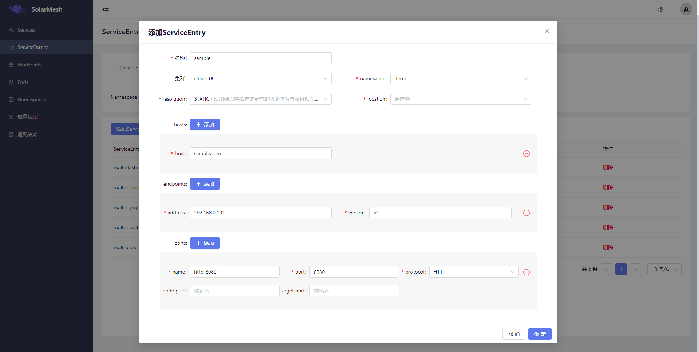
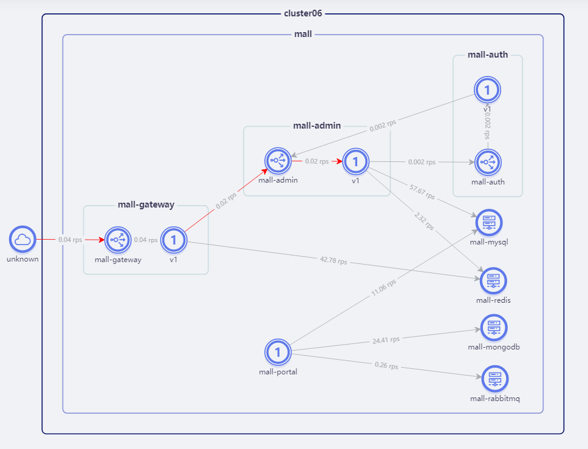

Istio 是基于 kubernetes 进行实现，因此其与 kubernetes 是强耦合的。它使用的根本场景是对云上的微服务进行治理。但实际的多数场景是产品均部署在虚拟机或物理机上，针对这种 istio 实际上是不适用的。 云上场景中，也存在基础组件安装在 vm (虚拟机或物理机)上，云上的微服务需要使用  vm 上的微服务，此时就需要将 vm 加入到 istio mesh。

关于如何将 vm 上的微服务加入到 istio mesh 中，本文不作太多的描述，大家可以查看官网对这部分的说明 https://istio.io/latest/docs/setup/install/virtual-machine/

本文档主要介绍如何使用已经接入istio的虚拟机。

## 声明虚拟机应用

在接入虚拟机之后，我们需要声明虚拟机上运行的应用，让集群内的服务可以访问到虚拟机上的应用

在SolarMesh的页面上创建一个`ServiceEntry`指向虚拟机上的一个应用，`hosts`配置访问虚拟机应用的域名，`endpoints`配置虚拟机的ip，`ports`配置虚拟机上应用的端口，类似于下图所示

## 访问虚拟机应用

当`ServiceEntry`创建成功，集群内的服务就可以通过`hosts`去访问虚拟机应用了

> ⚠️在访问之前记得关闭虚拟机上的防火墙，或者在防火墙上打开应用相应的端口，让请求可以顺利访问进去

下图是部署在solarmesh中的一个电商项目`mall-swarm`的流量视图，其中基础设施`mysql`，`redis`，`mongodb`部署在虚拟机中，业务服务部署在集群中

