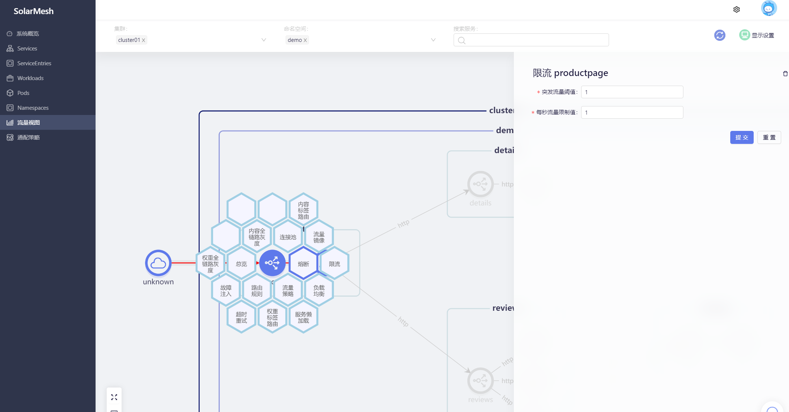
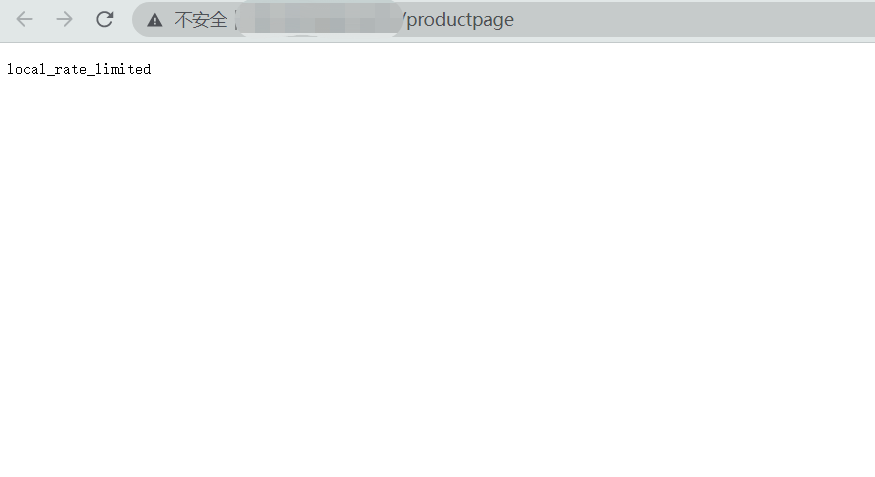

## 限流的概念
限流是一种限制发送到服务端的请求数量的机制。它指定客户端在给定时间段内可以向服务端发送的最大请求数，通常表示为一段时间内的请求数，例如每分钟300个请求或每秒10个请求等。限流的目的是防止服务因来自同一客户端IP或来自任何客户端的全局请求而过载。

以每分钟300个请求的限流机制为例，向服务发送301个请求，限流器将拒绝第301个请求。同时，限流器会返回一个429 HTTP状态码（Too Many Requests），并在请求到达服务之前进行拒绝。

## 试试看

> 假设我们已经部署过bookinfo示例项目(见 `快速开始/安装/使用solarctl安装示例项目`)，并且为bookinfo示例项目的服务接入了sidecar(见 `快速开始/接管服务`)

访问我们事先部署好的示例项目bookinfo的页面，多刷新几次，您会发现在没有任何策略干预的情况下，页面中 Book Reviews 一栏呈现三种状态: 红星、黑星和无星，它们的出现概率约为1:1:1。


我们为productpage 配置限流策略。



提交后，我们访问 productpage ，会发现它时不时就会出现错误。

(../../images/local-ratelimit-02.png)

我们通过 curl 访问，结果会更清晰：

```shell
< HTTP/1.1 429 Too Many Requests
< x-local-rate-limit: true
< content-length: 18
< content-type: text/plain
< date: Sat, 06 May 2023 09:44:36 GMT
< server: istio-envoy
< x-envoy-decorator-operation: productpage.demo.svc.cluster.local:9080/*
<
```

``429 Too Many Requests``,说明限流策略生效了。


