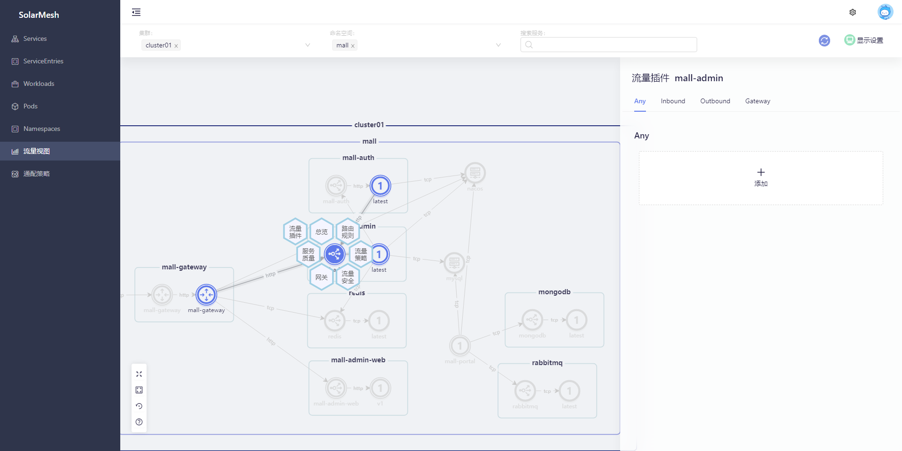

流量插件是一种对流量的扩展手段，它可以允许开发者对流经服务的流量在入站、出站时进行编码增强，达到对业务流量的切面编程(AOP Aspect Oriented Programming)能力。可以应用于对流量有业务诉求的使用场景，例如对敏感业务数据的过滤，在系统需要停机更新前下发更新通知，对特定核心接口的数据上报等。

流量插件是SolarMesh提供的[WASM](../tools/wasm.html)能力的进一步封装，您可以在接入了sidecar的服务中选择一个源服务，通过SolarMesh的页面将filter插入到服务当中。

## 前置条件

首先需要在流量插件库中声明已有的插件

```bash
$ kubectl edit cm -n service-mesh mesher-config

apiVersion: v1
data:
  application.yml: |
    config:
      name: "mesher"
      version: "v1.0.0"
      istiod_name: "discovery"
      in_cluster: true
      ......
      wasmPlugins:
      - name: desensitize
        nickname: 数据脱敏
        description: 脱敏所有手机号的数据
        uri: http://release.solarmesh.cn/wasm/data-cleaning.wasm
        type: 0
      - name: notice
        nickname: 通知公告
        description: 版本更新公告
        uri: http://release.solarmesh.cn/wasm/notice.wasm
        type: 0
```

重启`solar-controller`组件，更新流量插件库

```bash
kubectl rollout restart deploy/solar-controller -n service-mesh
```

## 试试看

### 示例项目

此次演示使用了一个典型的电商项目 [mall-swarm](https://github.com/macrozheng/mall-swarm)

mall-swarm是一套微服务商城系统，采用了 Spring Cloud Hoxton & Alibaba、Spring Boot 2.3、Oauth2、MyBatis、Docker、Elasticsearch、Kubernetes等核心技术，同时提供了基于Vue的管理后台方便快速搭建系统。mall-swarm在电商业务的基础集成了注册中心、配置中心、监控中心、网关等系统功能。

由于mall-swarm依赖众多，部署麻烦，我们将mall-swarm的所有中间件做了一份k8s部署yaml，让所有的中间件都部署到集群内方便测试，改造后源码开源在[mall-swarm-istio](https://github.com/solarmesh-cn/mall-swarm-istio)，所以我们这次使用mall-swarm改造版。

### 前置条件

* 在k8s集群中部署了mall-swarm-istio项目
* 服务接入了sidecar，并且访问正常


### 需求

在mall-swarm-istio项目中，访问`首页->订单->订单详情`页面，可以看到，对外暴露的手机号码是以明文形式展示在页面上的。


在某些场景中，以明文展示真实手机会存在一些安全隐患。所以我们希望可以对手机号码进行加密，让用户不能直接拿到订单上的真实手机号码。在这样的场景下，我们就可以借助流量插件的能力，在数据响应给前端之前对数据进行清洗，加密敏感信息。

### 实现

访问SolarMesh的流量视图页面，查看整个项目的流量拓扑。


由于手机号码是从`mall-admin`这个应用返回的数据，所以我们只需要控制住`mall-admin`这个应用的流量，让它的敏感数据不能响应到应用之外。

选择`mall-admin`，打开流量插件侧边栏。



添加一个`数据清洗`流量插件，这个插件会在响应数据中清洗掉所有手机号码。

![选择数据清洗插件]../../images/选择数据清洗插件.png)

保存`数据清洗`流量插件，这样流量插件就会在应用上生效了。


再次访问`首页->订单->订单详情`页面，现在这个页面的手机号码就不再是明文显示，而是加密之后的状态。


