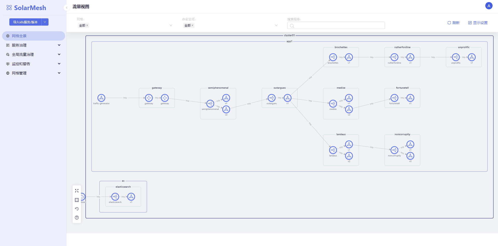

## 前置条件

### 环境配置

在安装 SolarMesh 之前，请先查看以下环境要求：

1. 准备一个1.21 及以上版本Kubernetes环境，确保可以访问外网、确保可以正常拉取镜像、确保有一定的计算资源，可以跑较多的应用。
2. 准备 kubectl、helm工具

### 下载安装包

安装包中包含命令行工具和helm charts包。
```shell
# 下载
wget http://release.solarmesh.cn/solar/v1.13/solar-v1.13.2-linux-amd64.tar.gz
# 解压
tar -xvf solar-v1.13.2-linux-amd64.tar.gz
# 赋权
export PATH=$PATH:$PWD/solar/bin/
chmod +x $PWD/solar/bin/solarctl
```

确认版本:
```shell
$ solarctl version
solarctl version: v1.13.2
```

## 安装 SolarMesh

### 1. 安装SolarMesh dashboard
```bash
solarctl install solar-mesh
```

检查组件状态：
```shell
$ kubectl get po -A -w
NAMESPACE              NAME                                               READY   STATUS    RESTARTS   AGE
service-mesh           solar-controller-58fc49b759-hpdwd                  2/2     Running   0          102s
service-mesh           solar-controller-58fc49b759-kwtf5                  2/2     Running   0          103s
solar-operator         solar-operator-596d9b48dc-knr7w                    1/1     Running   0          32s
```

配置登录账号：admin/admin
```shell
kubectl create secret generic admin --from-literal=username=admin --from-literal=password=admin -n service-mesh
kubectl label secret admin app=solar-controller -n service-mesh
```

### 2. 安装SolarMesh backend

#### 1. 控制器
```shell
export ISTIOD_REMOTE_EP=$(kubectl get nodes|awk '{print $1}' |awk 'NR==2'|xargs -n 1 kubectl get nodes  -o jsonpath='{.status.addresses[0].address}')
solarctl operator init --external-ip $ISTIOD_REMOTE_EP --eastwest-external-ip $ISTIOD_REMOTE_EP
```

#### 2. 后端服务
```shell
kubectl apply -f - <<EOF
apiVersion: install.solar.io/v1alpha1
kind: SolarOperator
metadata:
  name: cluster01 # 指定集群名称
  namespace: solar-operator
spec:
  profile: default
EOF
```

检查安装状态：

```shell
$ kubectl get po -n service-mesh
NAMESPACE              NAME                                               READY   STATUS    RESTARTS   AGE
service-mesh           networking-agent-d79988595-58tbs                   3/3     Running   0          52s
service-mesh           networking-agent-d79988595-nzfg5                   3/3     Running   0          2m46s
$ kubectl get po -n solar-operator
solar-operator         solar-operator-78d69dc876-sl7rl                    1/1     Running   0          7m20
```

#### 3. 安装Addons

##### 链路追踪和监控告警
```shell
$ solarctl install grafana --name cluster01
$ solarctl install jaeger --name cluster01
```

检查安装状态：

```shell
$ kubectl get po -n service-mesh
NAME                                READY   STATUS    RESTARTS   AGE
grafana-5d5ff44cd6-8wdj9            1/1     Running   0          1m
jaeger-5447b6ddcc-z4ng7             1/1     Running   0          1m
```

### 3. 完成集群初始化

注册集群kubeConfig到solarmesh
```shell
solarctl register --kube-config .kube/config --name cluster01
```

#### 4. 安装验证

访问 solarmesh dashboard, 使用如下命令获取 入口：
```shell
$ kubectl get svc -n service-mesh -l app=solar-controller
NAME               TYPE        CLUSTER-IP      EXTERNAL-IP   PORT(S)    AGE
solar-controller   ClusterIP   10.96.202.179   <none>        8080/TCP   28m
```
访问：



## 高可用和水平扩展

### 提高可用性

默认SolarMesh 安装的 solar-controller 与 networking-agent 组件都是2个副本，在一般情况下已经能满足较高负载的请求。

一般情况下，组件服务所拥有副本数越多，所对应的可用容错能力也就越高。如果你对可用性要求很高，可以继续提高副本数以增强容错能力。

### 高可用部署
如果您熟练使用istio多集群的安装与配置，并需要solar-controller 支持多集群级别的高可用，我们的solar-controller 可以部署在istio多集群形态中，这是我们最终形态的SolarMesh高可用部署。

为了成功部署高可用，你需要参照以下的说明。

1. 首先你得准备一个istio的多集群，部署的模式为 [multi-primary](https://istio.io/latest/docs/setup/install/multicluster/multi-primary/) .

2. 在Istio部署的两个集群（假设名为 cluster1、cluster2）中分别执行 SolarMesh的管理集群 的安装。

3. 在Istio部署的cluster1、cluster2集群中配置 Istio 的 Gateway 与 VirtualService 资源，使流量可以通过网关配置的域名访问到 solar-controller 组件。后续你访问SolarMesh就使用你现在配置的域名。

如下cluster1的配置：你得保证你的域名是可访问的

```shell
apiVersion: networking.istio.io/v1alpha3
kind: Gateway
metadata:
  name: gw
  namespace: service-mesh
spec:
  selector:
    istio: ingressgateway
  servers:
  - port:
      number: 80
      name: http
      protocol: HTTP
    hosts:
    - "web1.solarmesh.cn"

---
apiVersion: networking.istio.io/v1alpha3
kind: VirtualService
metadata:
  name: vs
  namespace: service-mesh
spec:
  hosts:
  - "*"
  gateways:
  - gw
  http:
  - route:
    - destination:
        host: solar-controller
        port:
          number: 8080
```

4. 测试。你访问 web1.solarmesh.cn ，然后查看 两个集群中的 solar-controller 对应的 pod 的日志。当你看到 日志是轮询产生的时候，说明 SolarMesh的管理集群 已经高可用部署成功了。

5. 安装SolarMesh的后端服务

6. 完成集群初始化，注册集群kubeConfig到solarmesh。注意，你需要在Istio安装的cluster1、cluster2中都执行注册业务集群的命令。

7. 其他。高可用部署 部署的模式下，目前 SolarMesh功能中通配策略 现在还无法高可用 ，你需要在Istio的cluster1、cluster2中都配置相应的策略。

## 了解更多

点击下面的链接，了解更多 SolarMesh 的相关功能：

- [灰度发布](/zh/docs/v1.12.x/tutorials/canary/)
- [本地限流](/zh/docs/v1.12.x/tutorials/ratelimit/)
- [黑白名单](/zh/docs/v1.12.x/tutorials/ap/)
- [流量插件](/zh/docs/v1.12.x/tutorials/mirror/)
- [故障注入](/zh/docs/v1.12.x/tutorials/fault/)
