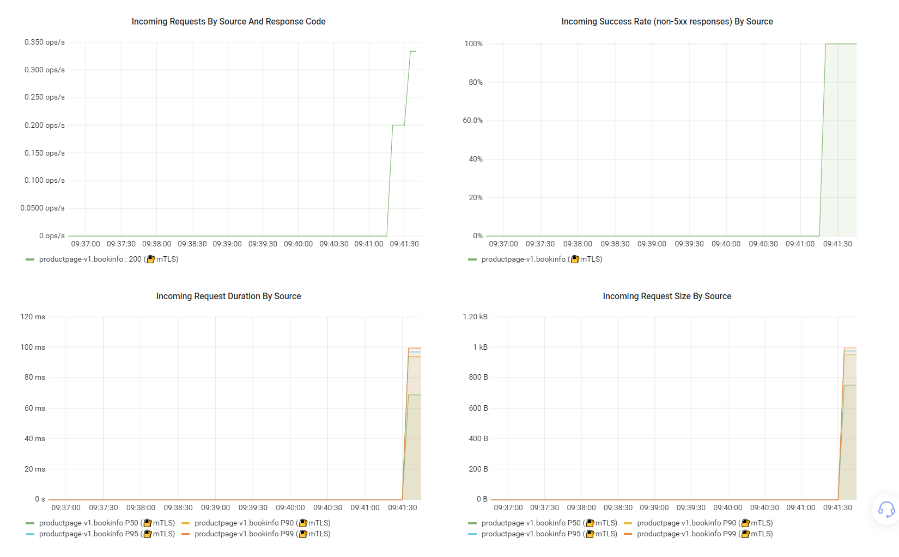
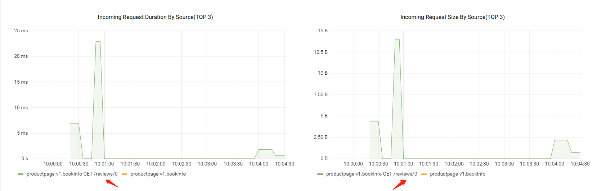
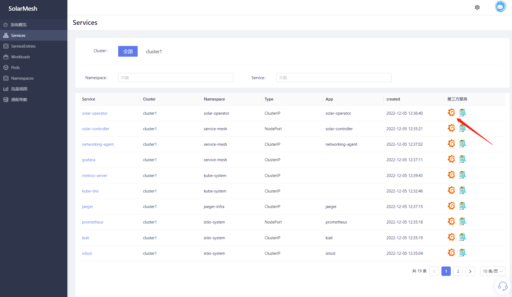
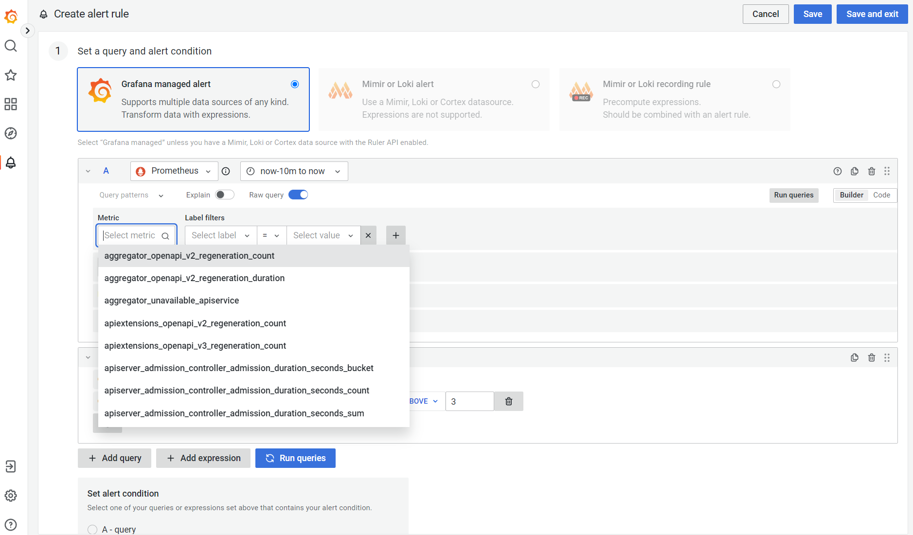
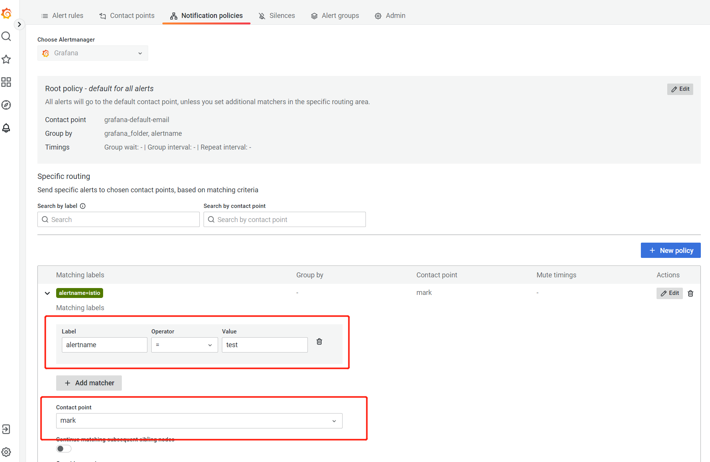
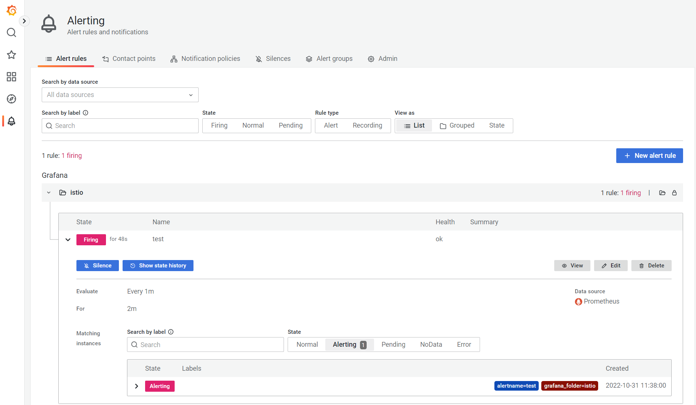
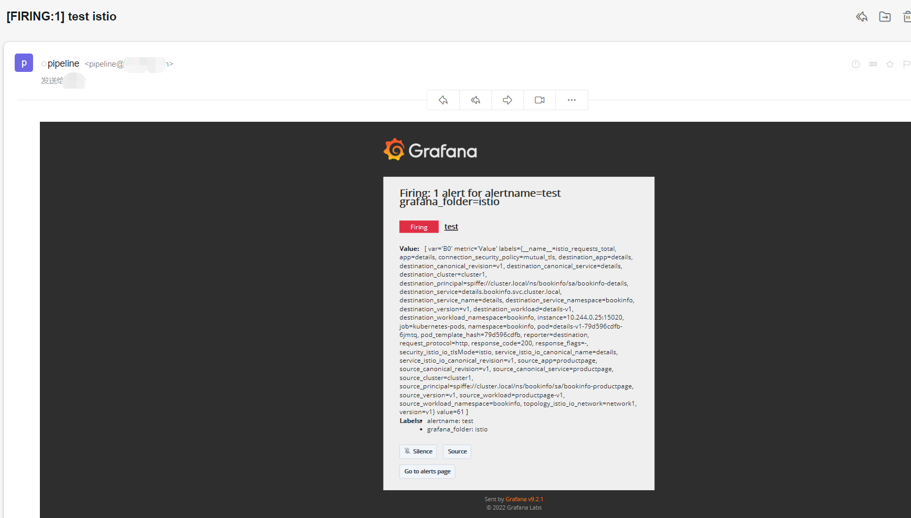

`grafana` 是一个开源的时序性统计和监控平台，提供丰富的可观察性仪表板，支持例如 prometheus、elasticsearch、graphite、influxdb 等众多的数据源。

SolarMesh的核心业务是云服务间的流量监管，grafana可以为SolarMesh提供丰富的仪表盘，借助SolarMesh提供的流量数据，直观的展示当前服务的流量状态

## 安装grafana

使用solarctl安装grafana
```bash
solarctl install grafana --name <集群名称: cluster01>
```
安装成功之后，grafana服务端将会安装在集群当中，默认namespace为service-mesh

```bash
kubectl get deploy -n service-mesh
NAME               READY   UP-TO-DATE   AVAILABLE   AGE
grafana            1/1     1            1           13h
```

### 扩展
默认情况下 grafana 使用默认的 istio 指标进行dashboard的展示，这能满足大多数时候的需求。如：



图中显示了请求PXX、请求成功率等内容。

如果您还需要在workload的图表中显示关于请求request_path等内容，您需要在安装grafana的时候指定两个参数：

- `--extra-metric`: 是否需要展示额外的request_method、request_path，默认值为 false，开启设置为 true
- `--istio-version`: 集群中istio的版本，格式为 x.xx

如下：

```shell
solarctl install grafana --name cluster1 --extra-metric=true --istio-version 1.11
```

另外，您还需要修改 istio configmap的配置：

```shell
meshConfig:
    defaultConfig:
      extraStatTags:
        - request_path
        - request_method
```

然后重启 istiod 、重启您业务workload。这些工作做完后，您可以在workload详情中，看到如下的图形，它展示了当前请求时间、请求大小TOP3接口图。



### 使用grafana进行告警

告警功能提供 istio监控指标的告警功能，用户对监控指标设置告警规则，当监控指标触发用户设置的告警条件时，支持以邮箱、alertmanager、webhook等方式通知用户，让用户在第一时间得知云服务发生异常，迅速处理故障，避免因资源问题造成业务损失。

#### 告警配置

grafana 的 告警入口在 `服务列表` 界面。点击 grafana 图标。点击左侧栏 `alerting`，点击 new alert rule 。




选择您需要告警的指标metrics，设置您的告警规则，创建收件人



刚告警触发时，可以看到告警规则的状态为 Firing 。



查看您的邮箱，您已经收到告警邮箱了。



#### 其他

##### 1. silence等

告警功能还支持silence等功能，这里不多赘述，详情可以查看 [grafana](https://grafana.com/docs/grafana/latest/alerting/) 。

##### 2. 存储

默认情况下，solarmesh 安装的grafana没用挂载存储卷，当grafana 重启后，数据会丢失。如果您需要数据持久化，您需要在安装 grafana 的时候通过指定 `-v true` 去创建 pvc，它默认会为 grafana 挂载一个 1Gi 的存储卷。

```shell
solarctl install grafana -h
The grafana subcommand installs the grafana in the cluster.

Usage:
  solarctl install grafana [flags]

Flags:
  -c, --context string                The name of the kubeconfig context to use
  -h, --help                          help for grafana
      --hub string                    grafana image (default "registry.cn-shenzhen.aliyuncs.com/solarmesh/grafana")
      --name string                   cluster name require
  -n, --namespace string              grafana installation namespace (default "service-mesh")
  -p, --path string                   .kubeConfig path
  -v, --persistent                    grafana persistent installation
      --prometheus-namespace string   prometheus namespace is exist namespace (default "istio-system")
  -t, --tag string                    grafana image tag (default "9.2.1")
      --watch-namespace string        solar operator namespace (default "solar-operator")
```

##### 对接其他的告警系统

大多数情况下，您公司可能已经有自己成熟的告警系统，您可能更习惯于使用自己的告警功能。如果您们的告警系统是基于 [Prometheus](https://prometheus.io/) 实现的，那么可以参考以下内容，配置 istio 相关告警指标，然后进行相关告警。

（1）采集指标

可以通过使用 servicemonitor、PodMonitor 去收集istio控制面以及数据面的metrics。

（2）设置istio相关的告警规则。
标准告警指标可以参考官网在这方面的描述： https://istio.io/latest/docs/reference/config/metrics/

## 卸载grafana

使用solarctl卸载grafana

> solarctl的安装见 `快速开始/安装->获取solarctl`

```bash
solarctl uninstall cluster --name grafana
```
