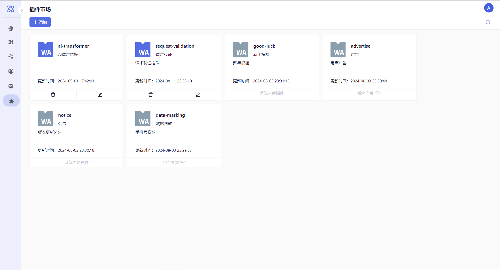
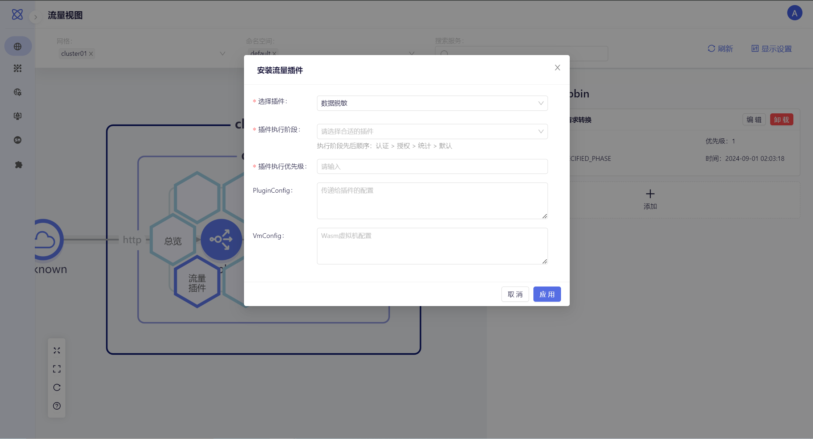
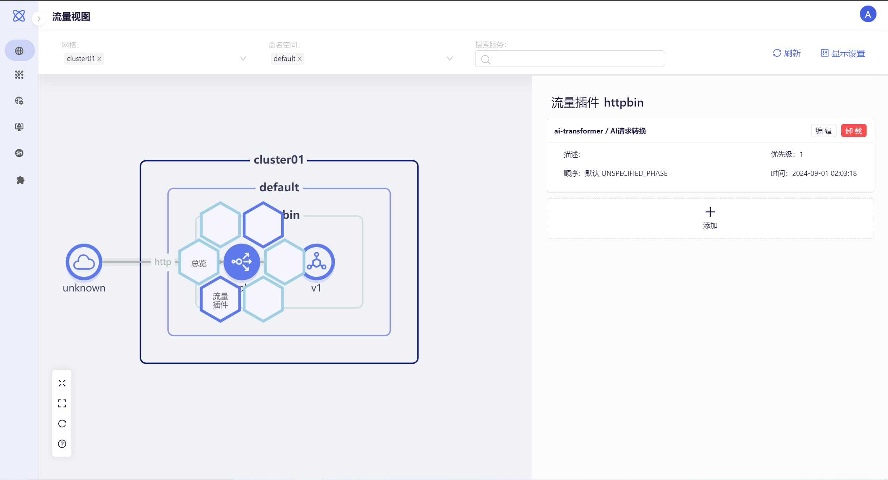
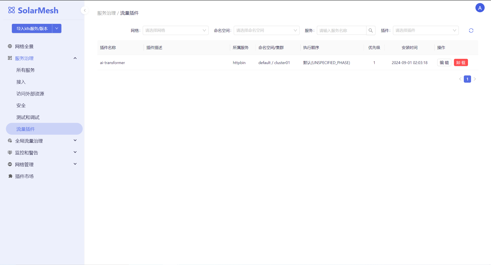

## WASM插件

Istio 的 WebAssembly (Wasm) 插件扩展机制通过沙箱隔离确保内存安全，支持多种编程语言，使得开发者可以用自己熟悉的语言编写插件。这些插件允许独立版本管理和升级，可以在不影响现有系统的情况下更新插件。此外，流量无损热更新功能确保了在部署更改时不会中断现有的连接。这一强大的特性集合帮助构建了更加灵活和安全的应用网络，使 Istio 成为现代微服务架构中的多功能工具。

## SolarMesh插件市场

SolarMesh 插件市场是一个专注于简化 Istio WebAssembly (Wasm) 插件引入的专业平台。它为用户提供了一个便捷的界面来定义和管理 Wasm 插件，包括插件的 OCR 地址、名称和其他重要配置。这一平台极大地提高了用户的操作便利性和系统的整体灵活性。

SolarMesh 插件市场的核心优势在于其易用性和专业性。用户可以通过简单的配置即可引入各种预先开发好的 Wasm 插件，无需深入了解底层技术细节。这些插件通过沙箱隔离技术确保了内存安全，增强了系统的稳定性和安全性。此外，插件市场的多语言支持使得用户可以根据需求选择合适的插件，而无需受限于特定的编程语言。

更重要的是，SolarMesh 插件市场与 Istio 生态系统无缝融合，使得用户可以充分利用 Istio 的强大功能。独立版本管理和无损热更新功能确保了插件可以在不影响现有流量的情况下进行升级，从而保障了服务的连续性和可靠性。通过这样一个高度集成且易于使用的插件市场，SolarMesh 不仅简化了插件的引入过程，还为构建更加灵活和安全的应用网络提供了强有力的支持。

目前插件市场中以内置了如下的插件：

### 上传插件

用户也可以添加自己开发的插件。点击“添加”,输入插件英文名称、插件中文名称、插件描述以及插件的地址。

插件地址支持以下类型：

- 镜像地址(推荐): `oci://private-registry:5000/check-header:latest`
- 文件地址: `https://private-bucket/filters/openid.wasm`

### 应用插件

在流量视图中，我们点击服务，选择我们需要应用的流量插件，如数据脱敏。

应用插件时，我们需要填如下参数。

- 插件执行阶段: 确定 WasmPlugin 在处理请求的过滤链中的插入位置, 执行阶段先后顺序：认证 > 授权 > 统计 > 默认认证 > 授权 > 统计 > 默认.
- 插件执行优先级: 假如有多个插件，那么可能需要设置优先级，数值越大，那么优先级越高，范围为1~1000.
- PluginConfig: 插件配置，此配置可用在插件中进行引用.
- VmConfig: 插件虚拟机配置，一般为环境变量.

当我们应用完插件后，可以在详情中看到我们安装的插件。

### 流量插件

在流量插件列表中可以看到整个集群中插件的安装情况。

