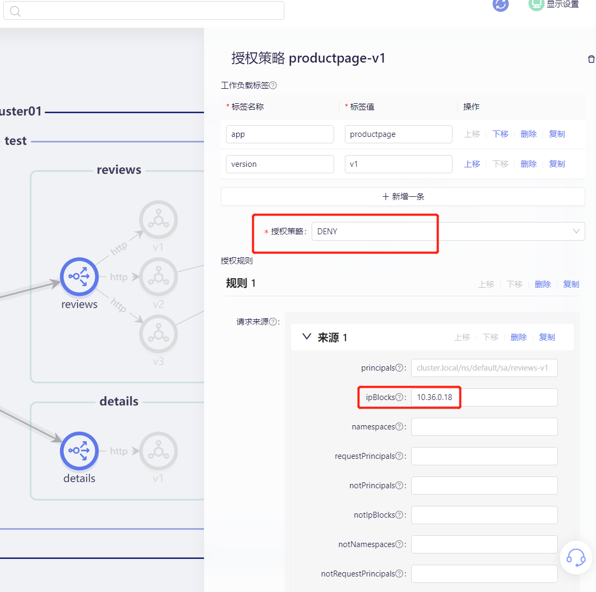

零信任是指无论在网络边界内部还是外部，都没有任何隐含的信任。SolarMesh是重要的云原生零信任体系落地载体之一，
将身份认证和授权从应用程序代码集成到SolarMesh，开箱即用、动态可配、更新策略更加容易且立即生效。本文介绍使用SolarMesh为服务实现黑白名单的访问。

**前置条件：**

- 部署bookinfo项目，并且每个实例都注入sidecar。
- 部署sleep 服务，方便测试

```sh
$ kubectl get po -n test -owide
NAME                             READY   STATUS    RESTARTS   AGE   IP           NODE       NOMINATED NODE   READINESS GATES
details-v1-65b994c875-kgbp2      2/2     Running   0          9d    10.36.0.9    49-node1   <none>           <none>
productpage-v1-8bf7687-nxb5t     2/2     Running   0          9d    10.36.0.14   49-node1   <none>           <none>
ratings-v1-bcdd8c995-vfqj9       2/2     Running   0          9d    10.36.0.16   49-node1   <none>           <none>
reviews-v1-5f4866bd47-sxr6b      2/2     Running   0          9d    10.36.0.17   49-node1   <none>           <none>
reviews-v2-7b66cff677-kjl4v      2/2     Running   0          9d    10.44.0.7    46-node2   <none>           <none>
reviews-v3-6dddcfbb87-94zkd      2/2     Running   0          9d    10.44.0.9    46-node2   <none>           <none>
sleep-5c88f5b48d-tlmb5           2/2     Running   0          9d    10.36.0.18   49-node1   <none>           <none>
```

我们先记住 sleep-5c88f5b48d-tlmb5 的 IP 为 ``10.36.0.18``,待会设置只有此 IP 不可以访问我们的 productpage-v1-8bf7687-nxb5t，模仿一个黑名单场景 。

## 试试看

我们先在`sleep-5c88f5b48d-tlmb5 ` 访问 productpage-v1-8bf7687-nxb5t:

```sh
$ kubectl exec -it sleep-5c88f5b48d-tlmb5 -n test sh
kubectl exec [POD] [COMMAND] is DEPRECATED and will be removed in a future version. Use kubectl exec [POD] -- [COMMAND] instead.
/ $ curl -v productpage:9080
*   Trying 10.21.152.27:9080...
* Connected to productpage (10.21.152.27) port 9080 (#0)
> GET / HTTP/1.1
> Host: productpage:9080
> User-Agent: curl/8.0.1-DEV
> Accept: */*
>
< HTTP/1.1 200 OK
< content-type: text/html; charset=utf-8
< content-length: 1683
< server: envoy
< date: Fri, 28 Apr 2023 09:33:56 GMT
< x-envoy-upstream-service-time: 149
<
<!DOCTYPE html>
<html>
  <head>
    <title>Simple Bookstore App</title>
<meta charset="utf-8">
<meta http-equiv="X-UA-Compatible" content="IE=edge">
<meta name="viewport" content="width=device-width, initial-scale=1">
...
```

如上所见访问是ok的。

我们现在配置个黑名单，限制它的访问。



保存，然后我们再访问试试。

```sh
$ curl -v productpage:9080
*   Trying 10.21.152.27:9080...
* Connected to productpage (10.21.152.27) port 9080 (#0)
> GET / HTTP/1.1
> Host: productpage:9080
> User-Agent: curl/8.0.1-DEV
> Accept: */*
>
< HTTP/1.1 403 Forbidden
< content-length: 19
< content-type: text/plain
< date: Fri, 28 Apr 2023 09:43:56 GMT
< server: envoy
< x-envoy-upstream-service-time: 71
<
* Connection #0 to host productpage left intact
```

结果显示 403，说明我们的配置生效了。

