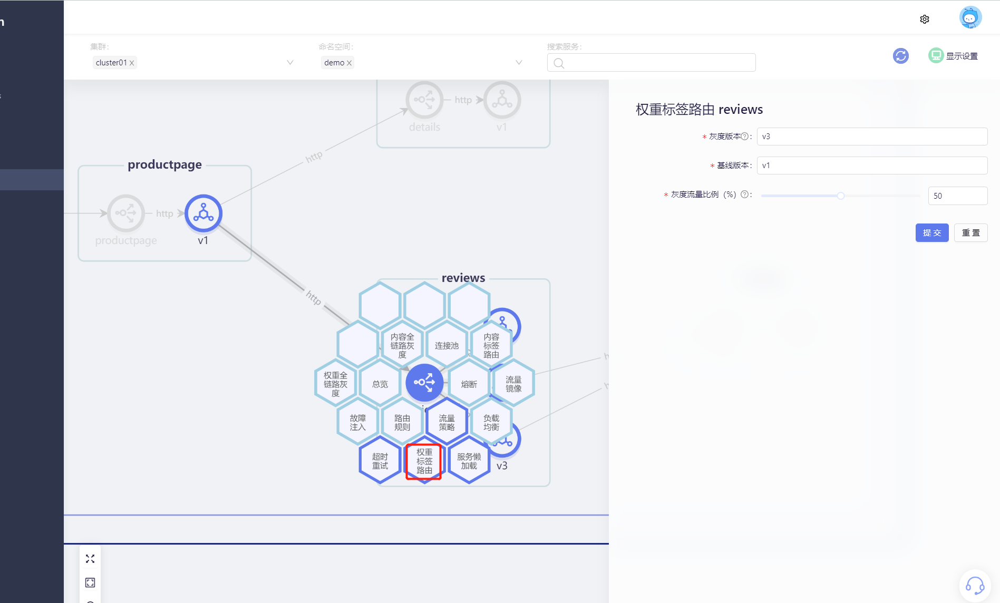

灰度发布，是版本升级平滑过渡的一种方式，当版本升级时，使部分用户使用新版本，其他用户继续使用老版本，待新版本稳定后，逐步扩大范围把所有用户流量都迁移到新版本上面来。
这样可以最大限度地控制新版本发布带来的业务风险，降低故障带来的影响面，同时支持快速回滚。

SolarMesh支持基于权重、内容的灰度发布。

## 试试看

> 假设我们已经部署过bookinfo示例项目，并且为bookinfo示例项目的服务接入了sidecar

使用SolarMesh为服务配置权重灰度发布的流程如下。

点击 "流量视图" 中具体服务，选择 "权重标签路由" 功能。

配置灰度版本、基线版本以及灰度版本流量比例即可。

我们为reviews 服义的v1 和 v3的版本设置灰度流量，比例为50%.

然后我们访问 productpage 界面，我们的期望是它的流量会在 review-v1 实例 和 review-v3 实例中来回切换，且流量接近为 50%。

查看流量视图，可以看到更清晰的流量情况：

