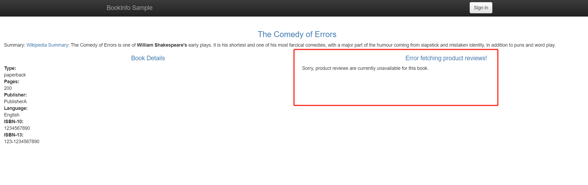
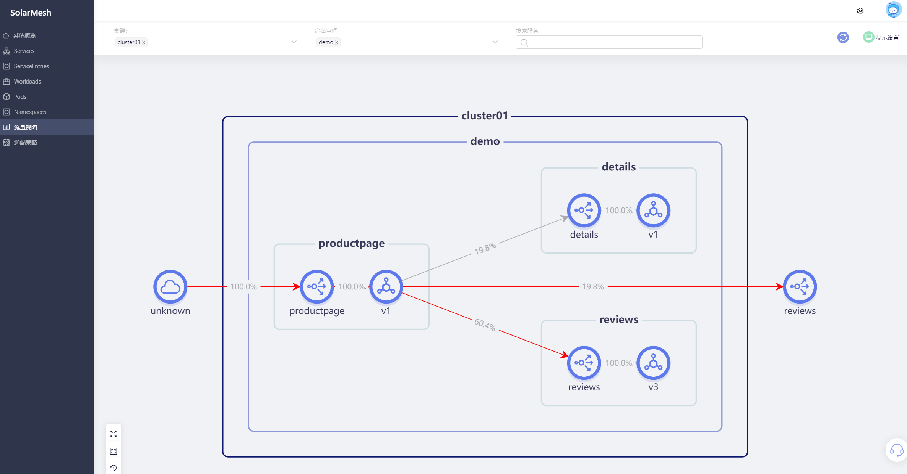

故障注入是一种系统测试方法，它涉及将网络故障和错误故意引入系统。它可以用来测试设计或配置的缺陷，并确保系统能够处理故障并从错误中恢复。

通过solarmesh，可以方便的在页面注入故障，以测试服务的容错性。您可以配置任意HTTP故障码，并将其注入到由solarmesh接管的目标服务中。在配置生效后，您对目标服务的HTTP请求将会返回设置好的故障码。

## 试试看

> 假设我们已经部署过bookinfo示例项目，并且为bookinfo示例项目的服务接入了sidecar

访问我们事先部署好的示例项目bookinfo的页面，多刷新几次，您会发现在没有任何策略干预的情况下，页面中 Book Reviews 一栏呈现三种状态: 红星、黑星和无星，它们的出现概率约为1:1:1。

我们为 reviews 服务配置一个 延迟故障。

再次访问示例 productpage 页面。我们可以发现故障已经产生，reviews 服务已经开始报错了。

此时进入SolarMesh的流量视图界面，您可以看到这样的一幅流量拓扑图。由于请求已经被注入了延迟错误，所以可以看到是 productpage 访问了的reviews流量线是红色的。

