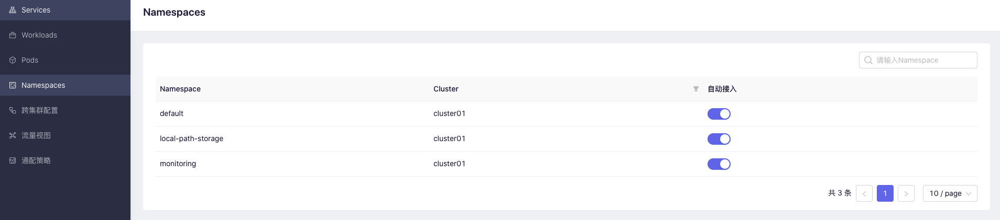

本章节讲解如何将集群中的服务交给SolarMesh接管

为了使用服务网格的所有功能，`kubernetes`中的Pod必须接入Istio Sidecar的代理。

以下各节描述了将Istio Sidecar注入到pod中的两种方法：

手动注入: 通过SolarMesh在Workload页面进行接入，并将代理配置注入其中。

自动注入：打开SolarMesh在Namespace页面的自动接入开关，自动注入会将当前Namespace下所有pod注入代理配置并且使用`准入控制器`在Pod创建时注入代理配置。

## 注意事项

根据SolarMesh规范，您的资源需要做以下的调整

* [workload](https://kubernetes.io/zh/docs/concepts/workloads/) 和 [pod](https://kubernetes.io/zh/docs/concepts/workloads/pods/) 需要添加 `app` 和 `version` 的标签。

```yaml
apiVersion: apps/v1
kind: Deployment
metadata:
  name: details-v1
  labels:
    app: details # workload 添加 app 的label
    version: v1 # workload 添加 version 的label
spec:
  replicas: 1
  selector:
    matchLabels:
      app: details
      version: v1
  template:
    metadata:
      labels:
        app: details # template 添加 app 的label
        version: v1 # template 添加 version 的label
    spec:
      serviceAccountName: bookinfo-details
      containers:
      - name: details
        image: docker.io/istio/examples-bookinfo-details-v1:1.15.0
        imagePullPolicy: IfNotPresent
        ports:
        - containerPort: 9080
```

支持的协议列表：https://istio.io/latest/docs/ops/configuration/traffic-management/protocol-selection/

## 自动注入

自动注入是使用kubernetes提供的`mutating webhook admission controller `，可以将Sidecar自动注入到适用的pod中。

请注意，与手动注入不同，自动注入发生在容器级。您不会看到部署本身的任何更改。您需要（通过kubectl describe）检查各个容器，以查看注入的代理。

### 在SolarMesh上进行自动注入

进入Namespces页面

打开namespace自动注入的开关



打开sidecar的开关之后就可以看到 --> READY 2/2

```bash
kubectl get po -n demo
NAMESPACE           NAME                                          READY   STATUS                  RESTARTS   AGE
demo                details-v1-687cc78964-tpk2t                   2/2     Running   0          14d
demo                productpage-v1-8488bbdbfd-wddv5               2/2     Running   0          14d
demo                ratings-v1-8ddf6c6c-xtx8d                     2/2     Running   0          14d
demo                reviews-v1-f965c5c7c-tfx58                    2/2     Running   0          14d
demo                reviews-v2-86b699c6bf-k6vft                   2/2     Running   0          14d
demo                reviews-v3-85b6d84958-7xwc4                   2/2     Running   0          14d
```

---

## 手动注入

### 在SolarMesh上进行手动注入

在workloads列表中找到您想注入的workload

在workload详情页面点击注入sidecar即可

接入中的状态:


等待仪表盘页面上显示 READY 2/2 则代表注入成功


