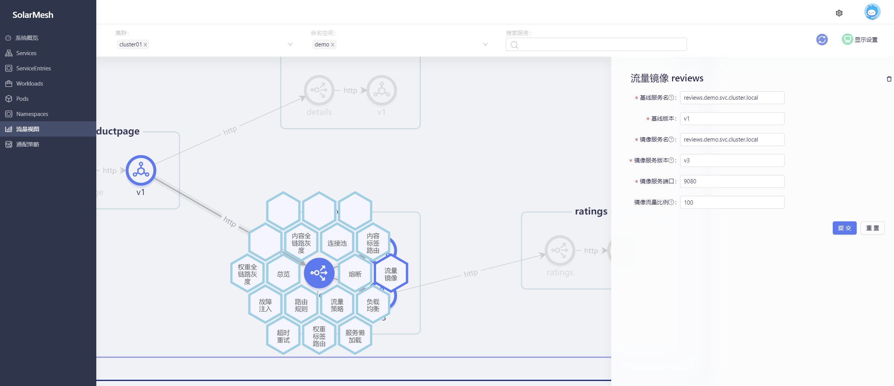

流量镜像是一种将实时流量的副本发送到镜像服务的功能，可用于在向用户推出风险最小的服务之前，用真实流量测试新版本的服务，或用于监控和审计现有服务的流量。

通过solarmesh，可以方便的在页面配置流量镜像。选择已接入sidecar的服务作为源服务，配置它的流量镜像到目标服务。在配置生效后，您对源服务的HTTP请求将会发送一份流量的副本到目标服务。

## 试试看

> 假设我们已经部署过bookinfo示例项目(见 `快速开始/安装/使用solarctl安装示例项目`)，并且为bookinfo示例项目的服务接入了sidecar(见 `快速开始/接管服务`)

访问我们事先部署好的示例项目bookinfo的productpage页面，多刷新几次，您会发现在没有任何策略干预的情况下，页面中 Book Reviews 一栏呈现三种状态: 红星、黑星和无星，它们的出现概率约为1:1:1。

我们为 reviews 的v1 版本设置 流量镜像，将它的流量镜像到 v3 版本中。

首先我们为 reviews设置目标规则，定义 v1 和 v3版本。

然后为其设置流量镜像策略。

再次访问示例项目bookinfo的productpage页面，无论我们怎么刷新，得到的结果是页面中 Book Reviews 一栏只会呈现出无星的状态。这说明镜像的流量并不会影响原本流量的正常运行。

然后查看流量视图：

我们会发现有从v3版本的流量到ratings服务，这其实是v1版本的镜像流量。

