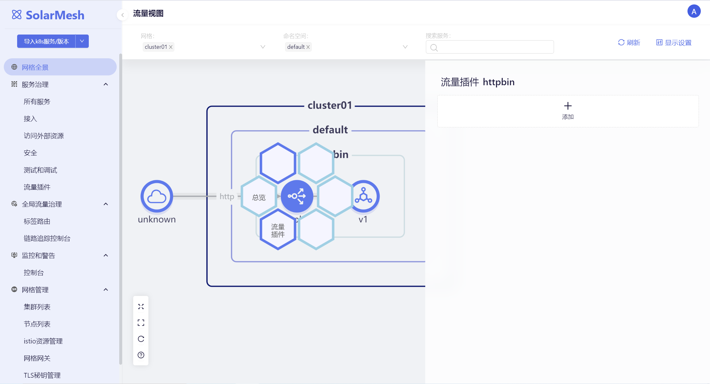
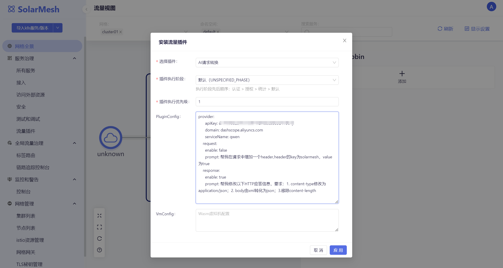
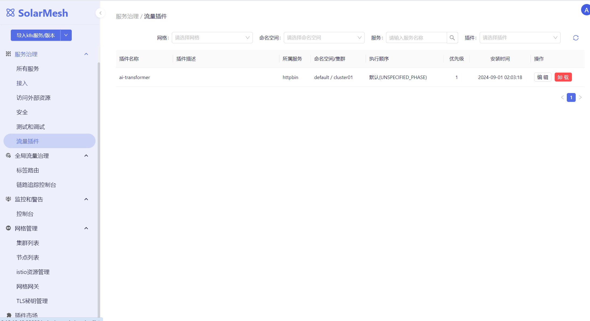
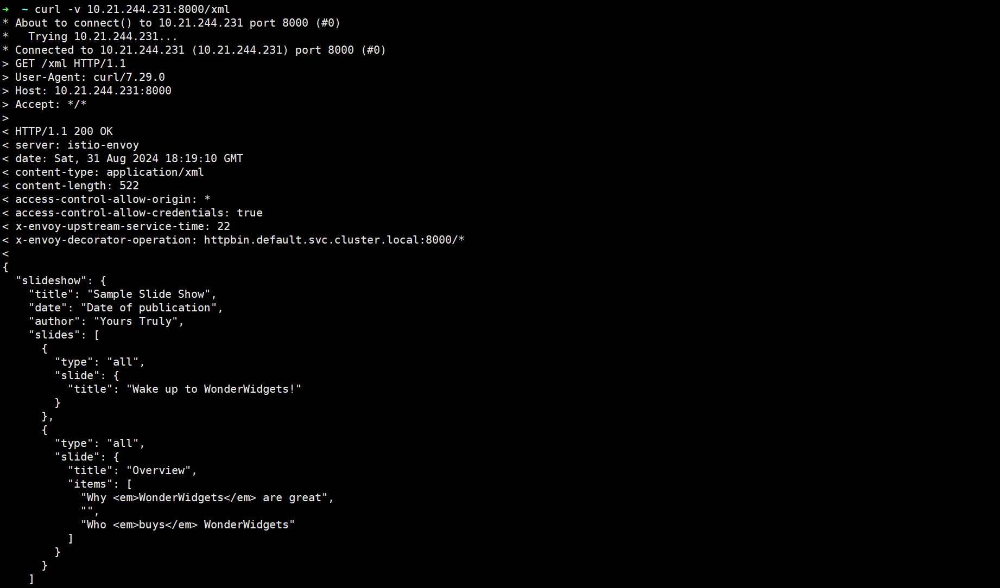
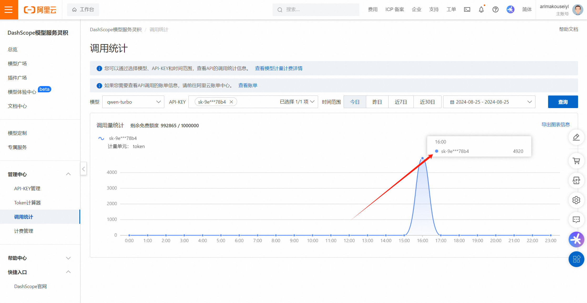
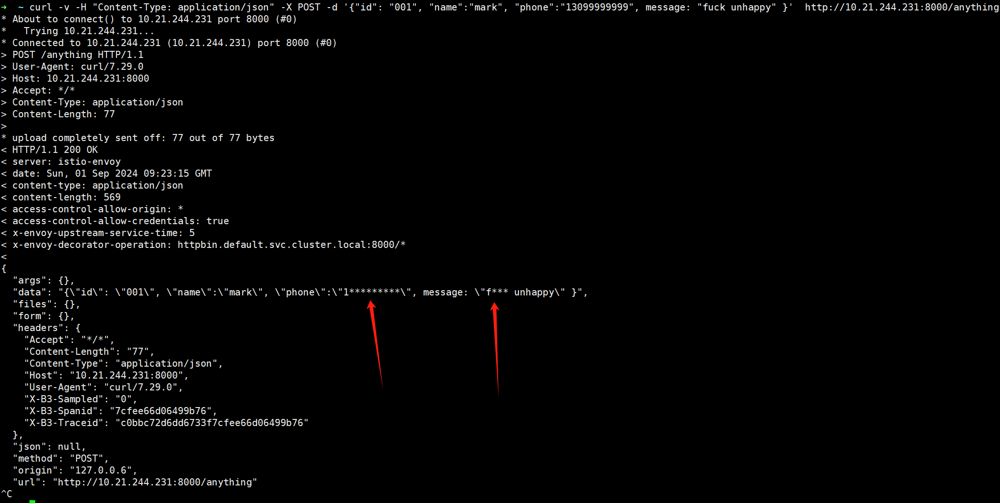

人工智能（AI）正在快速发展，引领着数字化转型的新时代。从深度学习到大数据分析，AI的进步为各行各业带来了前所未有的机遇。它能够高效准确地处理大量信息，帮助企业和机构做出更精准的决策。在医疗健康、教育、制造等众多领域，AI的应用提升了服务质量与生产效率，同时也为解决复杂的社会挑战提供了新的工具。

拥抱AI不仅是技术发展的必然趋势，也是提升个人技能、增强企业竞争力和社会整体福祉的关键。掌握AI基础，利用其强大功能，对于促进个人职业发展和社会进步都至关重要。随着AI技术的不断成熟，构建一个更加智能、高效的生活环境已成为可能。

SolarMesh最近也在积极的拥抱AI，并推出AI流量插件，助力我们的用户提升生产的效率。

## AI插件

AI插件全称AI Wasm插件，它是流量插件中的一个分类，利用AI的能力结合以Wasm的形得以实现插件式应用流量AI治理的能力。目前，SolarMesh实现了一种AI流量转换插件，以下是其具体的介绍。

### AI-Transformer

通过配置 AI 请求/响应转换插件，用户可以无需编写代码而使用自然语言来调整服务的请求和响应数据。例如，在测试某个服务接口时，测试人员可以通过这一插件，以原始请求/响应为例，自动生成用于边界条件测试的新请求/响应。大型语言模型往往能够考虑到更多的细节，从而帮助发现人工测试中可能遗漏的一些边界情况。

| 名称	                   | 数据类型	    | 填写要求 	 | 默认值	                        | 描述                    |
|-----------------------|----------|--------|-----------------------------|-----------------------|
| model                 | 	string	 | 非必填 	  | qwen-turbo	                 | 模型名称                  |
| request.enable        | 	bool	   | 必填	    | -	                          | 是否在request阶段开启转换      |
| request.prompt        | 	string	 | 必填	    | -	                          | request阶段转换使用的prompt  |
| response.enable       | string	  | 必填	    | -	                          | 是否在response阶段开启转换     |
| response.prompt	      | string	  | 必填	    | -	                          | response阶段转换使用的prompt |
| provider.serviceName	 | string	  | 非必填	   | -	                          | 目前仅支持通义千问             |
| provider.domain	      | string	  | 非必填 	  | dashscope.aliyuncs.com      | 	LLM服务域名              |
| provider.apiKey	      | string	  | 必填	    | -                           | 	阿里云dashscope服务的API   |

配置示例：
```yaml
    provider:
      apiKey:
      domain: dashscope.aliyuncs.com
      serviceName: qwen
    request:
      enable: false
      prompt: 帮我在请求中增加一个header,header的key为solarmesh，value为true
    response:
      enable: true
      prompt: 帮我修改以下HTTP应答信息，要求：1. content-type修改为application/json；2. body由xml转化为json；3.移除content-length
```

### 在SolarMesh中使用AI-Transformer

在网格全景中选择要安装插件的服务，点击流量插件。


设置“AI请求转换”插件，设置PluginConfig，然后保存。PluginConfig也就是上面配置示例的内容，它会将其配置到wasm插件中。


保存后，我们可以回到“流量插件”菜单，我们可以看到httpbin服务已经安装了ai-transformer插件。


接着我们去访问httpbin，验证我们的prompt是否能生效。

httpbin有一个xml接口，它可以返回一份xml格式的测试数据。


现在我们已经为httpbin安装了AI-Transformer插件了，我们再访问xml接口试试。



我们发现原本是xml格式返回的接口，现在变为了json格式，这其实就说明通义千问已经帮我们改了格式。

我们还可以回到阿里云的工作台，查看大致的api调用记录，当然这记录是有比较大的延迟才会出现的



### 进阶玩法

我们还可以利用AI-Transformer插件为我们的业务数据进行脱敏，如为手机号、敏感词汇进行加密处理。我们可以改进上面的规则为：
```yaml
    response:
      enable: true
      prompt: 帮我修改以下HTTP应答信息，对手机号格式的数据进行*号加密处理，对英文违禁词也进行*号加密处理
```

然后请求：
```shell
curl -v -H "Content-Type: application/json" -X POST -d '{"id": "001", "name":"mark", "phone":"13099999999", message: "fuck unhappy" }'  http://10.21.244.231:8000/anything
```

结果：


